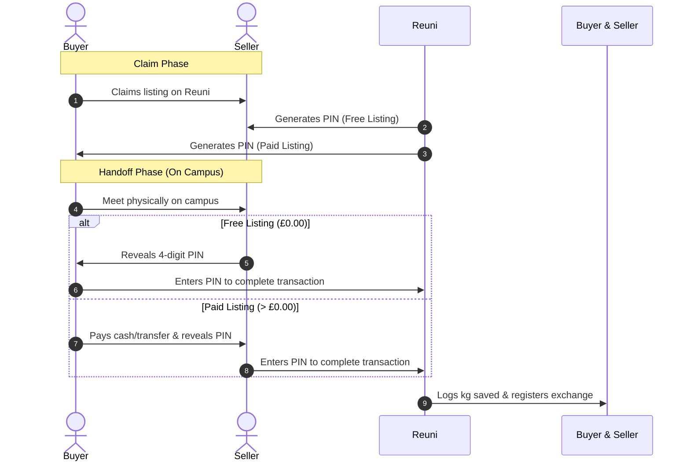

<div align="center">
  
  
  <br /><br />
  
  <h3>Preventing campus waste, one transaction at a time.</h3>
  
  <p size="4">
    Reuni connects university students and sustainability teams to trade, donate, and recycle goods. By replacing shipping logistics with face-to-face handoffs and measuring impact in verified kilograms saved, Reuni turns circular economy into a tangible, campus-wide habit.
  </p>

  <br />

  

  <br /><br />

  [](https://creativecommons.org/licenses/by-nc-nd/4.0/)
  &nbsp;
  [](https://www.python.org/)
  &nbsp;
  [](https://palletsprojects.com/p/flask/)
  &nbsp;
  [](tests/)
</div>

<br /><br />

> [!NOTE]
> **Portfolio Project Showcase**: Reuni was architected and built as a full-stack campus circular-economy platform designed for UK higher education institutions. It eliminates delivery emissions through hyper-local, face-to-face transactions and measures ecological impact in verified kilograms of waste diverted from landfills. This repository is preserved as an open portfolio piece demonstrating production Flask architecture, anti-IDOR access control, strict CSP security hardening, and relational data modeling.

<br />

## Live Interactive Demo

A live showcase instance is deployed on Render:
- **Primary Domain:** [https://reuni.uk](https://reuni.uk)
- **Fallback URL:** [https://reuni.onrender.com](https://reuni.onrender.com)

The hosted demo operates in read-only showcase mode with automated sample data pre-seeded. Feel free to explore the marketplace, leaderboards, Hall of Fame, in-app messaging, and ESG metrics using any of the demo accounts below:

| Institution | Role | Email | Password | Access Highlights |
|---|---|---|---|---|
| **Oxford Brookes** | Student | `a.rahman@brookes.ac.uk` | `BrookesDemo1` | Campus marketplace, active listings, in-app chat thread |
| **Oxford Brookes** | Student | `j.whitfield@brookes.ac.uk` | `BrookesDemo1` | Top recycler profile, claimed items, podium rank |
| **Oxford Brookes** | Sustainability Partner | `sustainability@brookes.ac.uk` | `BrookesDemo1` | ESG impact analytics dashboard, season management |
| **University of Oxford** | Student | `a.turing@ox.ac.uk` | `OxfordDemo1` | Multi-campus student exchange, podium rank |
| **University of Oxford** | Sustainability Partner | `sustainability@ox.ac.uk` | `OxfordDemo1` | Oxford campus ESG metrics & term tracking |
| **University of Cambridge** | Student | `i.newton@cam.ac.uk` | `BrookesDemo1` | Cambridge campus marketplace & transactions |
| **University of Cambridge** | Sustainability Partner | `sustainability@cam.ac.uk` | `BrookesDemo1` | Cambridge estate sustainability metrics |

<br />

<details>
<summary><strong>Interface &amp; Feature Walkthrough Animation</strong> (Click to expand)</summary>
<br />

<div align="center">
  
</div>

<br />
</details>

<hr />
<br /><br />

## Core Strategic Principles

<br />

<table width="100%" cellpadding="12" cellspacing="0">
  <tr>
    <td width="50%" align="center" valign="top">
      <br />
      <picture>
        <source media="(prefers-color-scheme: dark)" srcset="https://api.iconify.design/mdi:map-marker-outline.svg?color=%2370B8AE">
        
      </picture>
      <br /><br />
      <small style="color: #0D9488; letter-spacing: 2px; font-weight: 700; font-family: 'JetBrains Mono', monospace; font-size: 0.75rem;">CAMPUS TENANCY</small>
      <br /><br />
      <h4 align="center">Hyper-Local Nodes</h4>
      <p align="center">Architected for UK higher education institutions. High campus density eliminates shipping logistics, packaging, and delivery emissions—all handoffs are face-to-face on campus.</p>
      <br />
    </td>
    <td width="50%" align="center" valign="top">
      <br />
      <picture>
        <source media="(prefers-color-scheme: dark)" srcset="https://api.iconify.design/mdi:scale-balance.svg?color=%2370B8AE">
        
      </picture>
      <br /><br />
      <small style="color: #0D9488; letter-spacing: 2px; font-weight: 700; font-family: 'JetBrains Mono', monospace; font-size: 0.75rem;">ENVIRONMENTAL IMPACT</small>
      <br /><br />
      <h4 align="center">Dynamic Weight Tracking</h4>
      <p align="center">Every transaction records real physical mass (<code>kg saved</code>). This metric is sacred and immutable, feeding directly into university-wide carbon and ESG reports.</p>
      <br />
    </td>
  </tr>
  <tr>
    <td width="50%" align="center" valign="top">
      <br />
      <picture>
        <source media="(prefers-color-scheme: dark)" srcset="https://api.iconify.design/mdi:account-group-outline.svg?color=%2370B8AE">
        
      </picture>
      <br /><br />
      <small style="color: #0D9488; letter-spacing: 2px; font-weight: 700; font-family: 'JetBrains Mono', monospace; font-size: 0.75rem;">DECENTRALIZED TRUST</small>
      <br /><br />
      <h4 align="center">Distributed Jury System</h4>
      <p align="center">A self-governing student jury handles moderation flags. This eliminates manual administration and scales community trust at zero overhead cost.</p>
      <br />
    </td>
    <td width="50%" align="center" valign="top">
      <br />
      <picture>
        <source media="(prefers-color-scheme: dark)" srcset="https://api.iconify.design/mdi:ghost-outline.svg?color=%2370B8AE">
        
      </picture>
      <br /><br />
      <small style="color: #0D9488; letter-spacing: 2px; font-weight: 700; font-family: 'JetBrains Mono', monospace; font-size: 0.75rem;">ALGORITHMIC DEFENSE</small>
      <br /><br />
      <h4 align="center">Shadow Governance</h4>
      <p align="center">Flagged bad actors are algorithmically muted. The platform restricts their reach without warning them, rendering alt-accounts unnecessary.</p>
      <br />
    </td>
  </tr>
  <tr>
    <td width="50%" align="center" valign="top">
      <br />
      <picture>
        <source media="(prefers-color-scheme: dark)" srcset="https://api.iconify.design/mdi:key-outline.svg?color=%2370B8AE">
        
      </picture>
      <br /><br />
      <small style="color: #0D9488; letter-spacing: 2px; font-weight: 700; font-family: 'JetBrains Mono', monospace; font-size: 0.75rem;">TRANSACTION VERIFICATION</small>
      <br /><br />
      <h4 align="center">Secure PIN Handshake</h4>
      <p align="center">Cements physical collections via a secure, atomic 4-digit PIN exchange. For free items, the seller holds the PIN; for paid items, the buyer holds it. Verification happens atomically on handoff.</p>
      <br />
    </td>
    <td width="50%" align="center" valign="top">
      <br />
      <picture>
        <source media="(prefers-color-scheme: dark)" srcset="https://api.iconify.design/material-symbols-light:nest-eco-leaf-outline.svg?color=%2370B8AE" width="28" height="28" alt="Leaf">
        
      </picture>
      <br /><br />
      <small style="color: #0D9488; letter-spacing: 2px; font-weight: 700; font-family: 'JetBrains Mono', monospace; font-size: 0.75rem;">WRAP STANDARDS</small>
      <br /><br />
      <h4 align="center">Carbon Equivalent Metrics</h4>
      <p align="center">Calculates carbon equivalent savings (<code>total_co2e</code> in kg CO₂e) based on item categories and WRAP/DEFRA conversion factors rather than duplicating landfill weight metrics.</p>
      <br />
    </td>
  </tr>
</table>

<br /><br />

<hr />
<br /><br />

## Technology Stack

<br />

### Backend Core

- **Runtime &amp; Core Framework:** `Python 3.10+` &amp; `Flask 3.1`
  <br />Application factory pattern, blueprints, request lifecycle management, and custom decorators.
- **Database &amp; Migrations:** `Flask-SQLAlchemy` &amp; `Flask-Migrate` (PostgreSQL / SQLite)
  <br />Relational schema mapping, parameterized queries, and Alembic database migration logs.
- **Security &amp; Auth Guardrails:** `Flask-Login` &amp; `Flask-Limiter` &amp; `Werkzeug (scrypt)`
  <br />Session regeneration, rate-limiting, timing-safe cryptographic comparisons, and anti-IDOR filters.

<br />

### Image &amp; Integrations

- **Image Validation Pipeline:** `Pillow (PIL)`
  <br />EXIF stripping, resizing to web dimensions, WebP compression, and validation guards.
- **Email &amp; Communication:** `Brevo API SDK`
  <br />Transactional sign-up OTP verification codes, password resets, and PIN notifications.
- **Background Jobs:** `APScheduler`
  <br />Automated cron schedules for weekly leaderboard snapshot archival and GDPR anonymization routines.

<br />

### Frontend &amp; Testing

- **Rendering Engine:** `Jinja2` &amp; `Vanilla CSS / JS`
  <br />Zero-framework, buildless frontend architecture, styled with CSS Custom Properties and zero inline JavaScript (strict CSP).
- **Automated Verification:** `pytest` &amp; `beautifulsoup4`
  <br />261 automated assertions validating auth flows, security headers, marketplace operations, and cancellation tiers.

<br /><br />

<hr />
<br /><br />

## Developer Portal

<br />

<details>
<summary><strong>Transaction Verification Flow (PIN Handshake)</strong> (Click to expand)</summary>
<br />

The physical handoff is verified using a secure 4-digit PIN exchange. The protocol shifts verification roles based on the price configuration to align completion incentives:



<br />
</details>

<br />

<details>
<summary><strong>Project Architecture &amp; File Map</strong> (Click to expand)</summary>
<br />

```filepath
Reuni/
│
├── app/                        # Application Source Code
│   ├── routes/                 # Endpoint blueprints
│   │   ├── admin.py            # B2B admin settings & partner invitations
│   │   ├── auth.py             # User signup, login, OTP validation
│   │   ├── items.py            # Marketplace browse, detail, and lifecycle
│   │   ├── leaderboard.py      # Campus Leaderboard & Hall of Fame snapshots
│   │   ├── messaging.py        # Secure user-to-user in-app chat
│   │   └── partner.py          # ESG dashboards for university partners
│   │
│   ├── static/                 # Static Assets
│   │   ├── css/                # CSS architecture (style.css, landing.css, leaderboard.css)
│   │   ├── img/                # Graphics, badges, and illustrations
│   │   ├── js/                 # Modular vanilla JS (no inline JS allowed by CSP)
│   │   └── uploads/            # Local listing images (gitignored)
│   │
│   ├── templates/              # Jinja2 HTML templates
│   ├── utils/                  # Helper utilities (email, tokens, turnstile, logo downloader)
│   ├── config.py               # Flask application configuration classes
│   ├── models.py               # SQLAlchemy database models
│   ├── scheduler.py            # Automated snapshot & maintenance jobs
│   └── __init__.py             # App factory & security header setup
│
├── instance/                   # Local instance-specific files (e.g., SQLite DB)
├── migrations/                 # Alembic database migration scripts
├── tests/                      # Automated test suite (261 pytest assertions)
│
├── run.py                      # Flask development server entry point
├── seed.py                     # Demo data population utility (multi-campus)
├── pentest.py                  # Active penetration testing & security simulation suite
├── requirements.txt            # Python dependencies
├── future_roadmap.md           # Architecture & future considerations backlog
└── REUNI_DESIGN_SYSTEM.md      # Comprehensive UI/UX design tokens and patterns
```

<br />
</details>

<br />

<details>
<summary><strong>Local Setup &amp; Installation</strong> (Click to expand)</summary>
<br />

### 1. Prerequisites

Ensure you have Python 3.10+ installed on your system.

### 2. Installation

Clone the repository and set up the virtual environment:

```bash
# Create a virtual environment
python -m venv .venv

# Activate the virtual environment
# On Windows (PowerShell):
.venv\Scripts\Activate.ps1
# On Linux/macOS:
source .venv/bin/activate

# Install dependencies
pip install -r requirements.txt
```

### 3. Environment Configuration

Copy the example environment configuration:

```bash
cp .env.example .env
```

Configure `SECRET_KEY` and any preferred local database URL.

### 4. Database Setup & Running

Seed initial data and start the local development server:

```bash
# Seed initial demo data
python seed.py

# Run the dev server
python run.py
```

The server will start at [http://localhost:5000](http://localhost:5000).

<br />
</details>

<br />

<details>
<summary><strong>Development &amp; Testing CLI Commands</strong> (Click to expand)</summary>
<br />

### 1. Database Seeding

Seed the database with mock student accounts, listings, chat threads, and historical transaction records for Brookes, Oxford, and Cambridge:

```bash
# Seed fresh data (will skip if data exists)
python seed.py

# Force reset (drops all tables and seeds fresh)
python seed.py --force
```

### 2. Running the Test Suite

Run the full automated test suite verifying auth, settings, item lifecycles, and security guards across 261 test assertions:

```bash
pytest
```

### 3. Penetration Testing (Red Team Simulation)

Simulate attacks against application defenses (stored/reflected XSS, CSRF, IDOR message polling, brute-force lockout, and host header injection):

```bash
python pentest.py
```

<br />
</details>

<br />

<details>
<summary><strong>Security &amp; GDPR Compliance Constraints</strong> (Click to expand)</summary>
<br />

All routes and controllers adhere strictly to these engineering constraints:

### 1. Anti-IDOR (Insecure Direct Object References)

- **Verify Ownership:** Never query or mutate database items by ID alone. Always enforce ownership filters matching the active user session.
  ```python
  # CORRECT: Enforces that the item belongs to the current user
  item = Item.query.filter_by(id=item_id, seller_id=current_user.id).first()
  ```
- **Double-Sided Verification:** Both buyer and seller status are validated before allowing access to transaction chats or PIN verification forms.

### 2. Content Security Policy (CSP) & Sandboxing

- **Zero Inline JavaScript:** All Javascript is modularized within `app/static/js/` and loaded as external scripts. The CSP header enforces `script-src 'self'`.
- **Style Nonces:** Any inline styles require cryptographic style nonces (`nonce="{{ csp_nonce }}"`).
- **Safe Data Injection:** Backend state is passed to JS via HTML data attributes or dedicated JSON script blocks.

### 3. GDPR Compliance & Privacy

- **Log Hashing (No PII):** Emails are hashed using SHA-256 before writing to disk:
  ```python
  hashed_email = hashlib.sha256(email.strip().lower().encode('utf-8')).hexdigest()[:16]
  ```
- **Auto-Increment ID Logging:** Entities in logs are identified strictly by their database integer IDs.
- **Model Cleanliness:** Model `__repr__` methods never serialize sensitive properties (`email`, `phone`, `title`, or `name`).

### 4. Authentication & Password Hardening

- **Generic Error Feedback:** Auth error messages prevent account enumeration attacks.
- **Bcrypt / scrypt CPU Exhaustion Prevention:** Password fields are strictly capped at 128 characters.
- **Timing-Safe Verifications:** Security pins and tokens are compared using `secrets.compare_digest()`.
- **Session Regeneration:** `session.clear()` runs immediately prior to authenticating a session.

<br />
</details>

<br /><br />

<hr />
<br /><br />

## Kilograms Saved & Landfill Weights

<br />

The dynamic estimation of `kg saved` is computed using WRAP/DEFRA environmental data coefficients configured in `app/models.py`.

<br />

<div align="center">
  
</div>

<br /><br />

> [!NOTE]
> If an account is deleted under GDPR Right to Erasure, the user's personal profile statistics are zeroed, but individual sold items retain their `kg_saved` and `university_domain` properties. Global or campus-wide environmental metrics query and sum items directly (`Item.kg_saved`) where `is_sold=True` rather than summing user profile fields to avoid undercounting.

<br />

## Future Considerations & Architecture

For detailed architectural considerations, multi-campus tenancy scaling, and gamification concepts conceived during development, see [future_roadmap.md](future_roadmap.md).

<br />

## License

This project is licensed under the [Creative Commons Attribution-NonCommercial-NoDerivatives 4.0 International Public License (CC BY-NC-ND 4.0)](LICENSE).
