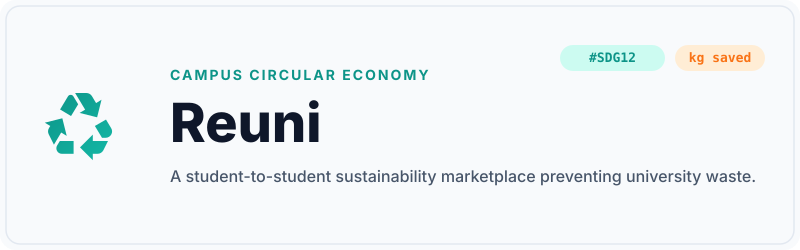
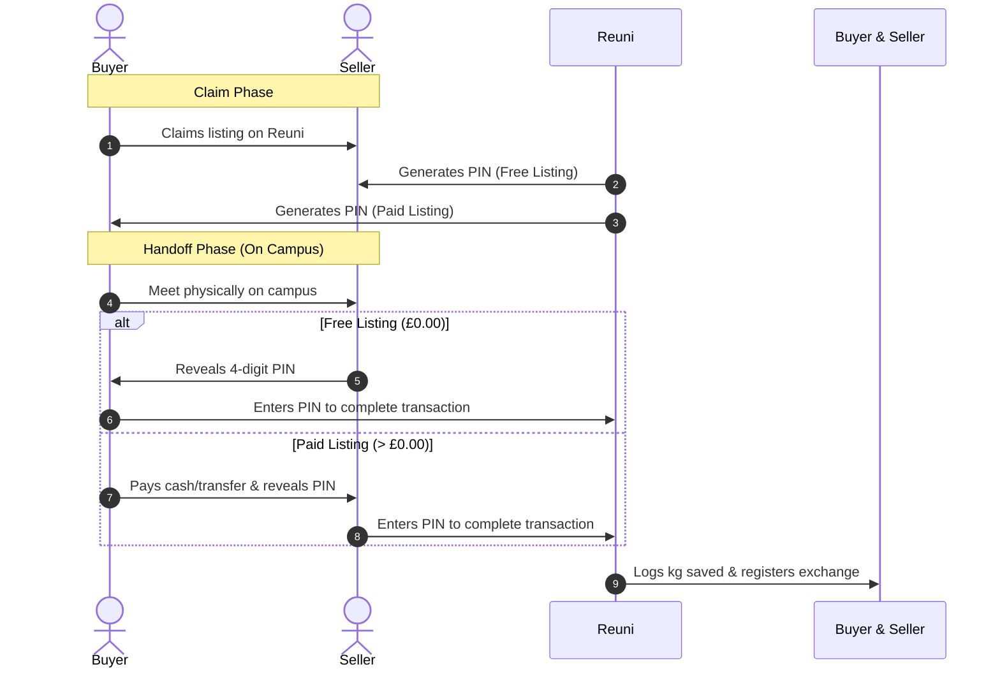
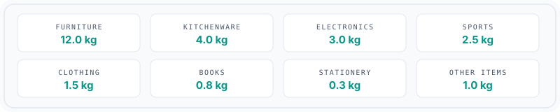

<div align="center">
  
  
  <br /><br />
  
  <h3>Preventing campus waste, one transaction at a time.</h3>
  
  <p size="4">
    Reuni connects students and staff on campus to trade, donate, and recycle goods. By replacing shipping with face-to-face handoffs and measuring impact in real kilograms saved, Reuni turns sustainability into a tangible, campus-wide habit.
  </p>

  <br />

  
</div>

<br /><br />

<hr />
<br /><br />

## Core Strategic Principles

<br />

<table width="100%" cellpadding="12" cellspacing="0">
  <tr>
    <td width="50%" align="center" valign="top">
      <br />
      <picture>
        <source media="(prefers-color-scheme: dark)" srcset="https://api.iconify.design/mdi:map-marker-outline.svg?color=%2370B8AE">
        
      </picture>
      <br /><br />
      <small style="color: #0D9488; letter-spacing: 2px; font-weight: 700; font-family: 'JetBrains Mono', monospace; font-size: 0.75rem;">SINGLE NODE FIRST</small>
      <br /><br />
      <h4 align="center">Single Node Deployment</h4>
      <p align="center">Launched exclusively at Oxford Brookes University (<code>brookes.ac.uk</code>). High density eliminates shipping logistics, packaging, and delivery emissions—all handoffs are face-to-face on campus.</p>
      <br />
    </td>
    <td width="50%" align="center" valign="top">
      <br />
      <picture>
        <source media="(prefers-color-scheme: dark)" srcset="https://api.iconify.design/mdi:scale-balance.svg?color=%2370B8AE">
        
      </picture>
      <br /><br />
      <small style="color: #0D9488; letter-spacing: 2px; font-weight: 700; font-family: 'JetBrains Mono', monospace; font-size: 0.75rem;">ENVIRONMENTAL IMPACT</small>
      <br /><br />
      <h4 align="center">Dynamic Weight Tracking</h4>
      <p align="center">Every transaction records real physical mass (<code>kg saved</code>). This metric is sacred and immutable, feeding directly into university-wide carbon and ESG reports.</p>
      <br />
    </td>
  </tr>
  <tr>
    <td width="50%" align="center" valign="top">
      <br />
      <picture>
        <source media="(prefers-color-scheme: dark)" srcset="https://api.iconify.design/mdi:account-group-outline.svg?color=%2370B8AE">
        
      </picture>
      <br /><br />
      <small style="color: #0D9488; letter-spacing: 2px; font-weight: 700; font-family: 'JetBrains Mono', monospace; font-size: 0.75rem;">DECENTRALIZED TRUST</small>
      <br /><br />
      <h4 align="center">Distributed Jury System</h4>
      <p align="center">A self-governing student jury handles moderation flags. This eliminates manual administration and scales community trust at zero overhead cost.</p>
      <br />
    </td>
    <td width="50%" align="center" valign="top">
      <br />
      <picture>
        <source media="(prefers-color-scheme: dark)" srcset="https://api.iconify.design/mdi:ghost-outline.svg?color=%2370B8AE">
        
      </picture>
      <br /><br />
      <small style="color: #0D9488; letter-spacing: 2px; font-weight: 700; font-family: 'JetBrains Mono', monospace; font-size: 0.75rem;">ALGORITHMIC DEFENSE</small>
      <br /><br />
      <h4 align="center">Shadow Governance</h4>
      <p align="center">Flagged bad actors are algorithmically muted. The platform restricts their reach without warning them, rendering alt-accounts unnecessary.</p>
      <br />
    </td>
  </tr>
  <tr>
    <td width="50%" align="center" valign="top">
      <br />
      <picture>
        <source media="(prefers-color-scheme: dark)" srcset="https://api.iconify.design/mdi:key-outline.svg?color=%2370B8AE">
        
      </picture>
      <br /><br />
      <small style="color: #0D9488; letter-spacing: 2px; font-weight: 700; font-family: 'JetBrains Mono', monospace; font-size: 0.75rem;">TRANSACTION VERIFICATION</small>
      <br /><br />
      <h4 align="center">Secure PIN Handshake</h4>
      <p align="center">Cements physical collections via a secure, atomic 4-digit PIN exchange. For free items, the seller holds the PIN; for paid items, the buyer holds it. Verification happens atomically on handoff.</p>
      <br />
    </td>
    <td width="50%" align="center" valign="top">
      <br />
      <picture>
        <source media="(prefers-color-scheme: dark)" srcset="https://api.iconify.design/material-symbols-light:nest-eco-leaf-outline.svg?color=%2370B8AE" width="28" height="28" alt="Leaf">
        
      </picture>
      <br /><br />
      <small style="color: #0D9488; letter-spacing: 2px; font-weight: 700; font-family: 'JetBrains Mono', monospace; font-size: 0.75rem;">WRAP STANDARDS</small>
      <br /><br />
      <h4 align="center">Carbon Equivalent Metrics</h4>
      <p align="center">Calculates carbon equivalent savings (<code>total_co2e</code> in kg CO₂e) based on item categories and WRAP/DEFRA conversion factors rather than duplicating landfill weight metrics.</p>
      <br />
    </td>
  </tr>
</table>

<br /><br />

<hr />
<br /><br />

## Technology Stack

<br />

### Backend Core

- **Runtime &amp; Core Framework:** `Python 3.x` &amp; `Flask 3.1`
  <br />Handles environment setup, routing configurations, and the request lifecycle.
- **Database &amp; Migrations:** `Flask-SQLAlchemy` &amp; `Flask-Migrate`
  <br />Relational schema mapping, parameterized SQL query structures, and Alembic database migration logs.
- **Security &amp; Auth Guardrails:** `Flask-Login` &amp; `Flask-Limiter` &amp; `Werkzeug (scrypt)`
  <br />User session logic, request rate-limiting blocks, and secure cryptographic password hashing.

<br />

### Image &amp; Integrations

- **Image Validation Pipeline:** `Pillow (PIL)`
  <br />Exif data and metadata removal, listing dimensions compression, and upload validation guards.
- **Email &amp; Communication:** `Brevo API SDK`
  <br />Dispatches transactional sign-up OTP verification codes, password reset sequences, and cancellation alerts.
- **Background Jobs:** `APScheduler`
  <br />Orchestrates background tasks, scheduling the nightly GDPR user data anonymization cron at 2:00 AM.

<br />

### Frontend &amp; Testing

- **Rendering Engine:** `Jinja2` &amp; `Vanilla CSS / JS`
  <br />Buildless page compilation, layout structures styled with CSS Custom Properties, and modular script patterns.
- **Auditing &amp; Testing:** `pytest` &amp; `beautifulsoup4`
  <br />Validates authentication contexts, marketplace transaction steps, settings modifications, and GDPR anonymization loops across 210 test assertions.

<br /><br />

<hr />
<br /><br />

## Developer Portal

<br />

<details>
<summary>🔄 <strong>Transaction Verification Flow (PIN Handshake)</strong> (Click to expand)</summary>
<br />

The physical handoff is verified using a secure 4-digit PIN exchange. The protocol shifts verification roles based on the price configuration to align completion incentives:



<br />
</details>

<br />

<details>
<summary>📁 <strong>Project Architecture &amp; File Map</strong> (Click to expand)</summary>
<br />

```filepath
UniCycle_AI_Master/
│
├── app/                        # Application Source Code
│   ├── routes/                 # Endpoint blueprints
│   │   ├── admin.py            # B2B admin settings & partner invitations
│   │   ├── auth.py             # User signup, login, OTP validation
│   │   ├── items.py            # Marketplace browse, detail, and lifecycle
│   │   ├── messaging.py        # Secure user-to-user in-app chat
│   │   └── partner.py          # ESG dashboards for university partners
│   │
│   ├── static/                 # Static Assets
│   │   ├── css/                # Global style sheets (style.css)
│   │   ├── img/                # Graphics, logos, and README assets
│   │   ├── js/                 # Vanilla JS modules (no inline JS allowed)
│   │   └── uploads/            # Local listing images (ignored in git)
│   │
│   ├── templates/              # Jinja2 HTML templates
│   ├── utils/                  # Helper utilities (email validation, SMS, etc.)
│   ├── config.py               # Flask application configuration classes
│   ├── models.py               # SQLAlchemy database models
│   ├── scheduler.py            # Nightly APScheduler cron setup
│   └── __init__.py             # App factory & security header setup
│
├── instance/                   # Local instance-specific files (e.g., SQLite DB)
├── migrations/                 # Alembic database migration scripts
├── tests/                      # Automated test suite (pytest)
│
├── run.py                      # Flask development server entry point
├── seed.py                     # Demo data population utility
├── promote_admin.py            # Admin bootstrapping CLI tool
├── pentest.py                  # RED Team simulation penetration testing tool
├── requirements.txt            # Python dependencies
└── product_specification.md    # Product and feature specifications
```

<br />
</details>

<br />

<details>
<summary>🚀 <strong>Local Setup &amp; Installation</strong> (Click to expand)</summary>
<br />

### 1. Prerequisites

Ensure you have Python 3.10+ installed on your system.

### 2. Installation

Clone the repository and set up the environment:

```bash
# Create a virtual environment
python -m venv .venv

# Activate the virtual environment
# On Windows (PowerShell):
.venv\Scripts\Activate.ps1
# On Linux/macOS:
source .venv/bin/activate

# Install dependencies
pip install -r requirements.txt
```

### 3. Environment Configuration

Create a `.env` file in the root directory. Copy and configure the following variables:

```env
# Flask Settings
FLASK_APP=run.py
FLASK_ENV=development
DEBUG=True
SECRET_KEY=your-secure-secret-key-here
BASE_URL=http://localhost:5000

# Allowed University Domains (comma-separated)
ALLOWED_UNIVERSITY_DOMAINS=brookes.ac.uk

# Brevo SMTP/Email Configuration
BREVO_API_KEY=your-brevo-api-key-here
BREVO_SENDER_EMAIL=support@reuni.ac.uk

# Storage Provider (local or r2)
STORAGE_PROVIDER=local

# Cloudflare R2 Settings (Required if STORAGE_PROVIDER=r2)
CF_R2_ACCESS_KEY_ID=your-r2-access-key-id
CF_R2_SECRET_ACCESS_KEY=your-r2-secret-access-key
CF_R2_ENDPOINT_URL=https://<account-id>.r2.cloudflarestorage.com
CF_R2_BUCKET_NAME=reuni-uploads
CF_R2_PUBLIC_URL=https://pub-your-bucket-id.r2.dev
```

### 4. Database Setup & Running

Start the development server. On startup, SQLite tables will be created automatically in the `instance/` folder:

```bash
python run.py
```

The server will start at [http://localhost:5000](http://localhost:5000).
<br />

</details>

<br />

<details>
<summary>🔧 <strong>Development &amp; Testing CLI Commands</strong> (Click to expand)</summary>
<br />

Reuni includes command-line tools to seed mock databases, promote accounts, execute unit tests, and perform red team vulnerability testing.

### 1. Database Seeding

Seed the database with mock student accounts, listings, and completed transaction histories for Oxford Brookes University:

```bash
# Seed fresh data (will skip if data exists)
python seed.py

# Force reset (drops all tables and seeds fresh)
python seed.py --force
```

### 2. Administrative Bootstrapping

Promote an existing account or create a new verified admin account. This script is guarded to **only run in debug mode** to protect production databases:

```bash
# Promote or create an admin
python promote_admin.py admin@brookes.ac.uk --name "Yousef (Admin)"
```

_Note: If creating a new account, the script will print a secure, auto-generated password once to stdout._

### 3. Penetration Testing (Red Team Simulation)

Test defenses against security risks (XSS, CSRF, IDOR, brute-force lockout, and rate limiting) using the socket-based penetration testing suite. This script spins up a test server instance and executes simulated attacks:

```bash
python pentest.py
```

### 4. Running the Test Suite

Run the suite of automated tests verifying auth, settings, items, and GDPR cancellation tiers:

```bash
pytest
```

<br />
</details>

<br />

<details>
<summary>🔒 <strong>Security &amp; GDPR Compliance Constraints</strong> (Click to expand)</summary>
<br />

All contributors must adhere strictly to these engineering constraints to prevent security regressions.

### 1. Anti-IDOR (Insecure Direct Object References)

- **Verify Ownership:** Never query or mutate database items by ID alone. Always enforce ownership filters matching the active user session.

  ```python
  # INCORRECT: Dangerous IDOR vulnerability
  item = Item.query.get(item_id)

  # CORRECT: Enforces that the item belongs to the current user
  item = Item.query.filter_by(id=item_id, seller_id=current_user.id).first()
  ```

- **Double-Sided Verification:** Both buyer and seller status must be validated before allowing access to transaction chats, phone details, or PIN verification forms.

### 2. Content Security Policy (CSP) & Sandboxing

- **Zero Inline JavaScript:** Writing `<script>` blocks inside templates or embedding inline handlers (e.g. `onclick=""`, `onchange=""`) is strictly forbidden. All Javascript must be written in modular files within `app/static/js/` and loaded as external scripts.
- **Style Nonces:** If inline style sheets are absolutely necessary, they must utilize style nonces: `<style nonce="{{ csp_nonce }}">`.
- **Safe Data Injection:** Safely pass variables from Jinja to JS using HTML data attributes (e.g. `data-user-id="{{ user.id }}"`) or using JSON script blocks:
  ```html
  <script type="application/json" id="config-weights">
    {{ weights | tojson | safe }}
  </script>
  ```

### 3. GDPR Compliance & Privacy

- **Log Hashing (No PII):** Never output emails, phone numbers, or names to standard log files.
- **SHA-256 Email Hashing:** When logging audit activities or login attempts, hash the email address before writing to disk:
  ```python
  hashed_email = hashlib.sha256(email.strip().lower().encode('utf-8')).hexdigest()[:16]
  ```
- **Auto-Increment ID Logging:** Identify users, claims, and listings in logging statements strictly by their database auto-increment integer IDs.
- **Representation Cleansing:** Model representations (`__repr__`) must never serialize sensitive properties (`email`, `phone`, `title`, or `name`).

### 4. Authentication & Password Hardening

- **Generic Error Feedback:** Forms for logins, registrations, lockouts, and resets must return generic responses (e.g. _"Invalid credentials"_ or _"Verification code sent"_) to prevent user and email enumeration.
- **Bcrypt DoS Protection:** Limit user password fields on registration and reset forms to a maximum of 128 characters to prevent CPU exhaustion.
- **Timing-Safe Verifications:** Compare verification pins, security codes, and tokens using `secrets.compare_digest()` to eliminate side-channel timing attacks.
- **Session Fixation Mitigation:** Run `session.clear()` immediately before authenticating a user on login.
<br />
</details>

<br /><br />

<hr />
<br /><br />

## Kilograms Saved & Landfill Weights

<br />

The dynamic estimation of `kg saved` is computed using WRAP/DEFRA environmental data coefficients configured in `app/models.py`.

<br />

<div align="center">
  
</div>

<br /><br />

> [!NOTE]
> If an account is deleted under GDPR Right to Erasure, the user's personal profile statistics are zeroed, but individual sold items retain their `kg_saved` and `university_domain` properties. Global or campus-wide environmental metrics must query and sum items directly (`Item.kg_saved`) where `is_sold=True` rather than summing user profile fields to avoid undercounting.

<br />
