# Reuni — Complete Architectural Map

> **Project:** Reuni (formerly UniCycle)
> **Author:** Yousef · **University:** Oxford Brookes (`brookes.ac.uk`)
> **Mission:** A hyper-local campus circular-economy marketplace supporting UN SDG 12 — Responsible Consumption & Production
> **Current Version:** Phase 1 MVP (fully built and tested)

---

## Table of Contents

1. [What Is Reuni?](#1-what-is-reuni)
2. [Tech Stack](#2-tech-stack)
3. [Project Directory Structure](#3-project-directory-structure)
4. [System Architecture Overview](#4-system-architecture-overview)
5. [Application Factory & Extensions](#5-application-factory--extensions)
6. [Configuration System](#6-configuration-system)
7. [Database Models & Schema](#7-database-models--schema)
8. [Blueprints & Route Map](#8-blueprints--route-map)
9. [Utility Modules](#9-utility-modules)
10. [Template Hierarchy & Frontend](#10-template-hierarchy--frontend)
11. [Static Assets](#11-static-assets)
12. [Authentication & Authorisation Flow](#12-authentication--authorisation-flow)
13. [Marketplace & Transaction Flow](#13-marketplace--transaction-flow)
14. [PIN Handshake Protocol](#14-pin-handshake-protocol)
15. [Cancellation & Reputation System](#15-cancellation--reputation-system)
16. [B2B Partner & Admin System](#16-b2b-partner--admin-system)
17. [GDPR Compliance & Account Deletion](#17-gdpr-compliance--account-deletion)
18. [Background Jobs](#18-background-jobs)
19. [Security Layers](#19-security-layers)
20. [Email System](#20-email-system)
21. [Test Suite](#21-test-suite)
22. [Operational Scripts](#22-operational-scripts)
23. [Environment Variables](#23-environment-variables)
24. [Key Design Decisions & Patterns](#24-key-design-decisions--patterns)

---

## 1. What Is Reuni?

Reuni is a **student-to-student sustainability marketplace** that prevents university waste. Students buy, sell, and donate items — keeping them out of landfill — and the platform tracks environmental impact in **real kilograms saved** (`kg_saved`).

### Core Concepts

| Concept | Description |
|---------|-------------|
| **Single node** | Launches at Oxford Brookes only. All handoffs are in-person on campus. |
| **Weight, not points** | Every transaction records real `kg_saved` based on WRAP UK data. |
| **PIN Handshake** | 4-digit PIN exchange proves physical collection happened. |
| **WhatsApp Bypass** | No in-app chat; phone numbers are revealed after claiming for WhatsApp coordination. |
| **B2B ESG Dashboard** | Universities get a free ESG dashboard showing campus sustainability metrics. |
| **GDPR Compliant** | UK GDPR-compliant with account deletion, data anonymisation, and a privacy policy. |

### User Roles

| Role | Description | Access |
|------|-------------|--------|
| `student` | Default role. Can list, buy, sell, claim items. | Marketplace, Dashboard, Profile, Settings |
| `partner` | University sustainability office staff. | Partner ESG Dashboard + student features (if `.ac.uk` email) |
| `admin` | System administrator. | Admin panel, Partner management, Partner Dashboard (global view) |

---

## 2. Tech Stack

| Layer | Technology |
|-------|-----------|
| **Language** | Python 3.x |
| **Framework** | Flask 3.1 |
| **ORM** | Flask-SQLAlchemy (SQLAlchemy) |
| **Database** | SQLite (dev/test) → PostgreSQL (prod) |
| **Migrations** | Flask-Migrate (Alembic) |
| **Auth** | Flask-Login (session-based) |
| **CSRF** | Flask-WTF (`CSRFProtect`) |
| **Rate Limiting** | Flask-Limiter (in-memory storage) |
| **Email (transactional)** | Brevo SDK (Python) for OTP; Flask-Mail for all other emails |
| **Password Hashing** | Werkzeug (`scrypt` / PBKDF2+SHA256) |
| **Token Signing** | `itsdangerous` (`URLSafeTimedSerializer`) |
| **Image Processing** | Pillow (resize, EXIF strip, format validation, JPEG compilation) |
| **Background Jobs** | APScheduler (`BackgroundScheduler`) |
| **Templates** | Jinja2 |
| **CSS** | Vanilla CSS design system (Plus Jakarta Sans font, WCAG AA) |
| **Frontend JS** | Vanilla JavaScript (`app.js`) |
| **Testing** | pytest + in-memory SQLite |
| **Prod Server** | Gunicorn |
| **Prod DB Driver** | psycopg (binary) |

### Dependencies (`requirements.txt`)

```
Flask==3.1.*
Flask-SQLAlchemy==3.1.*
Flask-Login==0.6.*
Flask-WTF==1.2.*
Flask-Limiter==3.8.*
Flask-Migrate==4.1.*
python-dotenv==1.1.*
Werkzeug==3.1.*
Pillow==11.*
pytest==8.*
Flask-Mail==0.10.0
brevo-python>=4.0.0
apscheduler==3.10.*
gunicorn>=21.2.0
psycopg[binary]>=3.0
```

---

## 3. Project Directory Structure

```
UniCycle_AI_Master/
├── app/                            # Main application package
│   ├── __init__.py                 # Application factory (create_app), extensions, core routes
│   ├── config.py                   # Configuration classes (Dev, Test, Prod)
│   ├── models.py                   # SQLAlchemy models (User, Item, CancellationRecord)
│   ├── scheduler.py                # APScheduler GDPR nightly anonymisation job
│   ├── routes/                     # Flask Blueprints
│   │   ├── __init__.py
│   │   ├── auth.py                 # Authentication blueprint (register, login, OTP, password reset)
│   │   ├── items.py                # Items blueprint (CRUD, buy/claim, PIN handshake, cancellation)
│   │   ├── partner.py              # Partner blueprint (ESG dashboard)
│   │   └── admin.py                # Admin blueprint (partner management, invites)
│   ├── utils/                      # Utility modules
│   │   ├── cancellation.py         # Cancellation tier logic & messaging
│   │   ├── decorators.py           # Custom decorators (verified_required, partner_required, admin_required)
│   │   ├── email_validation.py     # University domain extraction & validation
│   │   └── tokens.py               # Token generation/verification (partner invites, password resets)
│   ├── templates/                  # Jinja2 templates
│   │   ├── base.html               # Master layout (navbar, flash messages, footer)
│   │   ├── index.html              # Marketplace home (browse, search, filter)
│   │   ├── dashboard.html          # User dashboard (my listings, claims, purchases)
│   │   ├── profile.html            # User profile page
│   │   ├── settings.html           # Account settings (phone, password, delete account)
│   │   ├── privacy.html            # Privacy policy page
│   │   ├── auth/                   # Authentication pages
│   │   │   ├── login.html
│   │   │   ├── register.html
│   │   │   ├── verify_email.html
│   │   │   ├── resend_verification.html
│   │   │   ├── forgot_password.html
│   │   │   └── reset_password.html
│   │   ├── items/                  # Item-related pages
│   │   │   ├── list_item.html      # Create new listing form
│   │   │   ├── detail.html         # Item detail page
│   │   │   ├── edit_item.html      # Edit listing form
│   │   │   └── pin.html            # PIN handshake page
│   │   ├── partner/                # B2B partner pages
│   │   │   ├── dashboard.html      # ESG metrics dashboard
│   │   │   └── invite_register.html # Partner invite registration
│   │   ├── admin/                  # Admin pages
│   │   │   └── partners.html       # Partner management panel
│   │   └── errors/                 # Custom error pages
│   │       ├── 404.html
│   │       └── 500.html
│   └── static/                     # Static assets
│       ├── css/
│       │   └── style.css           # Complete design system (~92KB)
│       ├── js/
│       │   └── app.js              # Client-side JavaScript (~5KB)
│       ├── images/                 # App images (logo, hero, etc.)
│       ├── img/                    # Runtime images (e.g., cached university logos)
│       ├── seed_images/            # Pre-made images for database seeding
│       └── uploads/                # User-uploaded item photos (UUID-named .jpg files)
├── tests/                          # Test suite
│   ├── conftest.py                 # Shared fixtures (app, client, users, items)
│   ├── test_admin.py               # Admin panel tests
│   ├── test_auth.py                # Authentication tests (registration, login, lockout, OTP)
│   ├── test_cancellation.py        # Cancellation tier tests
│   ├── test_config.py              # Configuration validation tests
│   ├── test_email_validation.py    # Email domain extraction tests
│   ├── test_errors.py              # Custom error page tests
│   ├── test_gdpr.py                # GDPR account deletion tests
│   ├── test_handshake.py           # PIN handshake protocol tests
│   ├── test_index.py               # Marketplace browse/filter/pagination tests
│   ├── test_items.py               # Item CRUD tests
│   ├── test_models.py              # Model unit tests
│   ├── test_partner.py             # Partner dashboard tests
│   └── test_settings.py            # Settings page tests (phone, password)
├── migrations/                     # Alembic migration scripts
│   ├── alembic.ini
│   ├── env.py
│   ├── script.py.mako
│   └── versions/                   # Generated migration files
├── instance/                       # Instance folder (SQLite DB lives here)
├── run.py                          # Entry point (python run.py)
├── seed.py                         # Database seeder (demo data with placeholder images)
├── promote_admin.py                # CLI script to promote a user to admin role
├── requirements.txt                # Python dependencies
├── product_specification.md        # Full product specification document
├── .env                            # Environment variables (gitignored)
├── .env.example                    # Template for .env
├── .gitignore
└── .editorconfig
```

---

## 4. System Architecture Overview

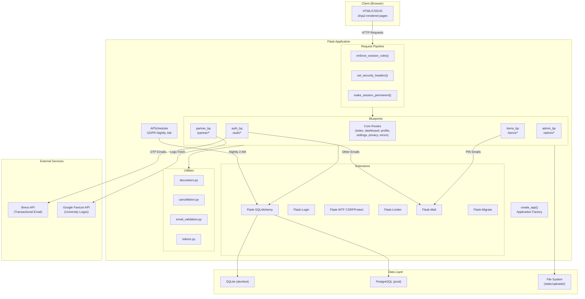

---

## 5. Application Factory & Extensions

The app uses the **Application Factory pattern** defined in `app/__init__.py`:

```python
# app/__init__.py — Key Structure
db = SQLAlchemy()
login_manager = LoginManager()
csrf = CSRFProtect()
migrate = Migrate()
limiter = Limiter(key_func=get_remote_address, default_limits=["1000 per day", "100 per hour"])
mail = Mail()

def create_app(config_class=None):
    app = Flask(__name__)
    # Load config, bind extensions, register blueprints, set up middleware
    return app
```

### What `create_app()` Does (in order)

1. **Loads configuration** — defaults to `DevelopmentConfig`
2. **Creates directories** — `instance/` (for SQLite), `static/uploads/`
3. **Binds extensions** — `db`, `login_manager`, `csrf`, `migrate`, `mail`, `limiter`
4. **Configures logging** — Rotating file handler (`Reuni.log`, 10MB, 10 backups) in non-debug
5. **Registers `user_loader`** — Flask-Login callback
6. **Registers `before_request` hooks**:
   - `enforce_session_rules()` — deactivated account check + partner 7-day session expiry
   - `make_session_permanent()` — enables permanent sessions (7-day lifetime)
7. **Registers 4 blueprints** — `auth_bp`, `items_bp`, `partner_bp`, `admin_bp`
8. **Defines core routes** — `index`, `dashboard`, `profile`, `settings/*`, `privacy`, `delete_account`
9. **Registers error handlers** — 404, 500, 413 (file too large)
10. **Sets security headers** — `after_request` hook for CSP, X-Frame-Options, etc.
11. **Creates tables** — only in testing mode (in-memory SQLite)
12. **Initialises scheduler** — GDPR nightly anonymisation job
13. **Auto-runs migrations** — in production (non-testing, non-debug)

### Core Routes (defined directly in `app/__init__.py`)

These routes don't belong to any blueprint — they're registered directly on the `app` object:

| Route | Methods | Auth | Description |
|-------|---------|------|-------------|
| `/` | GET | Public | Marketplace home — browse, search, filter items |
| `/dashboard` | GET | `@login_required` | User's listings, claims, and purchases |
| `/profile` | GET | `@login_required` | User profile (stats: listed, sold, bought) |
| `/settings` | GET | `@login_required` `@verified_required` | Settings page (phone, password, delete) |
| `/settings/phone` | POST | `@login_required` `@verified_required` | Update phone number |
| `/settings/password` | POST | `@login_required` `@verified_required` | Change password |
| `/settings/delete` | POST | `@login_required` `@verified_required` `@limiter(3/hr)` | GDPR account deletion |
| `/privacy` | GET | Public | Privacy policy page |

---

## 6. Configuration System

Defined in `app/config.py` with three environment classes:

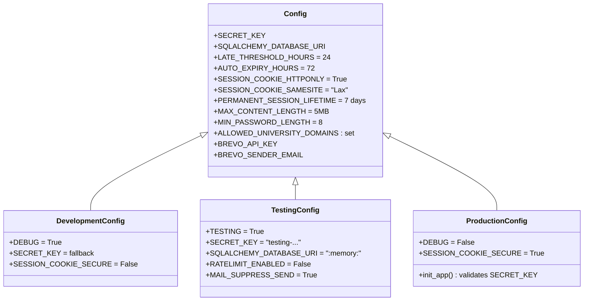

### Key Config Values

| Config Key | Value | Purpose |
|-----------|-------|---------|
| `ALLOWED_UNIVERSITY_DOMAINS` | `{"brookes.ac.uk"}` | Restricts registration to specific `.ac.uk` domains |
| `LATE_THRESHOLD_HOURS` | `24` | Clean vs Late cancellation boundary |
| `AUTO_EXPIRY_HOURS` | `72` | PIN auto-expiry after claiming |
| `MIN_PASSWORD_LENGTH` | `8` | Minimum password length |
| `MAX_CONTENT_LENGTH` | `5MB` | Maximum file upload size |
| `PERMANENT_SESSION_LIFETIME` | `604800` (7 days) | Session cookie expiry |

---

## 7. Database Models & Schema

### Entity-Relationship Diagram

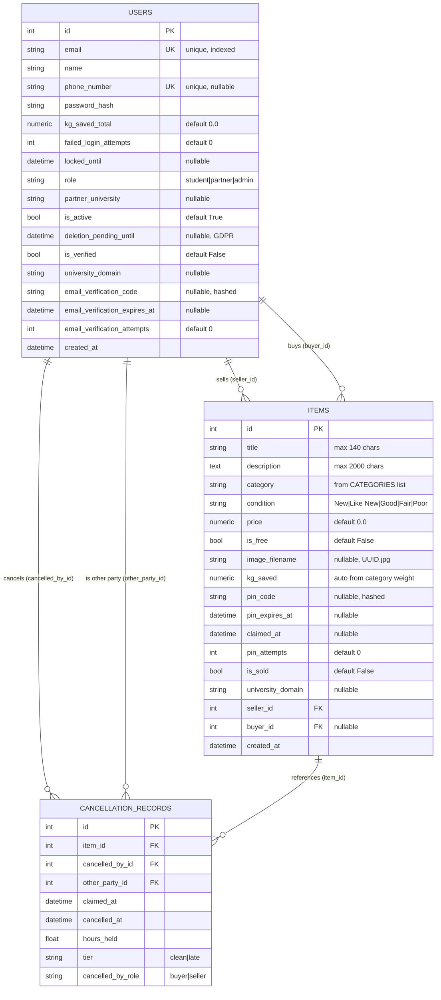

### Model: `User`

Located in `app/models.py`. Extends `UserMixin` (Flask-Login) and `db.Model`.

**Key Methods:**
- `set_password(password)` — hashes and stores password via Werkzeug
- `check_password(password)` — verifies password against hash
- `anonymise()` — GDPR data wipe: replaces name/email/phone/password with anonymised values, zeros `kg_saved_total`, clears verification fields

**Key Properties:**
- `is_partner` → `self.role == 'partner'`
- `is_admin` → `self.role == 'admin'`

**Relationships:**
- `items` → one-to-many via `seller_id`
- `purchases` → one-to-many via `buyer_id` (backref on Item)
- `cancellations_initiated` → via `cancelled_by_id`
- `cancellations_received` → via `other_party_id`

### Model: `Item`

**Key Constants (defined in `models.py`):**

```python
CATEGORY_WEIGHTS = {
    "Furniture": 12.0, "Kitchenware": 4.0, "Electronics": 3.0,
    "Sports": 2.5, "Clothing": 1.5, "Books": 0.8,
    "Stationery": 0.3, "Other": 1.0
}
CATEGORIES = list(CATEGORY_WEIGHTS.keys())
CONDITION_CHOICES = ["New", "Like New", "Good", "Fair", "Poor"]
ALLOWED_EXTENSIONS = {"jpg", "jpeg", "png", "webp"}
MAX_IMAGE_SIZE = 800  # pixels
```

### Model: `CancellationRecord`

An **immutable audit log** that records every cancelled claim. Used to build reputation data for the future trust score system.

---

## 8. Blueprints & Route Map

### Overview

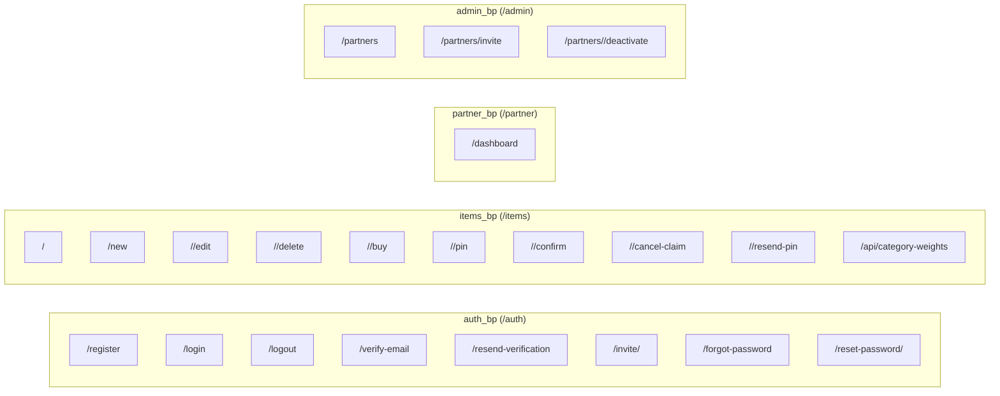

### Complete Route Table

#### `auth_bp` — Authentication (`/auth`)

| Route | Methods | Auth | Rate Limit | Purpose |
|-------|---------|------|-----------|---------|
| `/auth/register` | GET, POST | Public | — | Student registration with OTP email |
| `/auth/login` | GET, POST | Public | 10/min (IP:email) | Login with lockout after 5 fails |
| `/auth/logout` | POST | `@login_required` | — | Logout and session clear |
| `/auth/verify-email` | GET, POST | Public (session) | — | Enter 6-digit OTP code |
| `/auth/resend-verification` | GET, POST | Public | 10/hr (email) | Resend OTP email |
| `/auth/invite/<token>` | GET, POST | Public | — | Partner invite registration |
| `/auth/forgot-password` | GET, POST | Public | 3/hr (email) | Request password reset email |
| `/auth/reset-password/<token>` | GET, POST | Public | — | Set new password via token |

#### `items_bp` — Items & Transactions (`/items`)

| Route | Methods | Auth | Rate Limit | Purpose |
|-------|---------|------|-----------|---------|
| `/items/<id>` | GET | Public | — | Item detail page |
| `/items/new` | GET, POST | `@login_required` `@verified_required` | — | Create a new listing |
| `/items/<id>/edit` | GET, POST | `@login_required` (owner only) | — | Edit an existing listing |
| `/items/<id>/delete` | POST | `@login_required` (owner only) | — | Delete a listing |
| `/items/<id>/buy` | POST | `@login_required` `@verified_required` | — | Claim/buy an item (atomic) |
| `/items/<id>/pin` | GET | `@login_required` (buyer/seller) | — | View PIN handshake page |
| `/items/<id>/confirm` | POST | `@login_required` (enterer only) | — | Submit PIN to complete transaction |
| `/items/<id>/cancel-claim` | POST | `@login_required` (buyer/seller) | — | Cancel a pending claim |
| `/items/<id>/resend-pin` | POST | `@login_required` (holder only) | 3/hr | Regenerate and re-email PIN |
| `/items/api/category-weights` | GET | Public | — | JSON API: category → weight mapping |

#### `partner_bp` — B2B Partner Dashboard (`/partner`)

| Route | Methods | Auth | Purpose |
|-------|---------|------|---------|
| `/partner/dashboard` | GET | `@login_required` `@partner_required` | ESG metrics dashboard |

#### `admin_bp` — Admin Panel (`/admin`)

| Route | Methods | Auth | Purpose |
|-------|---------|------|---------|
| `/admin/partners` | GET | `@login_required` `@admin_required` | List all partner accounts |
| `/admin/partners/invite` | POST | `@login_required` `@admin_required` | Generate timed invite link |
| `/admin/partners/<id>/deactivate` | POST | `@login_required` `@admin_required` | Deactivate a partner account |

---

## 9. Utility Modules

### `app/utils/decorators.py`

Three custom decorators stacked below `@login_required`:

| Decorator | Purpose | Failure Behaviour |
|-----------|---------|-------------------|
| `@verified_required` | Requires `current_user.is_verified == True` | Redirect to `/auth/resend-verification` |
| `@partner_required` | Requires role `partner` or `admin` | Redirect to `/dashboard` |
| `@admin_required` | Requires role `admin` | `abort(403)` |

### `app/utils/email_validation.py`

| Function | Signature | Purpose |
|----------|-----------|---------|
| `extract_university_domain(email)` | `str → str \| None` | Extracts domain from valid `.ac.uk` email |
| `is_domain_allowed(domain, allowed_domains)` | `str, set → bool` | Checks domain against allowed set (empty = allow all) |

### `app/utils/cancellation.py`

| Function | Purpose |
|----------|---------|
| `calculate_hours_held(claimed_at)` | Returns hours elapsed since claim, rounded to 2dp |
| `get_cancellation_tier(claimed_at)` | Returns `"clean"` (≤24h) or `"late"` (>24h) |
| `get_tier_message_for_canceller(tier, role)` | Flash message for the person who cancelled |
| `get_tier_message_for_other_party(tier, role, ...)` | Email body for the other party |

### `app/utils/tokens.py`

| Function | Purpose | Token Expiry |
|----------|---------|-------------|
| `generate_partner_invite_token(domain, secret)` | Creates signed partner invite URL token | 48 hours |
| `verify_partner_invite_token(token, secret)` | Validates and returns university domain | 48 hours |
| `generate_password_reset_token(email, pw_hash, secret)` | Creates password reset token (salt = current password hash) | 1 hour |
| `verify_password_reset_token(token, pw_hash, secret)` | Validates reset token (auto-invalidated on password change) | 1 hour |

---

## 10. Template Hierarchy & Frontend

### Template Inheritance

```mermaid
graph TD
    Base["base.html<br/>(master layout)"]
    Base --> Index["index.html<br/>Marketplace"]
    Base --> Dashboard["dashboard.html"]
    Base --> Profile["profile.html"]
    Base --> Settings["settings.html"]
    Base --> Privacy["privacy.html"]

    Base --> Login["auth/login.html"]
    Base --> Register["auth/register.html"]
    Base --> VerifyEmail["auth/verify_email.html"]
    Base --> ResendVerif["auth/resend_verification.html"]
    Base --> ForgotPw["auth/forgot_password.html"]
    Base --> ResetPw["auth/reset_password.html"]

    Base --> Detail["items/detail.html"]
    Base --> ListItem["items/list_item.html"]
    Base --> EditItem["items/edit_item.html"]
    Base --> Pin["items/pin.html"]

    Base --> PartnerDash["partner/dashboard.html"]
    Base --> InviteReg["partner/invite_register.html"]

    Base --> AdminPartners["admin/partners.html"]

    Base --> Error404["errors/404.html"]
    Base --> Error500["errors/500.html"]
```

### `base.html` — What It Provides

- **Google Fonts** — Plus Jakarta Sans (400, 500, 700)
- **Responsive navbar** — Logo, navigation links, user dropdown (desktop), mobile hamburger
- **Flash message container** — Auto-renders Flask flash messages with category-based styling
- **Footer** — Copyright, links
- **Jinja2 blocks**: ``, ``, ``, ``
- **CSRF meta tag** — Available for JS fetch requests
- **Dark mode toggle** — Theme switcher

### Page Count: **21 templates total**

| Category | Count | Templates |
|----------|-------|-----------|
| Core | 6 | base, index, dashboard, profile, settings, privacy |
| Auth | 6 | login, register, verify_email, resend_verification, forgot_password, reset_password |
| Items | 4 | list_item, detail, edit_item, pin |
| Partner | 2 | dashboard, invite_register |
| Admin | 1 | partners |
| Errors | 2 | 404, 500 |

---

## 11. Static Assets

| Path | Description |
|------|-------------|
| `static/css/style.css` | Complete vanilla CSS design system (~92KB). Defines CSS custom properties, responsive grid, card components, form styles, marketplace filters, dark mode, animations. |
| `static/js/app.js` | Client-side JS (~5KB). Handles dark mode toggle, mobile menu, marketplace filter interactions, dynamic form behaviours (free/paid toggle), character counters. |
| `static/images/` | App-level images (logo, hero images, icons) |
| `static/img/` | Runtime-cached images (e.g., university logos fetched from Google Favicon API) |
| `static/seed_images/` | Pre-made product images used by `seed.py` |
| `static/uploads/` | User-uploaded item photos. UUID-named `.jpg` files. EXIF-stripped, resized to max 800px. |

### Design System Highlights

| Token | Light | Dark | Usage |
|-------|-------|------|-------|
| `--primary` | `#0D9488` (Teal) | `#70B8AE` | CTAs, links, kg_saved badges |
| `--accent` | `#F97316` (Orange) | `#FB923C` | Claim buttons, notifications |
| `--danger` | `#EF4444` (Red) | `#F87171` | Delete, error states |
| `--bg` | `#F8FAFC` | `#0F172A` | Page background |
| `--surface` | `#FFFFFF` | `#1E293B` | Cards, modals |
| **Font** | Plus Jakarta Sans | | 400/500/700 weights |
| **Cards** | `border-radius: 12px` | | Subtle box-shadow, no borders |
| **Buttons** | `border-radius: 8px` | | 44×44px min tap target |

---

## 12. Authentication & Authorisation Flow

### Registration Flow

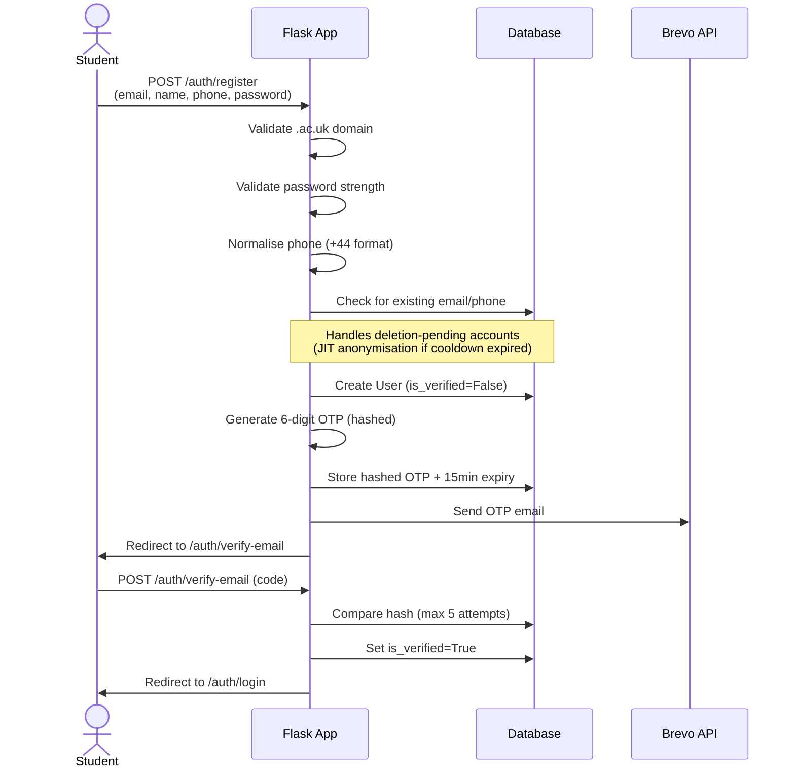

### Login Flow

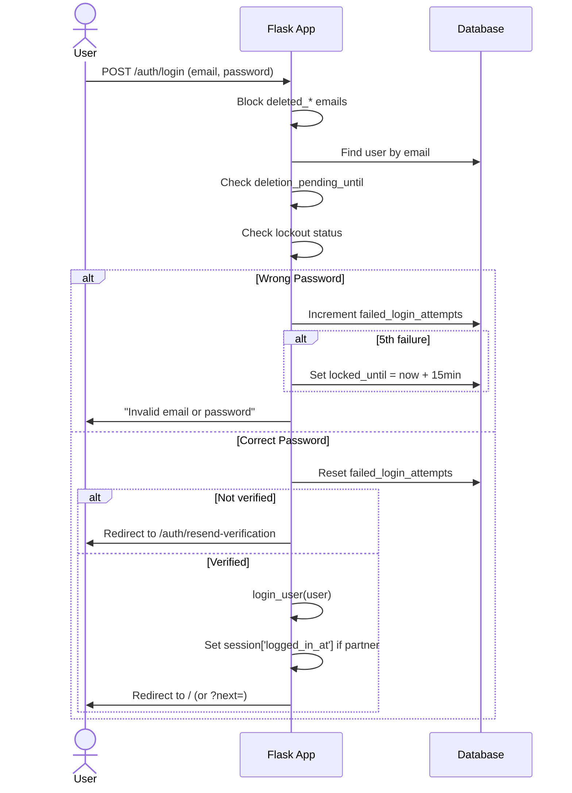

### Access Control Matrix

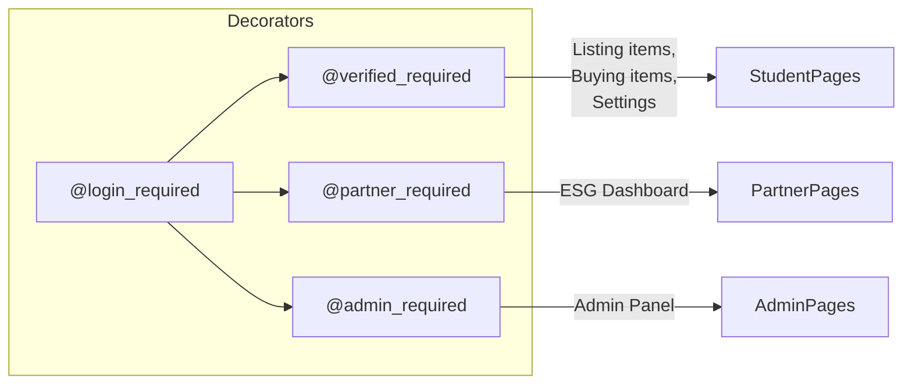

---

## 13. Marketplace & Transaction Flow

### Item Lifecycle State Machine

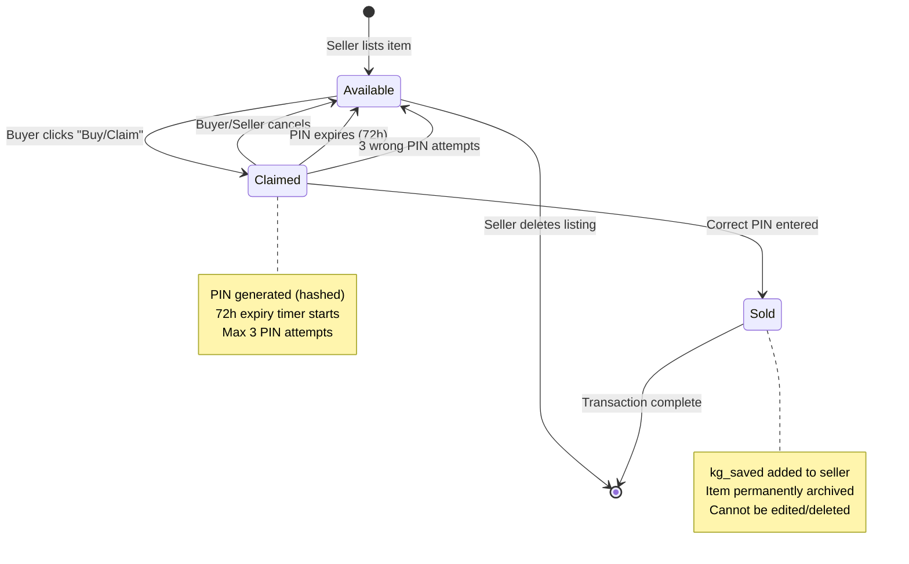

### Marketplace Browse (Index Page)

The `GET /` route supports:

| Filter | Parameter | Behaviour |
|--------|-----------|-----------|
| **Search** | `?q=` | Wildcard-escaped `ILIKE` on `title` |
| **Category** | `?category=` | Exact match from 8 categories |
| **Price Type** | `?price_type=free\|paid\|all` | Filter by `is_free` |
| **Min Price** | `?min_price=` | `price >= value` |
| **Max Price** | `?max_price=` | `price <= value` |
| **Pagination** | `?page=` | 12 items per page, cursor-based |

**Sort order:** Available items first (no buyer), then by `created_at` descending.

### Image Processing Pipeline

When a user uploads an image:

1. **Extension check** — Must be `.jpg`, `.jpeg`, `.png`, or `.webp`
2. **PIL verify** — Opens and verifies the image integrity
3. **Mode conversion** — RGBA/P → RGB
4. **Resize** — Thumbnail to max 800×800px (LANCZOS resampling)
5. **EXIF strip** — Creates a clean image from pixel data (no metadata)
6. **UUID filename** — Saved as `{uuid4_hex}.jpg`
7. **JPEG compression** — Quality 85

---

## 14. PIN Handshake Protocol

The PIN proves physical exchange happened. The holder varies by price:

| Item Type | PIN Holder | PIN Enterer | Why |
|-----------|-----------|-------------|-----|
| **Free (£0)** | **Seller** | **Buyer** | Seller needs proof of collection |
| **Paid (£)** | **Buyer** | **Seller** | Buyer has leverage — only reveals PIN after inspecting item |

### Free Item Flow

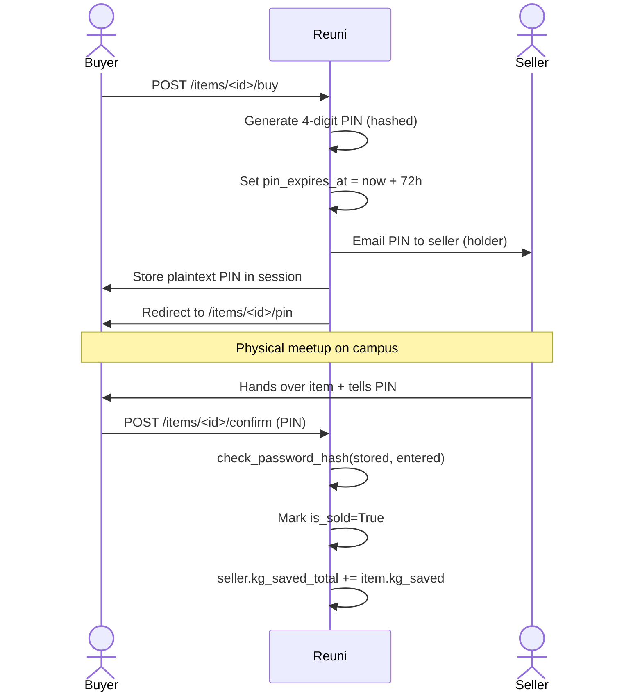

### Paid Item Flow

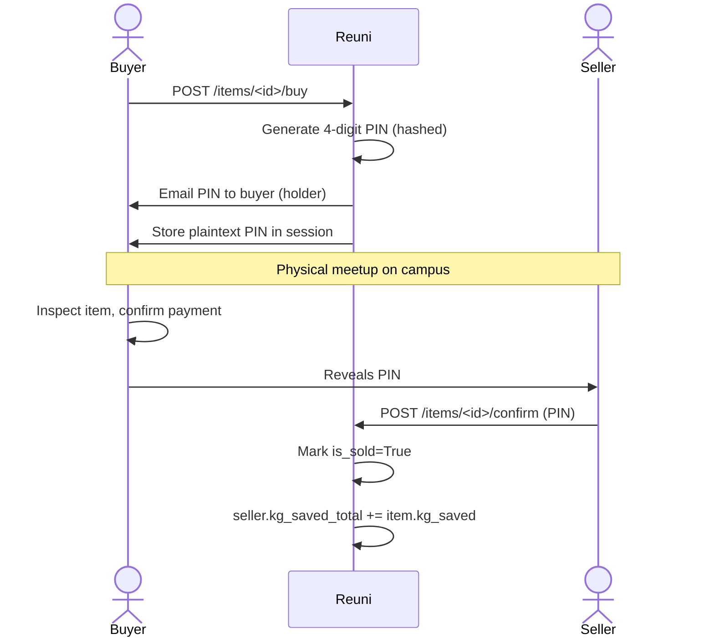

### PIN Safety Mechanisms

| Mechanism | Detail |
|-----------|--------|
| **Atomic claim** | `UPDATE ... WHERE buyer_id IS NULL AND is_sold = False` prevents race conditions |
| **Hashed PIN** | Stored as `generate_password_hash(pin)`, verified with `check_password_hash` |
| **72h auto-expiry** | `pin_expires_at` checked on every PIN page visit and confirmation |
| **3 attempt limit** | After 3 wrong PINs → claim auto-cancelled, item returns to available |
| **PIN resend** | Holder can regenerate PIN (rate-limited 3/hr), resets attempt counter |
| **Session cache** | Plaintext PIN stored in Flask session for immediate display to holder |

---

## 15. Cancellation & Reputation System

### Cancellation Tiers

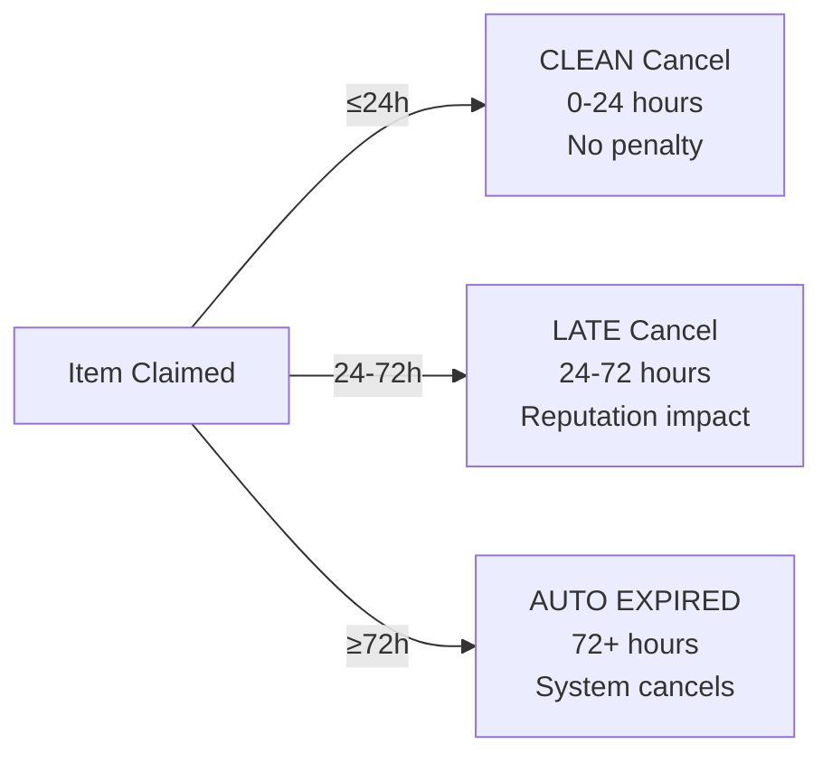

### What Happens on Cancellation

1. Calculate `hours_held` from `claimed_at`
2. Determine tier (`clean` or `late`)
3. Create `CancellationRecord` (immutable audit log)
4. Reset item fields: `buyer_id`, `pin_code`, `pin_expires_at`, `claimed_at`, `pin_attempts` → all nulled
5. Commit atomically (record + item reset)
6. Send email notification to the other party
7. Flash appropriate tier message to the canceller

### CancellationRecord Fields

| Field | Type | Description |
|-------|------|-------------|
| `cancelled_by_id` | FK → User | Who initiated the cancellation |
| `other_party_id` | FK → User | The other party |
| `hours_held` | Float | How long the claim was active |
| `tier` | String | `"clean"` or `"late"` |
| `cancelled_by_role` | String | `"buyer"` or `"seller"` |

> **Note:** Trust score penalties are not yet deducted in Phase 1. The `CancellationRecord` table builds the audit trail that will seed the Phase 2 trust score system.

---

## 16. B2B Partner & Admin System

### Partner Invitation Flow

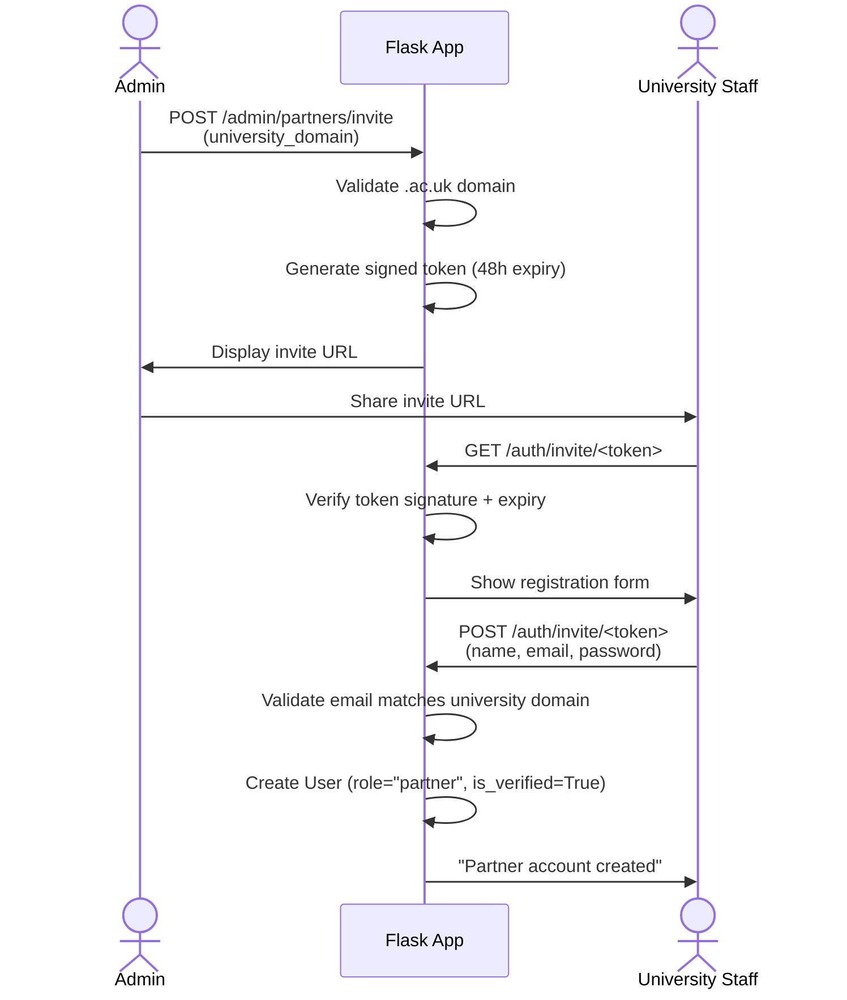

### Partner Dashboard Metrics

The ESG dashboard at `/partner/dashboard` shows:

| Metric | Query |
|--------|-------|
| Total Items Exchanged | `COUNT(items) WHERE is_sold=True AND university_domain=X` |
| Total kg Saved | `SUM(items.kg_saved) WHERE is_sold=True AND university_domain=X` |
| Total Verified Students | `COUNT(users) WHERE role='student' AND is_verified=True AND university_domain=X` |
| Category Breakdown | `GROUP BY category` with counts, kg, and percentages |
| Recent Exchanges | Last 5 sold items with relative timestamps |

**Admin global view:** If the logged-in user is an admin without a `partner_university`, all university data is shown (global aggregation).

---

## 17. GDPR Compliance & Account Deletion

### Two-Phase Deletion

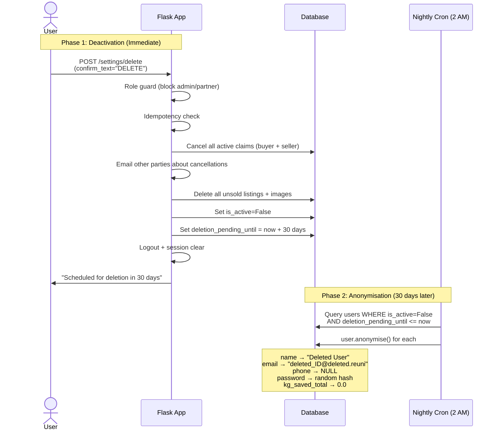

### Anonymisation Details

The `User.anonymise()` method:

| Field | Before | After |
|-------|--------|-------|
| `name` | "Alice Chen" | "Deleted User" |
| `email` | "alice@brookes.ac.uk" | "deleted_42@deleted.reuni" |
| `phone_number` | "+447912345678" | `NULL` (not empty string — avoids unique constraint) |
| `password_hash` | original hash | `generate_password_hash(secrets.token_hex(32))` |
| `kg_saved_total` | 15.5 | 0.0 |
| `is_verified` | True | False |
| `is_active` | False | False |
| `university_domain` | "brookes.ac.uk" | `NULL` |
| `deletion_pending_until` | datetime | `NULL` |

> **Important:** Sold items (`is_sold=True`) retain their `kg_saved` and `university_domain` values. ESG stats must query the `items` table directly, not sum `User.kg_saved_total`.

---

## 18. Background Jobs

### GDPR Anonymisation Scheduler

Defined in `app/scheduler.py`:

```python
# Runs at 2:00 AM every night
scheduler.add_job(anonymise_expired_accounts, 'cron', hour=2, minute=0, args=[app])
```

**Behaviour:**
- Queries users where `is_active=False` AND `deletion_pending_until <= now`
- Calls `user.anonymise()` on each
- Commits in a single transaction
- Logs results: `"GDPR Nightly Clean: Successfully anonymised N user account(s)."`
- **Disabled** in testing mode and in the Werkzeug reloader master process

---

## 19. Security Layers

### Defence-in-Depth Overview

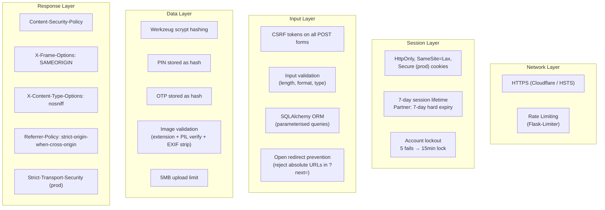

### Security Headers (set on every response)

| Header | Value |
|--------|-------|
| `X-Content-Type-Options` | `nosniff` |
| `X-Frame-Options` | `SAMEORIGIN` |
| `Referrer-Policy` | `strict-origin-when-cross-origin` |
| `Content-Security-Policy` | `default-src 'self'; script-src 'self' 'unsafe-inline'; style-src 'self' 'unsafe-inline' https://fonts.googleapis.com; font-src 'self' https://fonts.gstatic.com; img-src 'self' data:; connect-src 'self'` |
| `Strict-Transport-Security` | `max-age=31536000; includeSubDomains` (prod only) |

### Rate Limits

| Endpoint | Limit | Key Function |
|----------|-------|-------------|
| Login | 10/min | IP + email combination |
| Resend Verification | 10/hr | Email address |
| Forgot Password | 3/hr | Email address |
| Resend PIN | 3/hr | IP address |
| Delete Account | 3/hr | User ID |
| Global default | 1000/day, 100/hr | IP address |

---

## 20. Email System

### Dual Email Infrastructure

| Service | Used For | Integration |
|---------|----------|-------------|
| **Brevo SDK** | OTP verification emails only | `brevo-python` API client, HTML-formatted |
| **Flask-Mail** | All other transactional emails | SMTP-based, plain text |

### Email Types Sent

| Event | Recipient | Service | Content |
|-------|-----------|---------|---------|
| Registration OTP | New user | Brevo | 6-digit code, 15min expiry |
| Password reset link | User | Flask-Mail | Signed URL, 1hr expiry |
| PIN delivery | PIN holder | Flask-Mail | 4-digit PIN + exchange instructions |
| PIN resend | PIN holder | Flask-Mail | New 4-digit PIN |
| Claim cancellation | Other party | Flask-Mail | Who cancelled, tier info, item link |
| GDPR claim cancellation | Buyer/Seller | Flask-Mail | Account deletion notification |
| Partner welcome | New partner | Flask-Mail | Account creation confirmation |
| Partner deactivation | Partner | Flask-Mail | Access revoked notification |

---

## 21. Test Suite

### Test Configuration

| Setting | Value |
|---------|-------|
| Framework | pytest |
| Database | In-memory SQLite (`sqlite:///:memory:`) |
| Rate Limiting | Disabled (`RATELIMIT_ENABLED = False`) |
| Email | Suppressed (`MAIL_SUPPRESS_SEND = True`) |
| Allowed Domains | `{"brookes.ac.uk", "university.ac.uk"}` |

### Fixtures (`tests/conftest.py`)

| Fixture | Scope | Description |
|---------|-------|-------------|
| `app` | function | Creates app with `TestingConfig` |
| `client` | function | Flask test client |
| `init_db` | function | Creates tables and provides db session |
| `sample_user` | function | Pre-created verified student user |
| `sample_item` | function | Pre-created item with placeholder image |

### Test File Coverage

| File | Lines | Tests | Coverage Area |
|------|-------|-------|---------------|
| `test_auth.py` | 766 | 35 | Registration, login, OTP, lockout, password reset, open redirect |
| `test_gdpr.py` | 412 | 12 | Account deletion, anonymisation, claim cancellation, role guards |
| `test_handshake.py` | 337 | 18 | PIN generation, confirmation, expiry, wrong PINs, resend |
| `test_items.py` | 262 | 22 | CRUD operations, ownership checks, image validation |
| `test_cancellation.py` | 237 | 12 | Clean/late tiers, buyer/seller roles, email notifications |
| `test_settings.py` | 222 | 17 | Phone update, password change, validation |
| `test_index.py` | 201 | 18 | Search, category filter, price filter, pagination |
| `test_partner.py` | 193 | 6 | Dashboard metrics, access control, global vs scoped views |
| `test_admin.py` | 142 | 22 | Partner invites, deactivation, token validation |
| `test_models.py` | 74 | 11 | Model constructors, password hashing, relationships |
| `test_config.py` | 47 | 6 | Config class assertions, production validation |
| `test_email_validation.py` | 45 | 8 | Domain extraction, allowed domain checks |
| `test_errors.py` | 28 | 2 | 404 and 500 error page rendering |

**Total: 13 test files, 189 tests**

---

## 22. Operational Scripts

### `run.py` — Application Entry Point

```python
from app import create_app
app = create_app()
if __name__ == "__main__":
    app.run(debug=app.config.get("DEBUG", False), port=5000)
```

### `seed.py` — Database Seeder

- Drops all tables and re-creates them
- Creates 3 sample users (Alice, Bob, Cara) with `@university.ac.uk` emails
- Creates 8 sample items across all categories
- Generates placeholder images (coloured rectangles with category/title text) or uses pre-made seed images from `static/seed_images/`
- **Safety guard:** Refuses to run if `app.debug` is False

### `promote_admin.py` — Admin Promotion CLI

Promotes an existing user to the `admin` role via command line.

---

## 23. Environment Variables

Based on `.env.example`:

| Variable | Required | Purpose |
|----------|----------|---------|
| `SECRET_KEY` | **Yes (prod)** | Flask secret key for session signing |
| `DATABASE_URL` | No | Database URI (defaults to SQLite) |
| `BREVO_API_KEY` | No | Brevo API key for transactional emails |
| `BREVO_SENDER_EMAIL` | No | Sender email for Brevo (default: `support@reuni.ac.uk`) |
| `ALLOWED_UNIVERSITY_DOMAINS` | No | Comma-separated `.ac.uk` domains (default: `brookes.ac.uk`) |
| `MAIL_SERVER` | No | SMTP server for Flask-Mail |
| `MAIL_PORT` | No | SMTP port (default: 587) |
| `MAIL_USERNAME` | No | SMTP username |
| `MAIL_PASSWORD` | No | SMTP password |
| `MAIL_USE_TLS` | No | Enable TLS (default: true) |
| `MAIL_USE_SSL` | No | Enable SSL (default: false) |

---

## 24. Key Design Decisions & Patterns

### Architecture Patterns

| Pattern | Implementation |
|---------|---------------|
| **Application Factory** | `create_app()` in `app/__init__.py` |
| **Blueprint modularisation** | 4 blueprints for auth, items, partner, admin |
| **Decorator-based access control** | `@verified_required`, `@partner_required`, `@admin_required` |
| **Atomic database operations** | Claim uses `UPDATE ... WHERE buyer_id IS NULL` to prevent race conditions |
| **Two-phase deletion** | Deactivate → 30-day cooldown → nightly anonymisation |
| **Hashed secrets everywhere** | Passwords, PINs, and OTP codes are all stored as hashes |
| **Config-driven thresholds** | `LATE_THRESHOLD_HOURS`, `AUTO_EXPIRY_HOURS`, `MIN_PASSWORD_LENGTH` |

### Data Flow Conventions

| Convention | Detail |
|-----------|--------|
| **Timezone** | All datetimes stored as offset-naive UTC (`datetime.now(timezone.utc).replace(tzinfo=None)`) |
| **Phone normalisation** | All phones normalised to E.164-ish `+44` format |
| **Email normalisation** | All emails lowercased and stripped |
| **Image storage** | UUID filenames, JPEG format, `static/uploads/` directory |
| **Cascade deletion** | Unsold items deleted with user; sold items preserved (ESG data retention) |

### What The App Does NOT Do

| Concern | Approach |
|---------|----------|
| Payment processing | All payments are in-person (cash / bank transfer) |
| In-app chat | WhatsApp bypass handles all communication |
| GPS tracking | No location services |
| Advertising | No ads, no third-party data sharing |
| Native app | PWA-ready web app (mobile-first design) |

---

## Quick Start for AI Agents

When working on this project:

1. **Entry point:** `run.py` → calls `create_app()` from `app/__init__.py`
2. **Routes live in:** `app/__init__.py` (core) + `app/routes/*.py` (blueprints)
3. **Models live in:** `app/models.py` (3 models: User, Item, CancellationRecord)
4. **Config lives in:** `app/config.py` (3 classes: Dev, Test, Prod)
5. **Tests live in:** `tests/` with shared fixtures in `conftest.py`
6. **Run tests:** `pytest` from project root
7. **Run dev server:** `python run.py` (port 5000, debug mode)
8. **Seed database:** `python seed.py` (dev only)
9. **All templates extend:** `base.html`
10. **All CSS in one file:** `static/css/style.css`
11. **All JS in one file:** `static/js/app.js`
