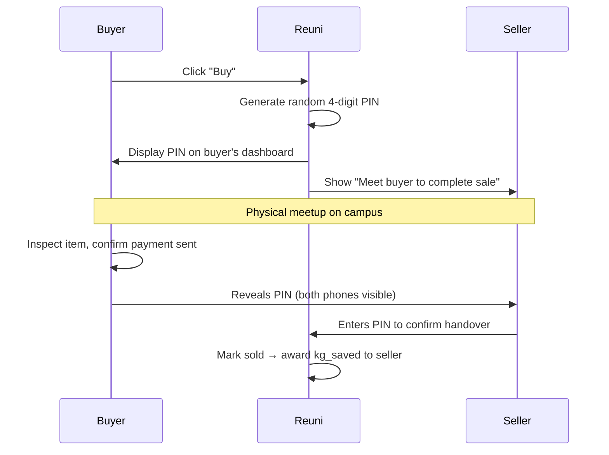
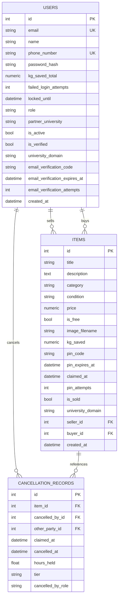

# Reuni — Product Specification

> **Version:** 1.3 · **Date:** 13 June 2026
> **Author:** Yousef / AI Assistant · **University:** Oxford Brookes (`brookes.ac.uk`)
> **Mission:** A hyper-local campus circular-economy platform supporting UN SDG 12 — Responsible Consumption & Production

---

## Table of Contents

1. [Vision & Strategy](#1-vision--strategy)
2. [Phase 1 — Core MVP](#2-phase-1--core-mvp)
3. [Phase 2 — Gamification & Growth](#3-phase-2--gamification--growth)
4. [Phase 3 — Pitch & Monetisation](#4-phase-3--pitch--monetisation)
5. [Phase 4 — Legal & Infrastructure](#5-phase-4--legal--infrastructure)
6. [Phase 5 — Anti-Fraud & Moderation](#6-phase-5--anti-fraud--moderation)
7. [Database Schema Roadmap](#7-database-schema-roadmap)
8. [Security Hardening](#8-security-hardening)
9. [Open Questions & Future Work](#9-open-questions--future-work)

---

## 1. Vision & Strategy

Reuni is a student-to-student sustainability marketplace that prevents university waste. Students buy, sell, and donate items — keeping them out of landfill — and the platform tracks the environmental impact in real kilograms saved.

### Strategic Principles

| Principle               | Implementation                                                                                                         |
| ----------------------- | ---------------------------------------------------------------------------------------------------------------------- |
| **Single node first**   | Launch at Oxford Brookes only. High user density eliminates delivery logistics — all handoffs are in-person on campus. |
| **Weight, not points**  | Every transaction records real `kg saved`. This metric is sacred, immutable, and feeds into university ESG reports.    |
| **Shadow governance**   | Bad actors are algorithmically muted, never publicly banned. The ghost never knows they're a ghost.                    |
| **Zero admin overhead** | No manual moderation team. The platform's user jury system distributes moderation at zero cost.                        |
| **Visa-safe**           | Platform remains 100% free while on Student Visa. Monetisation flips on Graduate Route Visa.                           |

---

## 2. Phase 1 — Core MVP

### 2.1 Tech Stack

| Layer            | Technology                                                                                                  |
| ---------------- | ----------------------------------------------------------------------------------------------------------- |
| Backend          | Python 3.x, Flask 3.1, Flask-SQLAlchemy, Flask-Login, Flask-WTF, Flask-Migrate, Flask-Limiter               |
| Database         | SQLite (dev/test) → PostgreSQL (prod)                                                                       |
| Frontend         | Jinja2 templates, Vanilla CSS + JS (no build step)                                                          |
| CSS              | Vanilla CSS design system (Plus Jakarta Sans font, WCAG AA accessible)                                      |
| Image processing | Pillow (resize, EXIF strip, format validation, JPEG compilation)                                            |
| Auth & Timers    | Session-based via Flask-Login, passwords hashed with Werkzeug (scrypt), tokens timed with `itsdangerous`     |
| Email            | Brevo API SDK (all transactional, password reset, PIN handshake, cancellation, and verification emails)     |
| Background Jobs  | APScheduler `BackgroundScheduler` (nightly GDPR anonymisation cron at 2 AM)                                 |

### 2.2 Current Feature Set (Built)

#### User Authentication & Access Control
- ✅ **Domain-restricted registration:** Signups restricted to allowed university `.ac.uk` email domains (configured in app, defaulting to `brookes.ac.uk`).
- ✅ **Email OTP verification:** Dual-phase signups sending a 6-digit OTP code to the student email (via Brevo API). The code is securely hashed in the DB, expires in 15 minutes, and has a max 5-attempt verification limit.
- ✅ **Brute-force account lockout:** Track failed login attempts and lock user accounts for 15 minutes after 5 consecutive failed logins.
- ✅ **Rate limiting:** Limiter middleware protects auth-sensitive routes (login capped at 10/min, resend-verification at 10/hour, forgot-password at 3/hour).
- ✅ **Open redirect prevention:** Login redirects check and reject external absolute URLs to prevent phishing.
- ✅ **Session hijacking security:** Permanent sessions last 7 days with secure attributes (`HttpOnly`, `SameSite=Lax`, and `Secure` cookies enforced in non-development modes).
- ✅ **Forgot password / Password reset:** Self-service password reset via a time-limited signed email link (1-hour expiry via `itsdangerous`). Token is salted with the user's current password hash — automatically invalidated once the password changes. Rate-limited to 3 requests per hour per email address. Redirect success URL strips email parameters to prevent PII leakage to history and logs.

#### Marketplace & Listing Management
- ✅ **Item Listing & Uploads:** Students can list items with titles, descriptions (max 2000 chars), categories, conditions, prices, or mark them as free. Enforces a price greater than zero (£ > 0.00) for all paid listings.
- ✅ **Image Processing Pipeline:** Validates uploads against whitelisted extensions (JPG, PNG, WebP), verifies format integrity using Pillow, resizes to a max dimension of 800px, strips metadata/EXIF tags for privacy, saves with secure UUID-based filenames, and limits files to 5MB.
- ✅ **Marketplace Browse:** Real-time search (wildcard-escaped), category filtering, price-type filter (free vs. paid), and price range filtering (min/max), using standard page-based pagination (12 items per page).
- ✅ **Listing Lifecycle Management:** Ownership-guarded editing and deletion of listings (blocked once a transaction is pending or sold).

#### Transaction Verification (PIN Handshake Protocol)
- ✅ **Physical Verification Scheme:** Cements physical collection via a secure 4-digit PIN exchange. PIN is generated atomically on claim:
  - **Free Item (£0):** Seller holds the PIN; Buyer inputs it on their phone to confirm receipt.
  - **Paid Item (£):** Buyer holds the PIN; Seller inputs it to confirm collection after receiving payment.
- ✅ **Role-Aware Instructions:** Customized headers guide users (e.g. Free seller vs. Paid seller) on when and who to reveal the PIN to.
- ✅ **PIN Expiry & Rate Limiting:** Timed 72-hour PIN auto-expiry. Capped at 3 failed attempts to enter the PIN before the claim is automatically cancelled and the item is returned to "Available".
- ✅ **PIN Email Delivery & Resend:** Automatically emails PIN codes to the respective code holder; features a resend action rate-limited to 3 times per hour.
- ✅ **WhatsApp Bypass:** Phone numbers normalized (normalizes local 07 to `+44`) and validated as unique to detect alt accounts. The seller's phone number is securely revealed to the buyer only after claiming, with a pre-formatted message link to coordinate meeting.
- ✅ **Phone Number Masking:** Displays masked phone numbers on-screen (e.g., showing only prefix and last 4 digits) to protect user PII from shoulder-surfing/screenshots while preserving deep-linked coordinates.
- ✅ **Visual Viewport Keyboard Helper:** Uses the `visualViewport` resize listener on mobile devices to dynamically center input cards and prevent soft keyboard layout overlap.

#### Reputation & Cancellation Management
- ✅ **Manual Cancellation Tiers:** Implemented structured tiers for claimed items cancelled before completion.
- ✅ **Cancellation Tiering:** Automatically flags cancellations as **Clean** (within 24 hours of claim) or **Late** (after 24 hours).
- ✅ **Reputation Tracking:** Writes permanent `CancellationRecord` audit logs in the database, tracking elapsed hours, roles, and cancellation types.
- ✅ **Smart Notifications:** Automated email notifications sent to the other party, and warning alerts displayed to the user who initiated the cancellation.
- ✅ **Claim Cleanup:** Atomic reset of PIN fields, buyer association, and timestamps upon cancellation.

#### B2B Institutional Portals & ESG Dashboard
- ✅ **Admin Partner Invitation Portal:** System admins can generate timed invite tokens (signed with URLSafeTimedSerializer, 48-hour expiration) for specific `.ac.uk` university domains.
- ✅ **Partner Lifecycle Management:** Admin portal lists and enables deactivation of partner accounts (sends deactivation notification email and revokes portal access).
- ✅ **B2B Partner Dashboard:** Dedicated portal for verified university partners (and global admins) showing real-time ESG metrics:
  - Total items successfully exchanged at their campus.
  - Total real `kg saved` from landfill (calculated dynamically from category weights).
  - Total verified student accounts at their university.
  - Categorical distribution breakdown of successfully exchanged items.
- ✅ **Partner Session Security:** Automatic session validation enforcing a hard 7-day session expiry (partner role is logged out and redirected to login). Legacy sessions lacking timestamps are safely bypassed.
- ✅ **Partner Dashboard Enhancements:** Dashboard shows a live circulation log (5 most recent exchanges with relative timestamps), category distribution with icons, and uses local static logo files with initials fallback to prevent tracking.
- ✅ **Scientific Carbon Footprint Metrics:** Calculates carbon equivalent savings (`total_co2e` in kg CO₂e) based on item categories and WRAP/DEFRA conversion factors rather than duplicating landfill weight metrics.

#### Account Management & GDPR
- ✅ **Account Settings:** Authenticated users can update their phone number (uniqueness-enforced, E.164 normalisation) and change their password (complexity policy: 8+ chars, mixed case, digit required) from a dedicated settings page.
- ✅ **GDPR Account Deletion (Right to Erasure):** Users can permanently delete their account from the settings page. On submission:
  - All active claims (as buyer and seller) are atomically cancelled with email notifications to the other parties.
  - All unsold listings and their uploaded images are immediately deleted.
  - Account is deactivated (`is_active=False`) and queued for anonymisation with a **30-day cooling-off period** (`deletion_pending_until`).
  - User is immediately logged out and the session is cleared.
  - Rate-limited to 3 requests per hour per user ID to prevent abuse.
  - Admin and partner accounts are blocked from self-deletion (require offboarding workflows).
- ✅ **Nightly GDPR Anonymisation Job:** An APScheduler `BackgroundScheduler` cron runs at **2:00 AM nightly** querying for deactivated accounts whose 30-day cooling-off period has expired, and calls `User.anonymise()` on each: replaces name, email, phone, and password hash with anonymised values, zeroes `kg_saved_total`, and clears all verification fields. Sold items retain their `kg_saved` and `university_domain` for ESG data integrity.
- ✅ **Privacy Policy Page:** A dedicated `/privacy` route rendering a full privacy policy covering data collected, retention periods, user rights, and GDPR contact information.

#### User Interface & Experience
- ✅ **Custom Error Pages:** Branded 404 (Not Found) and 500 (Internal Server Error) pages that match the application's design system, with helpful navigation back to the marketplace.
- ✅ **Deactivated Account Guard:** A `before_request` hook checks on every request whether the logged-in user's account has been deactivated; if so, they are immediately logged out and redirected.
- ✅ **JIT Registration Cleanup:** If a user with a deletion-pending account tries to re-register with the same email or phone after the cooling-off period has elapsed (before the nightly cron runs), the system anonymises the old account just-in-time so the re-registration can proceed.

#### Security, Auditing & Quality Assurance
- ✅ **CSRF Protection:** Enabled globally on all POST forms via Flask-WTF.
- ✅ **SQL Injection Prevention:** Parameterized SQL queries enforced through SQLAlchemy ORM.
- ✅ **Security Headers:** Strict response headers configured including `X-Content-Type-Options: nosniff`, `X-Frame-Options: SAMEORIGIN`, `Referrer-Policy: strict-origin-when-cross-origin`, and a custom `Content-Security-Policy`. Strict-Transport-Security (HSTS) is enabled in non-debug mode.
- ✅ **Logging:** Application factory configures rotating file logger (`Reuni.log`, max 10MB, up to 10 backups) to audit startup, errors, partner invites, deactivation events, and GDPR actions.
- ✅ **193 Automated Tests:** Extensive test suite using pytest and in-memory SQLite covering: authentication, registration flows, forgot password, admin features, partner dashboards, cancellation tiers, PIN handshakes, config validations, index pagination, GDPR deletion flows, settings management, and custom error pages.

---

### 2.3 Design System & Visual Identity

**Target audience:** University students (18–25) and staff. They use Depop, Vinted, Instagram daily. The UI must feel native to that world — modern, clean, trustworthy.

**Design inspiration:** Vinted (teal, clean marketplace), Olio (warm community feel), Depop (youthful card-based layout).

#### Color Palette

> **CSS variable naming convention:** All tokens use the `--color-*` prefix in the actual stylesheet (e.g. `--color-primary`, not `--primary`).

| CSS Token              | Light Mode             | Dark Mode              | Usage                                          |
| ---------------------- | ---------------------- | ---------------------- | ---------------------------------------------- |
| `--color-primary`      | `#0D9488` (Teal 600)   | `#70B8AE` (Teal 300)   | CTAs, links, kg_saved badges, primary actions  |
| `--color-primary-muted`| `#CCFBF1` (Teal 100)   | `rgba(13,148,136,0.15)`| Chip backgrounds, tag fills                    |
| `--color-accent`       | `#F97316` (Orange 500) | `#FB923C` (Orange 400) | Claim buttons, urgency states                  |
| `--color-danger`       | `#EF4444` (Red 500)    | `#F87171` (Red 400)    | Delete, error states, late cancellation        |
| `--color-success`      | `#22C55E` (Green 500)  | `#4ADE80` (Green 400)  | Completed transactions, verified badges        |
| `--color-warning`      | `#F59E0B` (Amber 500)  | `#FBBF24` (Amber 400)  | PIN expiry warnings, pending states            |
| `--color-bg`           | `#F8FAFC` (Slate 50)   | `#0F172A` (Slate 900)  | Page background                                |
| `--color-surface`      | `#FFFFFF`              | `#1E293B` (Slate 800)  | Cards, modals, sidebars                        |
| `--color-surface-raised`| `#F1F5F9` (Slate 100) | `#334155` (Slate 700)  | Nested surfaces, input fills                   |
| `--color-ink-primary`  | `#0F172A` (Slate 900)  | `#F1F5F9` (Slate 100)  | Headlines, labels                              |
| `--color-ink-secondary`| `#475569` (Slate 600)  | `#94A3B8` (Slate 400)  | Body text, descriptions                        |
| `--color-ink-tertiary` | `#94A3B8` (Slate 400)  | `#475569` (Slate-600)  | Timestamps, metadata, placeholders             |

> **Why teal + orange?** Teal communicates sustainability without the cliché green. Orange creates urgency on CTAs. This combo is proven with the same demographic — Olio and Too Good To Go use near-identical palettes in the UK market.

#### Typography

| Role                | Font              | Weight             | Size (CSS token)          |
| ------------------- | ----------------- | ------------------ | ------------------------- |
| Display / Hero      | Plus Jakarta Sans | 800                | `--type-display` (clamp)  |
| Section headers     | Plus Jakarta Sans | 700                | `--type-title` (clamp)    |
| Body text           | Plus Jakarta Sans | 400                | `--type-body` (0.9375rem) |
| Labels / metadata   | Plus Jakarta Sans | 500                | `--type-small` (0.8125rem)|
| Timestamps / tags   | Plus Jakarta Sans | 400                | `--type-micro` (0.6875rem)`|
| kg_saved / PINs     | **JetBrains Mono**| 600–700 (Semibold) | Matches body size         |

Loaded from Google Fonts: `Plus Jakarta Sans` (wght@400;500;600;700;800) + `JetBrains Mono` (wght@400;500;600;700;800)

> **Why JetBrains Mono for numbers?** Monospace rendering aligns digits in columns and gives kg values, PINs, and timestamps a data-precise feel that distinguishes them from prose copy.

#### Component Patterns

| Component      | Style                                                                               |
| -------------- | ----------------------------------------------------------------------------------- |
| Cards          | `border-radius: 12px` (`--radius-lg`), subtle `box-shadow`, no borders             |
| Buttons        | `border-radius: 10px` (`--radius-md`), 44×44px min tap target, hover lift animation|
| Inputs         | `border-radius: 10px`, 1.5px border, focus ring via `--color-primary` glow         |
| Status badges  | Pill-shaped (`border-radius: 999px`), coloured by state                             |
| Modals/Drawers | `border-radius: 16px` (`--radius-xl`), backdrop blur, slide-in from right (mobile) |
| Flash messages | Inline alert banners rendered below the navbar, category-coloured (success/danger/warning/info). Not toast-style — no slide animations. |
| Icons          | Google Material Symbols (outlined style), all decorative icons use `aria-hidden="true"` |

---

### 2.4a Mobile-First & PWA Strategy

No native app. The web app is designed mobile-first with a responsive layout. PWA features are planned for Phase 2:

#### Progressive Web App (PWA) — Planned (Phase 2)

> **Not yet implemented.** No `manifest.json` or service worker exists in the codebase.

- **Planned:** `manifest.json` → enables "Add to Home Screen" → launches fullscreen (URL bar hidden)
- **Planned:** Service worker caches static assets for faster loads; offline mode for browsing
- Zero app store friction — students just visit the URL

#### Camera Integration — Planned (Phase 2)

> **Not yet implemented.** The current image upload input uses `accept="image/*"` only — no `capture` attribute. Students upload existing photos from their device.

- **Planned:** Add `capture="camera"` to open the phone camera directly when listing items on mobile.

#### Responsive Layout — Current Implementation

| Screen                   | Layout                              | Navigation                                                   |
| ------------------------ | ----------------------------------- | ------------------------------------------------------------ |
| **Mobile** (<1024px)     | Single column, full-width cards     | Bottom tab bar (Home, Search, Sell, Profile) — **4 tabs**, plus Mobile Top Bar with hamburger button |
| **Desktop** (≥1024px)    | Sidebar-free max-width 1100px grid  | Sticky top navbar (Brand, Search form, "List an Item" CTA) + Profile Dropdown |

**Mobile bottom tab bar (4 items, fixed at bottom of screen):**
- **Home** → `/` (marketplace browse)
- **Search** → opens a full-screen search overlay dialog (with accessible focus trap and Escape-key dismiss)
- **Sell** → `/items/new` (or `/auth/login` if unauthenticated)
- **Profile** → `/profile` (shows first initial avatar if logged in, or `/auth/login` if not)

**Desktop User Profile Dropdown links (authenticated users only):**
List an Item → My Dashboard → My Profile → Settings → ESG Dashboard (partners/admin only) → Admin Panel (admin only) → Sign Out

**Mobile hamburger drawer:** A slide-in drawer from the left (triggered by ☰ button in the mobile top bar, animating via `translateX(-100%)` to `0` using custom ease transitions) mirrors the profile dropdown options for authenticated users.

> **Mobile-first rule:** Design for phone first, then `@media (min-width: 1024px)` overrides mobile-specific fixed overlays and enables the desktop navbar dropdown layout. The breakpoint is 1024px, not 768px.

---

### 2.4 Weight-Based Category System

Each category maps to a static average weight based on WRAP (UK Waste & Resources Action Programme) reference data. The platform uses **one single metric: `kg_saved`** — there is no separate "points" system.

> **One metric rule:** `kg_saved` is the number everywhere — user profiles, leaderboards, and university ESG reports all show the same value. No conversion, no confusion.

| Category    | Avg Weight (kg) | Typical Student Items                |
| ----------- | --------------- | ------------------------------------ |
| Furniture   | 12.0            | Desk, chair, bookshelf               |
| Kitchenware | 4.0             | Pot set, microwave, kettle           |
| Electronics | 3.0             | Laptop, monitor, calculator          |
| Sports      | 2.5             | Trainers, yoga mat, dumbbell set     |
| Clothing    | 1.5             | Jacket, bag, clothing bundle         |
| Books       | 0.8             | Single textbook                      |
| Stationery  | 0.3             | Notebooks, pen sets, folders         |
| Other       | 1.0             | Miscellaneous (conservative default) |

> **Design note:** 8 categories is the UX sweet spot (Hick's Law: 5–9 options). Weights represent what would have gone to landfill if the student hadn't sold it on Reuni.

---

### 2.5 The PIN Handshake Protocol

Prevents fake "ghost" transactions. Proves physical exchange happened. The PIN holder varies depending on whether the item is free or paid — this protects the party with the most to lose.

#### PIN Assignment Rules

| Item Type          | PIN Holder | PIN Enterer | Rationale                                                      |
| ------------------ | ---------- | ----------- | -------------------------------------------------------------- |
| **Free item (£0)** | **Seller** | **Buyer**   | Seller needs proof the item was collected                      |
| **Paid item (£)**  | **Buyer**  | **Seller**  | Buyer has leverage — only reveals PIN after receiving the item |

#### Free Item Flow

#### Paid Item Flow

#### Simultaneous Exchange Guide

The PIN page displays clear safety instructions to both parties:

> **Safe Exchange Guide**
>
> 1. Meet in a **public space on campus** (library, SU, café)
> 2. Buyer: inspect the item first
> 3. Seller: confirm you've received payment (cash, bank transfer — check your app)
> 4. Both phones out — PIN holder shows PIN, other party types it in
> 5. **Both confirm the on-screen "Complete" before walking away**

For items above **£100**, an additional advisory appears:

> _"For high-value items, we recommend meeting at the SU reception desk and completing the exchange with both phones visible."_ (Rendered with the Google Material Symbol warning icon).

#### Edge Cases

| Scenario                               | Outcome                                                                         |
| -------------------------------------- | ------------------------------------------------------------------------------- |
| **Buyer no-show** (72h PIN expiry)     | Claim auto-cancelled, item returns to "available", cancellation record logged.  |
| **Seller no-show** (72h PIN expiry)    | Claim expires, item returns to "available", cancellation record logged.         |
| **Buyer refuses to reveal PIN (paid)** | Seller doesn't hand over item. Stalemate resolves itself — no exchange happens. |
| **Seller refuses PIN (free)**          | Buyer walks away, claim expires. Logged as a transaction report (see §6.8).     |

#### Claim Cancellation Policy

**Buyer cancellation:**

| Time After Claim           | Can Cancel?       | Trust Penalty | Item Status            |
| -------------------------- | ----------------- | ------------- | ---------------------- |
| **0 – 24 hours**           | ✅ Free cancel    | 0             | Returns to "available" |
| **24 – 72 hours**          | ✅ Late cancel    | -3 trust      | Returns to "available" |
| **72 hours (auto-expiry)** | ❌ System cancels | -5 trust      | Returns to "available" |

**Anti-griefing rule:** After a buyer cancels a claim on an item, they are **blocked from claiming that same item again.** Prevents claim → cancel → re-claim loops that lock items in limbo.

**Seller cancellation:**

| Cancellations This Month | Trust Penalty |
| ------------------------ | ------------- |
| 1st and 2nd              | 0 (free)      |
| 3rd+                     | -2 trust each |

Seller cancellation never penalises the buyer (not their fault). The 2 free per month allows genuine "changed my mind" situations without enabling selective buyer rejection.

> **Current Implementation Note:** Since user trust scores are not yet stored in the database model, point penalties are not automatically subtracted during Phase 1. Instead, all cancellation metrics (elapsed hours, roles, and clean/late tiers) are written directly to the `cancellation_records` table to build a transaction history that will seed the trust score system when it is implemented in Phase 2.

**UI transparency:** The claim status page shows the buyer a clear countdown:

> 🟢 _"Free cancellation — 18h 32m left to cancel without penalty"_

or

> 🟡 _"Late cancellation — Cancelling now will result in a small trust adjustment"_

---

### 2.6 External Communication (WhatsApp Bypass)

To avoid building in-app chat for the MVP:

- Registration requires a **phone number** (WhatsApp) — normalised to `+44` format, validated as unique across all accounts
- Duplicate phone numbers are rejected: _"An account with this phone number already exists."_ — doubles as **alt-account detection**
- When an item is claimed, the system reveals the seller's number to the buyer
- A "Copy Message" button pre-fills: _"Hey, I just claimed your [Item Name] on Reuni. When can we meet for the PIN handshake?"_
- Contact info is hidden until after the buyer clicks "Claim"/"Buy" — protects seller privacy

---

## 3. Phase 2 — Gamification & Growth

### 3.1 University Scoping

- Sign-ups restricted to `.ac.uk` emails (implemented validation rules)
- University domain extracted via Python (implemented and tested helper `extract_university_domain`)
- DB schema supports multi-university domain mapping (`university_domain` stored on `users` and `items`)

### 3.2 Graduated Student Handling

The PIN handshake is the natural membership filter — graduates who leave campus can't complete in-person exchanges and naturally stop using the platform.

| Scenario                                      | Outcome                                  |
| --------------------------------------------- | ---------------------------------------- |
| Graduate still on campus (selling dorm room)  | High-value transactions — don't block    |
| Graduate moved away                           | Can't PIN handshake → natural attrition  |
| Dormant account (no transactions this season) | Automatically excluded from leaderboards |

**Phase 2 (multi-university):** Annual re-verification email to `.ac.uk` address. If it bounces → account enters read-only mode (browse only, can't list or claim).

---

### 3.3 Trust Score System (Planned)

An internal, invisible health metric per user account. Never shown directly to users as a raw number.

| Parameter                  | Value                       |
| -------------------------- | --------------------------- |
| Starting score             | 100                         |
| Floor                      | 0 (clamped, never negative) |
| Shadow-ban threshold       | 50                          |
| Jury eligibility threshold | 120+                        |

#### How trust is earned

| Action                                         | Trust Change |
| ---------------------------------------------- | ------------ |
| Successful PIN handshake (no reports on item)  | +2           |
| Serving on jury (voting with majority)         | +2           |
| First 30 days with no reports (one-time bonus) | +5           |
| Selling 10th item milestone                    | +3           |

#### How trust is lost

| Action                                   | Trust Change     |
| ---------------------------------------- | ---------------- |
| Category fraud (convicted by jury)       | -15              |
| False mass-reporting (acquitted by jury) | -25 per reporter |
| Jury conviction (unanimous)              | -25              |
| Claim no-show (72h PIN expiry)           | -5               |

#### Shadow Protocol (Sub-50 Trust)

When a user's trust drops below 50:

- Their items are **algorithmically muted** — they can still post, but no one else sees their listings
- No warning messages, no account deletion alerts, no manual admin review
- **Recovery path:** Complete 3 clean PIN handshakes within 60 days → trust resets to 60 (on probation, but visible again)
- **One vague notification:** _"Your listings are receiving less visibility due to community feedback. Continue making successful transactions to improve."_

---

### 3.3 Leaderboard Seasons (Planned)

| Period             | State                                                                                                     |
| ------------------ | --------------------------------------------------------------------------------------------------------- |
| **Sep 1 – Jun 30** | Ranked season. Two leaderboards: Micro (top 10 at your university) and Macro (university vs. university). |
| **Jul 1 – Aug 31** | Off-season. Marketplace works normally. Leaderboard frozen. Banner: "🏆 Term Champions: [Top 3]"          |
| **Sep 1**          | Leaderboard resets to zero. Previous season's top 3 enter permanent Hall of Fame.                         |

> **Critical:** The `kg_saved` lifetime total on each user's profile is **never** reset. Only the seasonal ranking resets.

---

### 3.4 Academic Year kg Tracking

Three tiers of environmental data, each serving a different purpose:

| Metric                  | Storage                                                       | Resets?     | Status / Purpose                     |
| ----------------------- | ------------------------------------------------------------- | ----------- | ------------------------------------ |
| **Lifetime total**      | `users.kg_saved_total`                                        | Never       | **Built** — User's environmental impact |
| **Seasonal kg**         | `season_scores` table                                         | Each season | **Planned** — Powers leaderboard     |
| **Academic year total** | Computed: `SUM(kg_saved) WHERE season BETWEEN Sep 1 – Aug 31` | N/A (query) | **Planned** — University ESG reports |

**For the university ESG dashboard:**

- "_Oxford Brookes students saved **2,847 kg** from landfill in 2026–27_"
- **Scientific CO₂e Avoided:** Calculated based on WRAP/DEFRA Waste Hierarchy material-specific emission factors (avoided kg of CO₂e per kg diverted from landfill):
  - **Electronics:** 40.0
  - **Furniture:** 7.5
  - **Clothing:** 5.0
  - **Sports:** 4.0
  - **Kitchenware:** 3.0
  - **Books:** 1.5
  - **Stationery:** 1.0
  - **Other:** 3.0
- Breakdown of both physical landfill weight saved (kg) and equivalent emissions offset (kg CO₂e) by category.
- Month-by-month trend chart and year-on-year comparison (when data exists).

---

### 3.5 Badge / Milestone System (Planned)

Badges are a visual gamification layer on top of `kg_saved`. They create mini-goals and dopamine hits without introducing a separate points system.

#### Badge Tiers

| Badge | kg Threshold | Reward |
|---|---|---|
| 🌱 Seedling | 1 kg | Badge on profile |
| 🌿 Sapling | 5 kg | Badge + 1 free boost token |
| 🌳 Tree | 10 kg | Badge + profile border glow (cosmetic) |
| 🌲 Grove | 25 kg | Badge + 2 boost tokens + "Top Seller" label on listings |
| 🏔️ Forest | 50 kg | Badge + permanent teal profile border + early jury eligibility |
| 🌍 Ecosystem | 100 kg | Badge + unique animated profile frame + permanent "♻️ Ecosystem" title next to username on all listings |

#### Badge Rules

| Property | Rule |
|---|---|
| Tied to | Lifetime `kg_saved_total` (not seasonal) |
| Resets? | ❌ Never — badges are permanent |
| Progress bar | "████████░░ 0.2 kg to Tree 🌳" shown on dashboard |
| Notification | In-app notification + animation when a new badge is unlocked |

---

### 3.6 Future Monetisation — Purchasable Boosts (Post-Graduation)

> [IMPORTANT]
> This is a **post-visa** feature. No monetisation while on Student Visa.

When monetisation is enabled (Graduate Route Visa):
- Users can **purchase boost tokens** with real money (e.g., £0.50 per token)
- This uses a separate payment flow — **`kg_saved` is never a spendable currency**
- `kg_saved` remains sacred, immutable, and exclusively for ESG reporting
- Purchased boosts work identically to earned boosts (organic feed injection)

---

### 3.7 Guerrilla Acquisition

Print QR codes linking to the site → tape inside university laundry rooms, cafes, and international dorms. Zero cost, high density, captures students when they're already thinking about stuff.

---

## 4. Phase 3 — Pitch & Monetisation

### 4.1 The Trojan Horse Pitch

1. Approach the University Sustainability Office
2. Offer them a **free ESG data dashboard** showing total `kg_saved` by their students (**fully built** at `/partner/dashboard`!)
3. In exchange, they put your link in the **official university newsletter**
4. They supply the users for free — you supply the data they need for government reporting

### 4.2 The B2B Flip

Once Reuni has hundreds of users and proven data across multiple universities:

- Charge universities a **yearly licensing fee** to access the ESG data dashboard
- Universities need this data to prove "green" metrics to the UK government
- Revenue model flips from C2C to B2B without touching student-facing pricing

---

## 5. Phase 4 — Legal & Infrastructure

### 5.1 Visa Compliance

| Phase           | Visa                | Monetisation                                                  |
| --------------- | ------------------- | ------------------------------------------------------------- |
| Student (now)   | Student Visa        | **None** — 100% free, no ads, no charges. University project. |
| Post-graduation | Graduate Route Visa | Incorporate company, flip monetisation switch                 |

### 5.2 Infrastructure

| Service    | Provider                                         | Cost    |
| ---------- | ------------------------------------------------ | ------- |
| Hosting    | GitHub Student Developer Pack                    | Free    |
| CDN / DDoS | Cloudflare Free Tier                             | Free    |
| Database   | SQLite (dev) → Supabase/Railway free tier (prod) | Free    |
| Domain     | .ac.uk subdomain or cheap .com                   | ~£10/yr |

### 5.3 GDPR Compliance

- ✅ **Privacy policy page:** `/privacy` — covers data collected, retention, user rights, and GDPR contact.
- ✅ **"Delete my account" (right to erasure):** Full two-phase deletion: immediate deactivation + claim cleanup → 30-day cooling-off → nightly anonymisation job at 2 AM.
- ✅ **Data anonymisation:** `User.anonymise()` wipes all PII on the user record. Sold items retain `kg_saved` and `university_domain` for ESG integrity (data minimisation).
- **Planned:** Cookie consent banner (if analytics or non-essential cookies are introduced).
- **Data stored:** Email, name, phone_number, hashed password, transaction and cancellation history
- **No:** GPS tracking, advertising IDs, third-party data sharing

---

## 6. Phase 5 — Anti-Fraud & Moderation

### 6.1 Rate Limits

| Constraint                | Limit              | Status                                                |
| ------------------------- | ------------------ | ----------------------------------------------------- |
| Login attempts            | Max 10 per minute  | **Built** (IP + Email keying, blocks via rate limits) |
| Verification Resends      | Max 10 per hour    | **Built** (Email keying, blocks spam)                 |
| Forgot password requests  | Max 3 per hour     | **Built** (Email keying, prevents reset spam)         |
| PIN handshakes resend     | Max 3 per hour     | **Built** (Protects email relays)                     |
| Account deletion requests | Max 3 per hour     | **Built** (User ID keying, prevents abuse)            |
| Item listings per account | Max 5 per 24 hours | **Planned**                                           |
| Reports per account       | Max 3 per 24 hours | **Planned**                                           |

---

### 6.2 Jury Moderation System (Planned)

When an item receives enough reports, it's shown to **3 random users with 120+ trust** for a yes/no audit.

#### Verdict Truth Table

| Vote A    | Vote B    | Vote C     | Outcome       | Reporters      | Seller                  | Jurors                   |
| --------- | --------- | ---------- | ------------- | -------------- | ----------------------- | ------------------------ |
| ✅ Clear  | ✅ Clear  | ✅ Clear   | **Acquitted** | -25 trust each | No change               | +2 trust + boost token   |
| ✅ Clear  | ✅ Clear  | ❌ Guilty  | **Acquitted** | -25 trust each | No change               | +2 trust (majority only) |
| ❌ Guilty | ❌ Guilty | ✅ Clear   | **Flagged**   | No change      | -15 trust, item hidden  | +2 trust (majority only) |
| ❌ Guilty | ❌ Guilty | ❌ Guilty  | **Convicted** | No change      | -25 trust, item removed | +2 trust + boost token   |
| ✅ Clear  | ❌ Guilty | 🔘 Abstain | **Tie**       | Held           | Held                    | Draft 4th user           |

> **Key rule:** Dissenting voters are never punished. Protects minority opinions and prevents rubber-stamping.
>
> **Item visibility:** Hidden items use `moderation_status` column (`visible` → `hidden` → `removed`), not deletion. Preserves audit trail for ESG/legal.

---

### 6.3 Anti-Wash-Trading (Planned)

- **3-item point cap** between the same two users in a 30-day window
- Marketplace utility (buying/selling) is unlimited — only leaderboard `kg_saved` is capped
- Sellers won't reject bulk buyers just because the point cap is hit — primary utility (money / convenience) overrides secondary utility (leaderboard position)

---

### 6.4 Alt-Account Detection

- **Flag duplicate WhatsApp/phone numbers:** Enforced in registration database constraints. (Built)
- **Shadow fingerprinting:** Shadow-banned users who register with a second `.ac.uk` email can be detected via shared device fingerprint or phone number. (Planned)

---

### 6.5 Bootstrap Phase (First 100 Users) (Planned)

- Disable the -25 reporter penalty (social graph too small for random jury to work)
- Enable it automatically once user count hits 100
- This prevents early users from being afraid to report

---

### 6.6 Boost Token Economy (Planned)

| Parameter     | Value                                                                      |
| ------------- | -------------------------------------------------------------------------- |
| Earned by     | Voting with majority on jury                                               |
| Max inventory | 3 tokens                                                                   |
| Expiry        | 30 days                                                                    |
| Effect        | Item natively injected into organic feed (e.g., every ~5th item in scroll) |
| Spend         | Manual — user chooses when to boost which item                             |

---

### 6.7 In-App Notifications (Planned)

Since this is a web app (no native push notifications):

- Notification bell icon next to user profile in the navbar
- Notifications stored in DB with `is_read = False` by default
- Unread count badge on the bell icon
- Used for: jury summons, PIN generation, claim confirmations, trust changes, boost token awards
- Notification feed page: simple list, mark-as-read on click

---

### 6.8 Split Report System (Planned)

Reports are categorised into two types that follow completely different resolution paths:

#### Listing Reports → Jury

Things the jury can visually verify from the item page:

| Report Type               | What Jury Sees                             |
| ------------------------- | ------------------------------------------ |
| Wrong category            | Photo + listed category → obvious mismatch |
| Inappropriate content     | Photo + description                        |
| Fake / misleading listing | Photo + title + description                |

These follow the verdict truth table in §6.2.

#### Transaction Reports → Pattern-Based

Things the jury **cannot** verify (he-said-she-said meetup disputes):

| Report Type                       | Examples                                                    |
| --------------------------------- | ----------------------------------------------------------- |
| Seller no-show / refused handover | "Seller didn't turn up" / "Seller refused to give the item" |
| Buyer no-show / refused PIN       | "Buyer never showed" / "Buyer took item but won't give PIN" |
| Item quality mismatch             | "Item was broken / not as described in person"              |

**Resolution — no jury, no immediate penalty:**

1. Report is **logged silently** against the other user's account
2. Neither party receives an immediate trust penalty — one angry person can't tank someone's score
3. A user can only submit one transaction report per transaction (prevents spam)
4. **Pattern trigger:** If **3 different users** independently file transaction reports against the same person within 60 days → automatic **-10 trust**, no jury needed
5. The reported user never sees "you've been reported" — they just see their trust quietly dropping if they're genuinely a bad actor

> **Why no jury?** Because the jury can only judge what they can see (the listing). They can't see what happened in a car park. Sending transaction disputes to the jury risks punishing the actual victim.

#### Dispute Scope — Terms of Service

Reuni explicitly does not adjudicate payment or quality disputes:

> _"Reuni connects buyers and sellers. All payments are made directly between users. Reuni does not process, hold, or guarantee any payments or item quality."_

The campus social pressure, `.ac.uk` identity verification, and simultaneous PIN exchange protocol mitigate real-world risk.

---

## 7. Database Schema Roadmap

### Current Schema (MVP — Built)

> **Data Integrity and Constraints Note:**
> - The `items` table implements a database-level check constraint (`CheckConstraint('length(description) <= 2000')`) to enforce the 2000-character description limit across SQLite and production PostgreSQL environments.
> - The `cancellation_records` table foreign keys (`item_id`, `cancelled_by_id`, and `other_party_id`) are configured with `ON DELETE RESTRICT` to serve as a database-level guard rail. Since users are anonymised in-place rather than hard-deleted, and unsold listings' cancellation records are explicitly cleaned up programmatically in application code before item deletion, this preserves the audit logs for B2B reporting and prevents accidental deletions.

---

### Future Schema (Phase 2+)

New columns on existing tables:

| Table   | New Column          | Type                            | Purpose                                    |
| ------- | ------------------- | ------------------------------- | ------------------------------------------ |
| `users` | `trust_score`       | `Integer, default=100`          | Internal trust metric                      |
| `users` | `boost_tokens`      | `Integer, default=0`            | Capped at 3                                |
| `items` | `moderation_status` | `String(20), default='visible'` | `visible` / `hidden` / `removed`           |
| `items` | `is_boosted`        | `Boolean, default=False`        | Currently boosted in feed                  |
| `items` | `boost_expires_at`  | `DateTime`                      | When boost ends                            |

New tables:

| Table              | Purpose                                                                |
| ------------------ | ---------------------------------------------------------------------- |
| `notifications`    | In-app notification feed (user_id, message, type, is_read, created_at) |
| `reports`          | Item reports (reporter_id, item_id, reason, created_at)                |
| `jury_votes`       | Jury verdicts (juror_id, report_id, vote, created_at)                  |
| `seasons`          | Leaderboard seasons (name, start_date, end_date, is_active)            |
| `season_scores`    | Per-user seasonal kg_saved (user_id, season_id, kg_saved)              |
| `category_weights` | Category → avg weight mapping (replaces hardcoded dict)                |
| `trust_log`        | Audit trail of trust changes (user_id, delta, reason, created_at)      |

> **All schema changes will be managed via Flask-Migrate (Alembic)** — no data loss, versioned migrations, rollback capability.

---

## 8. Security Hardening

### Implemented (MVP)

| Area               | Implementation                                                                                            |
| ------------------ | --------------------------------------------------------------------------------------------------------- |
| Password hashing   | Werkzeug defaults (scrypt)                                                                                |
| Password strength  | Server-side enforcement: minimum 8 characters, requiring mixed case (upper/lower) and a digit.             |
| CSRF protection    | Flask-WTF `CSRFProtect` on all POST forms                                                                 |
| SQL injection      | SQLAlchemy ORM parameterises all queries                                                                  |
| Image validation   | Extension whitelist + PIL verify + EXIF strip + UUID filenames                                            |
| Upload limit       | `MAX_CONTENT_LENGTH = 5 MB`                                                                               |
| Open redirect      | Login `?next=` param rejects absolute / external URLs                                                     |
| Security headers   | `X-Content-Type-Options`, `X-Frame-Options`, `Referrer-Policy`, and Strict-Transport-Security (STS)       |
| CSP configuration  | Strict `Content-Security-Policy` header restricting assets, scripts, styles, and fonts to trusted sources |
| Ownership checks   | Edit/delete routes verify `seller_id == current_user.id`                                                  |
| Session management    | Flask-Login handles secure session cookies; hard 7-day timeout for partner sessions.                         |
| Email OTP validation  | 6-digit OTP verified via secure hash comparison, 15m expiration, locked after 5 failed attempts              |
| Account Lockout       | Temporary 15-minute account lockout after 5 consecutive failed login attempts                                |
| Rate Limiting         | Middleware controls all sensitive entry points (login, OTP resend, forgot password, PIN resend, account delete) |
| Password reset tokens | `itsdangerous` signed tokens, 1-hour expiry, salted with current password hash (auto-invalidated on change)  |
| Account deletion      | Two-phase GDPR deletion: immediate deactivation → 30-day cooldown → nightly anonymisation at 2 AM           |
| DB migrations         | Flask-Migrate (Alembic) — version-controlled schema changes, executed manually (`flask db upgrade`) in production (preventing race conditions) |
| CLI Admin Promotion  | `promote_admin.py` is restricted to development environments (`app.debug=True`) and uses cryptographically secure random passwords to prevent accidental credential leakage in server logs. |

### Planned (Production)

| Area              | Implementation                                          |
| ----------------- | ------------------------------------------------------- |
| HTTPS             | Cloudflare free tier / `Flask-Talisman`                 |

---

## 9. Open Questions & Future Work

| Question                                                       | Status / Resolution                                                                                                        |
| -------------------------------------------------------------- | -------------------------------------------------------------------------------------------------------------------------- |
| Should NudeNet image moderation be added?                      | **Deferred to Phase 3.** Jury system handles content moderation for now.                                                   |
| University off-season (summer) — run marketplace or shut down? | **Run normally, freeze leaderboard.** Marketplace stays open, rankings pause.                                              |
| Multi-university data isolation?                               | **Schema-ready** (`university_domain` column on both users and items). No cross-university data leakage by default.        |
| Payment integration?                                           | **Not needed for MVP.** All transactions are in-person cash/bank transfer. Platform shows price, doesn't process payments. |
| Email notifications?                                           | **Implemented** via Brevo API SDK (all transactional and verification emails including OTP, password resets, PIN handshakes, cancellation alerts, GDPR deletion notifications, and partner welcome/deactivation emails; no Flask-Mail dependency). |
| Real-time chat?                                                | **Permanently deferred.** WhatsApp bypass handles all communication needs. Building chat is technical debt with no ROI.    |
| QR Code Handshake?                                             | **Deferred to Phase 2.** An alternative option where the PIN holder displays a QR code encoding the PIN, which the other party scans to confirm physical exchange. |
