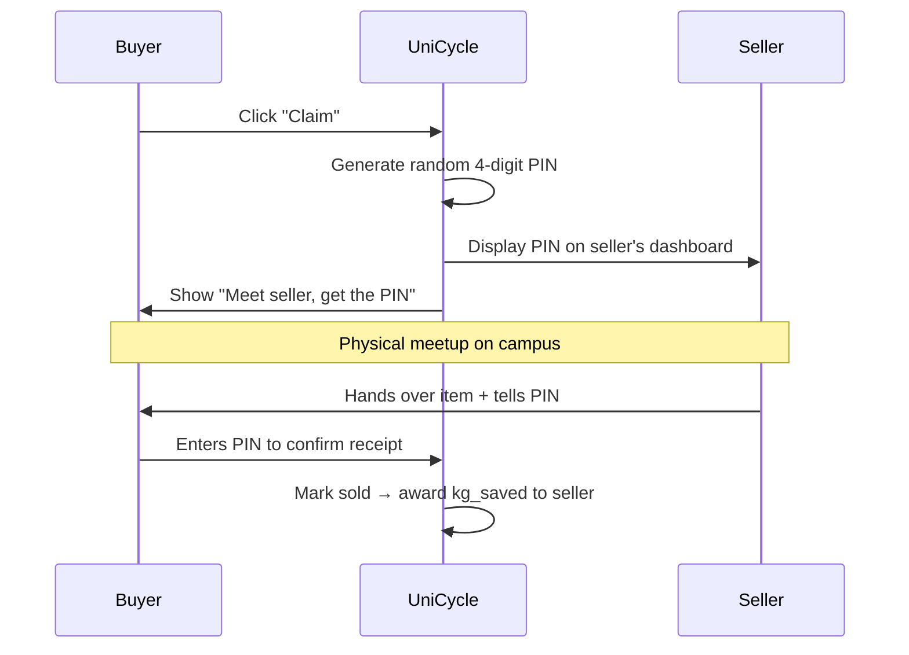
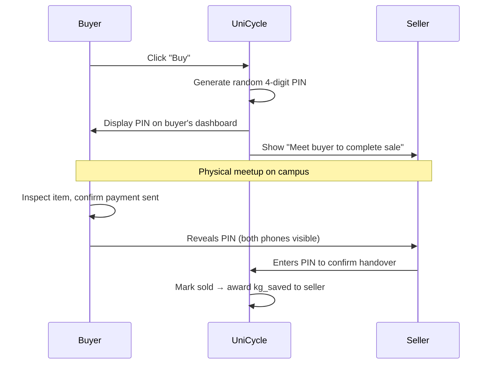
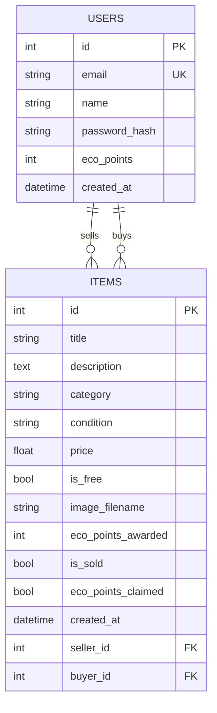

# UniCycle — Product Specification

> **Version:** 1.1 · **Date:** 29 March 2026
> **Author:** Yousef · **University:** Oxford Brookes (`brookes.ac.uk`)
> **Mission:** A hyper-local campus circular-economy platform supporting UN SDG 12 — Responsible Consumption & Production

---

## Table of Contents

1. [Vision & Strategy](#1-vision--strategy)
2. [Phase 1 — Core MVP](#2-phase-1--core-mvp)
3. [Phase 2 — Gamification & Growth](#3-phase-2--gamification--growth)
4. [Phase 3 — Pitch & Monetisation](#4-phase-3--pitch--monetisation)
5. [Phase 4 — Legal & Infrastructure](#5-phase-4--legal--infrastructure)
6. [Phase 5 — Anti-Fraud & Moderation](#6-phase-5--anti-fraud--moderation)
7. [Database Schema Roadmap](#7-database-schema-roadmap)
8. [Security Hardening](#8-security-hardening)
9. [Open Questions & Future Work](#9-open-questions--future-work)

---

## 1. Vision & Strategy

UniCycle is a student-to-student sustainability marketplace that prevents university waste. Students buy, sell, and donate items — keeping them out of landfill — and the platform tracks the environmental impact in real kilograms saved.

### Strategic Principles

| Principle               | Implementation                                                                                                         |
| ----------------------- | ---------------------------------------------------------------------------------------------------------------------- |
| **Single node first**   | Launch at Oxford Brookes only. High user density eliminates delivery logistics — all handoffs are in-person on campus. |
| **Weight, not points**  | Every transaction records real `kg saved`. This metric is sacred, immutable, and feeds into university ESG reports.    |
| **Shadow governance**   | Bad actors are algorithmically muted, never publicly banned. The ghost never knows they're a ghost.                    |
| **Zero admin overhead** | No manual moderation team. The platform's user jury system distributes moderation at zero cost.                        |
| **Visa-safe**           | Platform remains 100% free while on Student Visa. Monetisation flips on Graduate Route Visa.                           |

---

## 2. Phase 1 — Core MVP

### 2.1 Tech Stack

| Layer            | Technology                                                                     |
| ---------------- | ------------------------------------------------------------------------------ |
| Backend          | Python 3.x, Flask 3.1, Flask-SQLAlchemy, Flask-Login, Flask-WTF, Flask-Migrate |
| Database         | SQLite (dev) → PostgreSQL (prod)                                               |
| Frontend         | Jinja2 templates + Vue 3 (CDN, no build step)                                  |
| CSS              | Vanilla CSS design system (Inter font, WCAG AA accessible)                     |
| Image processing | Pillow (resize, EXIF strip, format validation)                                 |
| Auth             | Session-based via Flask-Login, passwords hashed with Werkzeug (PBKDF2+SHA256)  |

### 2.2 Current Feature Set (Built)

- ✅ User registration and login (`.ac.uk` emails)
- ✅ Item listing with image upload (validated, resized, EXIF-stripped)
- ✅ Marketplace browse with search + category filtering
- ✅ Item detail page
- ✅ Edit / Delete own listings (ownership-guarded)
- ✅ Buy / Claim items (marks sold, awards eco-points to seller)
- ✅ User dashboard (listings, purchases, eco-points)
- ✅ Eco-points preview via Vue 3 (instant UI feedback on category selection)
- ✅ CSRF protection on all forms
- ✅ Security headers (X-Content-Type-Options, X-Frame-Options, Referrer-Policy)
- ✅ 5 MB upload limit
- ✅ Open redirect prevention on login
- ✅ Database migrations via Flask-Migrate (Alembic)
- ✅ 65 automated tests (pytest, in-memory SQLite)

### 2.3 Design System & Visual Identity

**Target audience:** University students (18–25) and staff. They use Depop, Vinted, Instagram daily. The UI must feel native to that world — modern, clean, trustworthy.

**Design inspiration:** Vinted (teal, clean marketplace), Olio (warm community feel), Depop (youthful card-based layout).

#### Color Palette

| Token            | Light Mode             | Dark Mode              | Usage                                      |
| ---------------- | ---------------------- | ---------------------- | ------------------------------------------ |
| `--primary`      | `#0D9488` (Teal 600)   | `#70B8AE` (Muted Teal) | CTAs, links, kg_saved badges               |
| `--primary-soft` | `#CCFBF1` (Teal 100)   | `#134E4A` (Teal 900)   | Subtle highlights, status banners          |
| `--accent`       | `#F97316` (Orange 500) | `#FB923C` (Orange 400) | Boost tokens, claim buttons, notifications |
| `--danger`       | `#EF4444` (Red 500)    | `#F87171` (Red 400)    | Delete, error states                       |
| `--bg`           | `#F8FAFC` (Slate 50)   | `#0F172A` (Slate 900)  | Page background                            |
| `--surface`      | `#FFFFFF`              | `#1E293B` (Slate 800)  | Cards, modals                              |
| `--text`         | `#1E293B` (Slate 800)  | `#F1F5F9` (Slate 100)  | Body text                                  |
| `--text-muted`   | `#64748B` (Slate 500)  | `#94A3B8` (Slate 400)  | Secondary text, timestamps                 |

> **Why teal + coral?** Teal says sustainability without the cliché "green = eco." Coral creates warmth and urgency on CTAs. This combo is proven with the same demographic — Olio and Too Good To Go use near-identical palettes in the UK market.

#### Typography

| Role           | Font              | Weight        | Size     |
| -------------- | ----------------- | ------------- | -------- |
| Headings       | Plus Jakarta Sans | 700 (Bold)    | 1.5–2rem |
| Body           | Plus Jakarta Sans | 400 (Regular) | 1rem     |
| Captions       | Plus Jakarta Sans | 500 (Medium)  | 0.75rem  |
| kg_saved badge | Plus Jakarta Sans | 700 (Bold)    | 1.25rem  |

Load from Google Fonts: `<link href="https://fonts.googleapis.com/css2?family=Plus+Jakarta+Sans:wght@400;500;700&display=swap">`

> **Why Plus Jakarta Sans?** Same readability as Inter but rounder, warmer letterforms. Feels like a community app, not a corporate dashboard.

#### Component Patterns

| Component     | Style                                                                  |
| ------------- | ---------------------------------------------------------------------- |
| Cards         | `border-radius: 12px`, subtle `box-shadow`, no borders                 |
| Buttons       | `border-radius: 8px`, 44×44px minimum tap target, hover lift animation |
| Inputs        | `border-radius: 8px`, 2px border, focus glow in `--primary`            |
| Status badges | Pill-shaped (`border-radius: 999px`), coloured by state                |
| Modals        | Centred overlay with backdrop blur, slide-up on mobile                 |
| Notifications | Toast-style, slides in from top-right (desktop) / top (mobile)         |

### 2.4a Mobile-First & PWA Strategy

No native app. The web app is designed mobile-first and wrapped as a PWA:

#### Progressive Web App (PWA)

- `manifest.json` → enables "Add to Home Screen" → launches fullscreen (URL bar hidden)
- UniCycle icon on phone home screen, looks and feels like a native app
- Service worker caches static assets for faster loads (Phase 2: offline mode)
- Zero app store friction — students just visit the URL

#### Camera Integration

```html
<input type="file" accept="image/*" capture="camera" />
```

Opens the phone camera directly from the browser.

#### Responsive Layout

| Screen                  | Layout                          | Navigation                                                     |
| ----------------------- | ------------------------------- | -------------------------------------------------------------- |
| **Mobile** (<768px)     | Single column, full-width cards | Bottom tab bar (Home, Search, ➕ List, Notifications, Profile) |
| **Tablet** (768–1024px) | 2-column grid                   | Bottom tab bar                                                 |
| **Desktop** (>1024px)   | 3-column grid with sidebar      | Top navbar                                                     |

> **Mobile-first rule:** Design for phone first, then `@media (min-width: 768px)` adds desktop layout. Never the other way around.

### 2.4 Weight-Based Category System

Each category maps to a static average weight based on WRAP (UK Waste & Resources Action Programme) reference data. The platform uses **one single metric: `kg_saved`** — there is no separate "points" system.

> **One metric rule:** `kg_saved` is the number everywhere — user profiles, leaderboards, and university ESG reports all show the same value. No conversion, no confusion.

| Category    | Avg Weight (kg) | Typical Student Items                |
| ----------- | --------------- | ------------------------------------ |
| Furniture   | 12.0            | Desk, chair, bookshelf               |
| Kitchenware | 4.0             | Pot set, microwave, kettle           |
| Electronics | 3.0             | Laptop, monitor, calculator          |
| Sports      | 2.5             | Trainers, yoga mat, dumbbell set     |
| Clothing    | 1.5             | Jacket, bag, clothing bundle         |
| Books       | 0.8             | Single textbook                      |
| Stationery  | 0.3             | Notebooks, pen sets, folders         |
| Other       | 1.0             | Miscellaneous (conservative default) |

> **Design note:** 8 categories is the UX sweet spot (Hick's Law: 5–9 options). Weights represent what would have gone to landfill if the student hadn't sold it on UniCycle.

### 2.5 The PIN Handshake Protocol

Prevents fake "ghost" transactions. Proves physical exchange happened. The PIN holder varies depending on whether the item is free or paid — this protects the party with the most to lose.

#### PIN Assignment Rules

| Item Type          | PIN Holder | PIN Enterer | Rationale                                                      |
| ------------------ | ---------- | ----------- | -------------------------------------------------------------- |
| **Free item (£0)** | **Seller** | **Buyer**   | Seller needs proof the item was collected                      |
| **Paid item (£)**  | **Buyer**  | **Seller**  | Buyer has leverage — only reveals PIN after receiving the item |

#### Free Item Flow



#### Paid Item Flow



#### Simultaneous Exchange Guide

The PIN page displays clear safety instructions to both parties:

> 🤝 **Safe Exchange Guide**
>
> 1. Meet in a **public space on campus** (library, SU, café)
> 2. Buyer: inspect the item first
> 3. Seller: confirm you've received payment (cash, bank transfer — check your app)
> 4. Both phones out — PIN holder shows PIN, other party types it in
> 5. **Both confirm the on-screen "✅ Complete" before walking away**

For items above **£100**, an additional advisory appears:

> ⚠️ _"For high-value items, we recommend meeting at the SU reception desk and completing the exchange with both phones visible."_

#### Edge Cases

| Scenario                               | Outcome                                                                         |
| -------------------------------------- | ------------------------------------------------------------------------------- |
| **Buyer no-show** (72h PIN expiry)     | Claim auto-cancelled, item returns to "available", buyer receives -5 trust      |
| **Seller no-show** (72h PIN expiry)    | Claim expires, no penalty to buyer (seller is the no-show)                      |
| **Buyer refuses to reveal PIN (paid)** | Seller doesn't hand over item. Stalemate resolves itself — no exchange happens. |
| **Seller refuses PIN (free)**          | Buyer walks away, claim expires. Logged as a transaction report (see §6.8).     |

#### Claim Cancellation Policy

**Buyer cancellation:**

| Time After Claim           | Can Cancel?       | Trust Penalty | Item Status            |
| -------------------------- | ----------------- | ------------- | ---------------------- |
| **0 – 24 hours**           | ✅ Free cancel    | 0             | Returns to "available" |
| **24 – 72 hours**          | ✅ Late cancel    | -3 trust      | Returns to "available" |
| **72 hours (auto-expiry)** | ❌ System cancels | -5 trust      | Returns to "available" |

**Anti-griefing rule:** After a buyer cancels a claim on an item, they are **blocked from claiming that same item again.** Prevents claim → cancel → re-claim loops that lock items in limbo.

**Seller cancellation:**

| Cancellations This Month | Trust Penalty |
| ------------------------ | ------------- |
| 1st and 2nd              | 0 (free)      |
| 3rd+                     | -2 trust each |

Seller cancellation never penalises the buyer (not their fault). The 2 free per month allows genuine "changed my mind" situations without enabling selective buyer rejection.

**UI transparency:** The claim status page shows the buyer a clear countdown:

> 🟢 _"Free cancellation — 18h 32m left to cancel without penalty"_

or

> 🟡 _"Late cancellation — Cancelling now will result in a small trust adjustment"_

### 2.6 External Communication (WhatsApp Bypass)

To avoid building in-app chat for the MVP:

- Registration requires a **phone number** (WhatsApp) — normalised to `+44` format, validated as unique across all accounts
- Duplicate phone numbers are rejected: _"This number is already linked to an account"_ — doubles as **alt-account detection**
- When an item is claimed, the system reveals the seller's number to the buyer
- A "Copy Message" button pre-fills: _"Hey, I just claimed your [Item Name] on UniCycle. When can we meet for the PIN handshake?"_
- Contact info is hidden until after the buyer clicks "Claim"/"Buy" — protects seller privacy

---

## 3. Phase 2 — Gamification & Growth

### 3.1 University Scoping

- Sign-ups restricted to `.ac.uk` emails
- University domain extracted via Python (e.g., `brookes.ac.uk`)
- Initially all users are Brookes; schema is prepared for multi-university

### 3.2 Graduated Student Handling

The PIN handshake is the natural membership filter — graduates who leave campus can't complete in-person exchanges and naturally stop using the platform.

| Scenario                                      | Outcome                                  |
| --------------------------------------------- | ---------------------------------------- |
| Graduate still on campus (selling dorm room)  | High-value transactions — don't block    |
| Graduate moved away                           | Can't PIN handshake → natural attrition  |
| Dormant account (no transactions this season) | Automatically excluded from leaderboards |

**Phase 2 (multi-university):** Annual re-verification email to `.ac.uk` address. If it bounces → account enters read-only mode (browse only, can't list or claim).

### 3.3 Trust Score System

An internal, invisible health metric per user account. Never shown directly to users as a raw number.

| Parameter                  | Value                       |
| -------------------------- | --------------------------- |
| Starting score             | 100                         |
| Floor                      | 0 (clamped, never negative) |
| Shadow-ban threshold       | 50                          |
| Jury eligibility threshold | 120+                        |

#### How trust is earned

| Action                                         | Trust Change |
| ---------------------------------------------- | ------------ |
| Successful PIN handshake (no reports on item)  | +2           |
| Serving on jury (voting with majority)         | +2           |
| First 30 days with no reports (one-time bonus) | +5           |
| Selling 10th item milestone                    | +3           |

#### How trust is lost

| Action                                   | Trust Change     |
| ---------------------------------------- | ---------------- |
| Category fraud (convicted by jury)       | -15              |
| False mass-reporting (acquitted by jury) | -25 per reporter |
| Jury conviction (unanimous)              | -25              |
| Claim no-show (72h PIN expiry)           | -5               |

#### Shadow Protocol (Sub-50 Trust)

When a user's trust drops below 50:

- Their items are **algorithmically muted** — they can still post, but no one else sees their listings
- No warning messages, no account deletion alerts, no manual admin review
- **Recovery path:** Complete 3 clean PIN handshakes within 60 days → trust resets to 60 (on probation, but visible again)
- **One vague notification:** _"Your listings are receiving less visibility due to community feedback. Continue making successful transactions to improve."_

### 3.3 Leaderboard Seasons

| Period             | State                                                                                                     |
| ------------------ | --------------------------------------------------------------------------------------------------------- |
| **Sep 1 – Jun 30** | Ranked season. Two leaderboards: Micro (top 10 at your university) and Macro (university vs. university). |
| **Jul 1 – Aug 31** | Off-season. Marketplace works normally. Leaderboard frozen. Banner: "🏆 Term Champions: [Top 3]"          |
| **Sep 1**          | Leaderboard resets to zero. Previous season's top 3 enter permanent Hall of Fame.                         |

> **Critical:** The `kg_saved` lifetime total on each user's profile is **never** reset. Only the seasonal ranking resets.

### 3.4 Academic Year kg Tracking

Three tiers of environmental data, each serving a different purpose:

| Metric                  | Storage                                                       | Resets?     | Purpose                              |
| ----------------------- | ------------------------------------------------------------- | ----------- | ------------------------------------ |
| **Lifetime total**      | `users.kg_saved_total`                                        | Never       | User's all-time environmental impact |
| **Seasonal kg**         | `season_scores` table                                         | Each season | Powers leaderboard rankings          |
| **Academic year total** | Computed: `SUM(kg_saved) WHERE season BETWEEN Sep 1 – Aug 31` | N/A (query) | University ESG reports               |

**For the university ESG dashboard:**

- "_Oxford Brookes students saved **2,847 kg** from landfill in 2026–27_"
- Breakdown by category (Furniture: 1,200 kg, Electronics: 890 kg, etc.)
- Month-by-month trend chart
- Year-on-year comparison (when data exists)

### 3.5 Badge / Milestone System

Badges are a visual gamification layer on top of `kg_saved`. They create mini-goals and dopamine hits without introducing a separate points system.

#### Badge Tiers

| Badge | kg Threshold | Reward |
|---|---|---|
| 🌱 Seedling | 1 kg | Badge on profile |
| 🌿 Sapling | 5 kg | Badge + 1 free boost token |
| 🌳 Tree | 10 kg | Badge + profile border glow (cosmetic) |
| 🌲 Grove | 25 kg | Badge + 2 boost tokens + "Top Seller" label on listings |
| 🏔️ Forest | 50 kg | Badge + permanent teal profile border + early jury eligibility |
| 🌍 Ecosystem | 100 kg | Badge + unique animated profile frame + permanent "♻️ Ecosystem" title next to username on all listings |

#### Badge Rules

| Property | Rule |
|---|---|
| Tied to | Lifetime `kg_saved_total` (not seasonal) |
| Resets? | ❌ Never — badges are permanent |
| Progress bar | "████████░░ 0.2 kg to Tree 🌳" shown on dashboard |
| Notification | In-app notification + animation when a new badge is unlocked |

> **Psychology:** Selling a t-shirt (1.5 kg) alone feels small, but "1.5 kg closer to your next badge" triggers the progress bar effect — the same dopamine loop that makes people grind XP in games. Small items feel meaningful because they contribute to a visible milestone.

### 3.6 Future Monetisation — Purchasable Boosts (Post-Graduation)

> [IMPORTANT]
> This is a **post-visa** feature. No monetisation while on Student Visa.

When monetisation is enabled (Graduate Route Visa):
- Users can **purchase boost tokens** with real money (e.g., £0.50 per token)
- This uses a separate payment flow — **`kg_saved` is never a spendable currency**
- `kg_saved` remains sacred, immutable, and exclusively for ESG reporting
- Purchased boosts work identically to earned boosts (organic feed injection)

> **Why not use kg as currency?** If users "spend" kg on boosts, the ESG number becomes meaningless. Universities need a real, unmanipulated total. Two systems, cleanly separated: kg = environmental impact (immutable), boost tokens = marketplace utility (earnable + purchasable).

### 3.7 Guerrilla Acquisition

Print QR codes linking to the site → tape inside university laundry rooms, cafes, and international dorms. Zero cost, high density, captures students when they're already thinking about stuff.

---

## 4. Phase 3 — Pitch & Monetisation

### 4.1 The Trojan Horse Pitch

1. Approach the University Sustainability Office
2. Offer them a **free ESG data dashboard** showing total `kg_saved` by their students
3. In exchange, they put your link in the **official university newsletter**
4. They supply the users for free — you supply the data they need for government reporting

### 4.2 The B2B Flip

Once UniCycle has hundreds of users and proven data across multiple universities:

- Charge universities a **yearly licensing fee** to access the ESG data dashboard
- Universities need this data to prove "green" metrics to the UK government
- Revenue model flips from C2C to B2B without touching student-facing pricing

---

## 5. Phase 4 — Legal & Infrastructure

### 5.1 Visa Compliance

| Phase           | Visa                | Monetisation                                                  |
| --------------- | ------------------- | ------------------------------------------------------------- |
| Student (now)   | Student Visa        | **None** — 100% free, no ads, no charges. University project. |
| Post-graduation | Graduate Route Visa | Incorporate company, flip monetisation switch                 |

### 5.2 Infrastructure

| Service    | Provider                                         | Cost    |
| ---------- | ------------------------------------------------ | ------- |
| Hosting    | GitHub Student Developer Pack                    | Free    |
| CDN / DDoS | Cloudflare Free Tier                             | Free    |
| Database   | SQLite (dev) → Supabase/Railway free tier (prod) | Free    |
| Domain     | .ac.uk subdomain or cheap .com                   | ~£10/yr |

### 5.3 GDPR Compliance

- **Required:** Privacy policy page, cookie consent (if applicable)
- **Required:** "Delete my account" button (right to erasure)
- **Data stored:** Email, name, WhatsApp/contact, hashed password, transaction history
- **No:** GPS tracking, advertising IDs, third-party data sharing

---

## 6. Phase 5 — Anti-Fraud & Moderation

### 6.1 Rate Limits

| Constraint                | Limit              |
| ------------------------- | ------------------ |
| Item listings per account | Max 5 per 24 hours |
| Reports per account       | Max 3 per 24 hours |

### 6.2 Jury Moderation System

When an item receives enough reports, it's shown to **3 random users with 120+ trust** for a yes/no audit.

#### Verdict Truth Table

| Vote A    | Vote B    | Vote C     | Outcome       | Reporters      | Seller                  | Jurors                   |
| --------- | --------- | ---------- | ------------- | -------------- | ----------------------- | ------------------------ |
| ✅ Clear  | ✅ Clear  | ✅ Clear   | **Acquitted** | -25 trust each | No change               | +2 trust + boost token   |
| ✅ Clear  | ✅ Clear  | ❌ Guilty  | **Acquitted** | -25 trust each | No change               | +2 trust (majority only) |
| ❌ Guilty | ❌ Guilty | ✅ Clear   | **Flagged**   | No change      | -15 trust, item hidden  | +2 trust (majority only) |
| ❌ Guilty | ❌ Guilty | ❌ Guilty  | **Convicted** | No change      | -25 trust, item removed | +2 trust + boost token   |
| ✅ Clear  | ❌ Guilty | 🔘 Abstain | **Tie**       | Held           | Held                    | Draft 4th user           |

> **Key rule:** Dissenting voters are never punished. Protects minority opinions and prevents rubber-stamping.

> **Item visibility:** Hidden items use `moderation_status` column (`visible` → `hidden` → `removed`), not deletion. Preserves audit trail for ESG/legal.

### 6.3 Anti-Wash-Trading

- **3-item point cap** between the same two users in a 30-day window
- Marketplace utility (buying/selling) is unlimited — only leaderboard `kg_saved` is capped
- Sellers won't reject bulk buyers just because the point cap is hit — primary utility (money / convenience) overrides secondary utility (leaderboard position)

### 6.4 Alt-Account Detection

- Flag duplicate WhatsApp/phone numbers across accounts
- Shadow-banned users who register with a second `.ac.uk` email can be detected via shared device fingerprint or phone number

### 6.5 Bootstrap Phase (First 100 Users)

- Disable the -25 reporter penalty (social graph too small for random jury to work)
- Enable it automatically once user count hits 100
- This prevents early users from being afraid to report

### 6.6 Boost Token Economy

| Parameter     | Value                                                                      |
| ------------- | -------------------------------------------------------------------------- |
| Earned by     | Voting with majority on jury                                               |
| Max inventory | 3 tokens                                                                   |
| Expiry        | 30 days                                                                    |
| Effect        | Item natively injected into organic feed (e.g., every ~5th item in scroll) |
| Spend         | Manual — user chooses when to boost which item                             |

> **No banner ads, no special styling.** The boosted item looks identical to every other item. It's simply positioned more frequently in the feed. The user doesn't know it's boosted unless they're the seller.

### 6.7 In-App Notifications

Since this is a web app (no native push notifications):

- Notification bell icon next to user profile in the navbar
- Notifications stored in DB with `is_read = False` by default
- Unread count badge on the bell icon
- Used for: jury summons, PIN generation, claim confirmations, trust changes, boost token awards
- Notification feed page: simple list, mark-as-read on click

### 6.8 Split Report System

Reports are categorised into two types that follow completely different resolution paths:

#### Listing Reports → Jury

Things the jury can visually verify from the item page:

| Report Type               | What Jury Sees                             |
| ------------------------- | ------------------------------------------ |
| Wrong category            | Photo + listed category → obvious mismatch |
| Inappropriate content     | Photo + description                        |
| Fake / misleading listing | Photo + title + description                |

These follow the verdict truth table in §6.2.

#### Transaction Reports → Pattern-Based

Things the jury **cannot** verify (he-said-she-said meetup disputes):

| Report Type                       | Examples                                                    |
| --------------------------------- | ----------------------------------------------------------- |
| Seller no-show / refused handover | "Seller didn't turn up" / "Seller refused to give the item" |
| Buyer no-show / refused PIN       | "Buyer never showed" / "Buyer took item but won't give PIN" |
| Item quality mismatch             | "Item was broken / not as described in person"              |

**Resolution — no jury, no immediate penalty:**

1. Report is **logged silently** against the other user's account
2. Neither party receives an immediate trust penalty — one angry person can't tank someone's score
3. A user can only submit one transaction report per transaction (prevents spam)
4. **Pattern trigger:** If **3 different users** independently file transaction reports against the same person within 60 days → automatic **-10 trust**, no jury needed
5. The reported user never sees "you've been reported" — they just see their trust quietly dropping if they're genuinely a bad actor

> **Why no jury?** Because the jury can only judge what they can see (the listing). They can't see what happened in a car park. Sending transaction disputes to the jury risks punishing the actual victim.

#### Dispute Scope — Terms of Service

UniCycle explicitly does not adjudicate payment or quality disputes:

> _"UniCycle connects buyers and sellers. All payments are made directly between users. UniCycle does not process, hold, or guarantee any payments or item quality."_

The campus social pressure, `.ac.uk` identity verification, and simultaneous PIN exchange protocol mitigate real-world risk.

---

## 7. Database Schema Roadmap

### Current Schema (MVP — Built)



### Future Schema (Phase 2+)

New columns on existing tables:

| Table   | New Column          | Type                            | Purpose                                    |
| ------- | ------------------- | ------------------------------- | ------------------------------------------ |
| `users` | `trust_score`       | `Integer, default=100`          | Internal trust metric                      |
| `users` | `boost_tokens`      | `Integer, default=0`            | Capped at 3                                |
| `users` | `university_domain` | `String(100)`                   | Extracted from email, e.g. `brookes.ac.uk` |
| `users` | `contact_method`    | `String(20)`                    | `whatsapp` / `telegram` / `instagram`      |
| `users` | `contact_handle`    | `String(120)`                   | Phone number or handle                     |
| `items` | `kg_saved`          | `Float`                         | Looked up from category weight table       |
| `items` | `moderation_status` | `String(20), default='visible'` | `visible` / `hidden` / `removed`           |
| `items` | `pin_code`          | `String(4)`                     | Random 4-digit PIN for handshake           |
| `items` | `pin_expires_at`    | `DateTime`                      | 72-hour auto-expiry                        |
| `items` | `is_boosted`        | `Boolean, default=False`        | Currently boosted in feed                  |
| `items` | `boost_expires_at`  | `DateTime`                      | When boost ends                            |

New tables:

| Table              | Purpose                                                                |
| ------------------ | ---------------------------------------------------------------------- |
| `notifications`    | In-app notification feed (user_id, message, type, is_read, created_at) |
| `reports`          | Item reports (reporter_id, item_id, reason, created_at)                |
| `jury_votes`       | Jury verdicts (juror_id, report_id, vote, created_at)                  |
| `seasons`          | Leaderboard seasons (name, start_date, end_date, is_active)            |
| `season_scores`    | Per-user seasonal kg_saved (user_id, season_id, kg_saved)              |
| `category_weights` | Category → avg weight mapping (replaces hardcoded dict)                |
| `trust_log`        | Audit trail of trust changes (user_id, delta, reason, created_at)      |

> **All schema changes will be managed via Flask-Migrate (Alembic)** — no data loss, versioned migrations, rollback capability.

---

## 8. Security Hardening

### Implemented (MVP)

| Area               | Implementation                                                 |
| ------------------ | -------------------------------------------------------------- |
| Password hashing   | Werkzeug PBKDF2+SHA256 with salt                               |
| CSRF protection    | Flask-WTF `CSRFProtect` on all POST forms                      |
| SQL injection      | SQLAlchemy ORM parameterises all queries                       |
| Image validation   | Extension whitelist + PIL verify + EXIF strip + UUID filenames |
| Upload limit       | `MAX_CONTENT_LENGTH = 5 MB`                                    |
| Open redirect      | Login `?next=` param rejects absolute URLs                     |
| Security headers   | `X-Content-Type-Options`, `X-Frame-Options`, `Referrer-Policy` |
| Ownership checks   | Edit/delete routes verify `seller_id == current_user.id`       |
| Session management | Flask-Login handles session cookies                            |
| DB migrations      | Flask-Migrate (Alembic) — version-controlled schema changes    |

### Planned (Production)

| Area              | Implementation                                          |
| ----------------- | ------------------------------------------------------- |
| HTTPS             | Cloudflare free tier / `Flask-Talisman`                 |
| Rate limiting     | Flask-Limiter (5 login attempts/min, 10 listings/hour)  |
| Password policy   | Server-side: min 8 chars, mixed case + digit            |
| CSP header        | `Content-Security-Policy` via `Flask-Talisman`          |
| Email restriction | Validate `@*.ac.uk` domain on registration              |
| Secret key        | Fail-hard in production if `SECRET_KEY` env var missing |

---

## 9. Open Questions & Future Work

| Question                                                       | Status                                                                                                                     |
| -------------------------------------------------------------- | -------------------------------------------------------------------------------------------------------------------------- |
| Should NudeNet image moderation be added?                      | **Deferred to Phase 3.** Jury system handles content moderation for now.                                                   |
| University off-season (summer) — run marketplace or shut down? | **Run normally, freeze leaderboard.** Marketplace stays open, rankings pause.                                              |
| Multi-university data isolation?                               | **Schema-ready** (`university_domain` column). No cross-university data leakage by default.                                |
| Payment integration?                                           | **Not needed for MVP.** All transactions are in-person cash/bank transfer. Platform shows price, doesn't process payments. |
| In-app notifications vs email?                                 | **In-app only for MVP.** Email notifications are a Phase 3 feature (requires email sending infrastructure).                |
| Real-time chat?                                                | **Permanently deferred.** WhatsApp bypass handles all communication needs. Building chat is technical debt with no ROI.    |
| QR Code Handshake?                                             | **Deferred to Phase 2.** An alternative option where the PIN holder displays a QR code encoding the PIN, which the other party scans to confirm physical exchange. |
