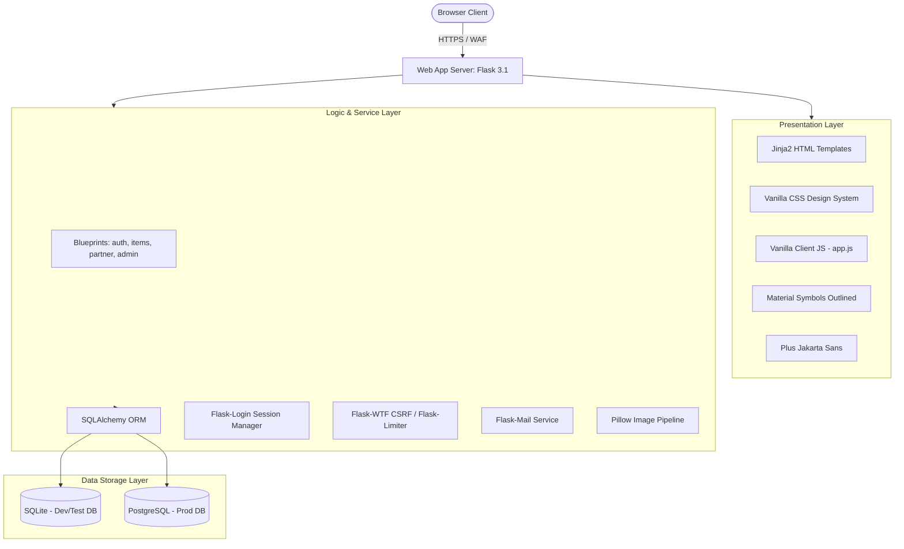
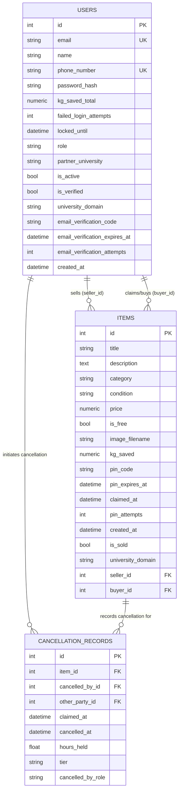
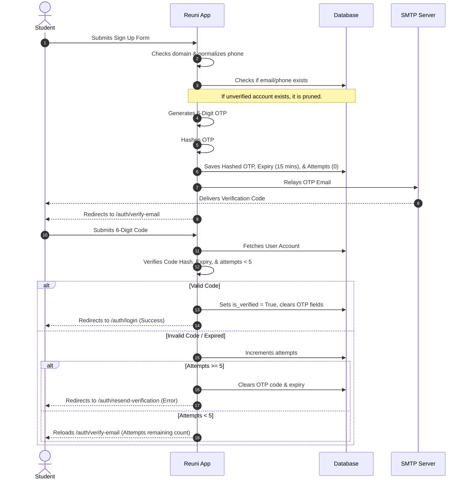
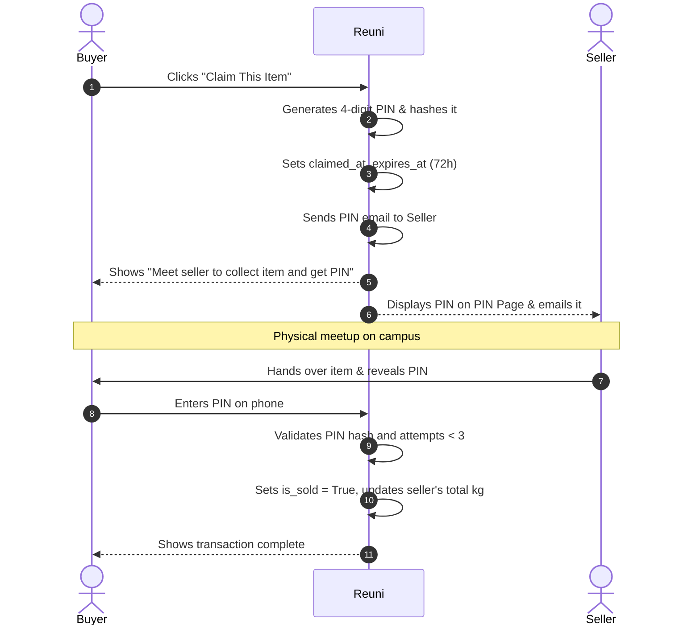
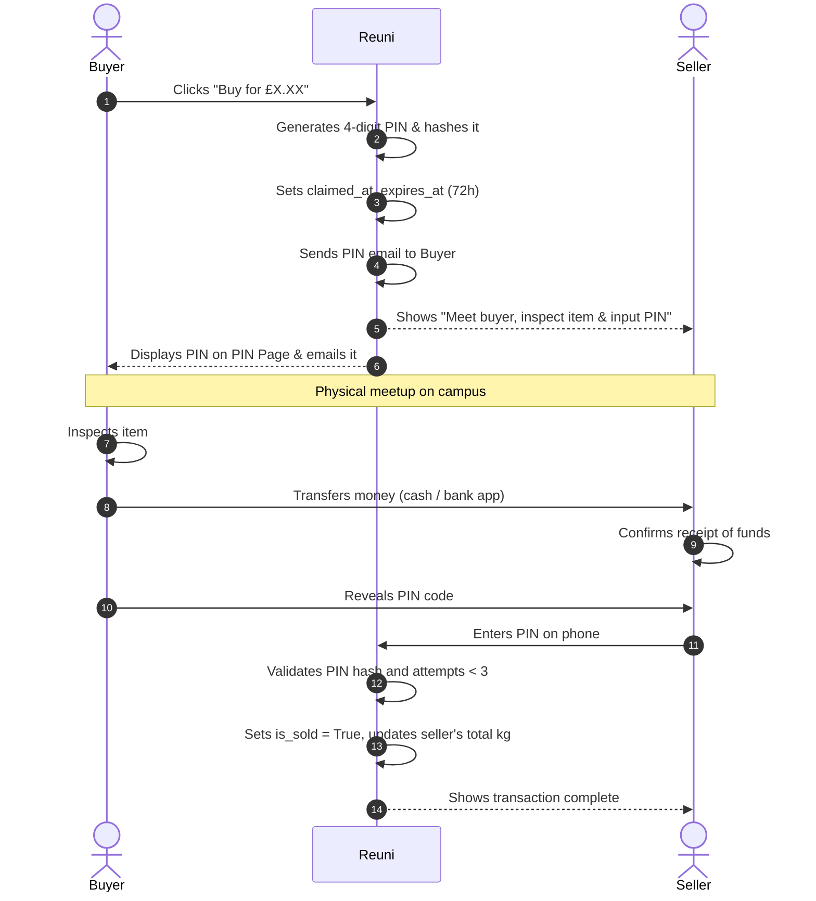
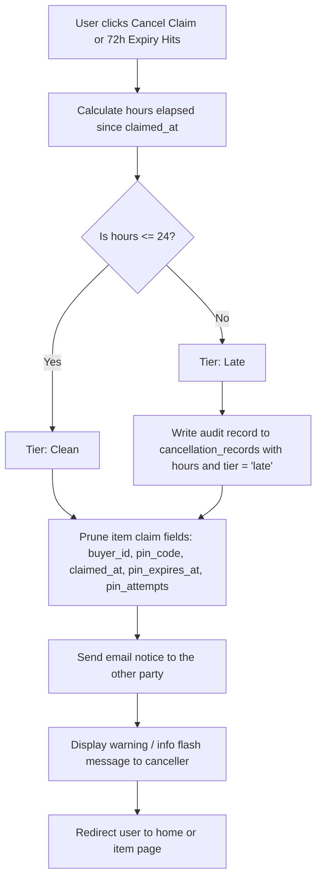
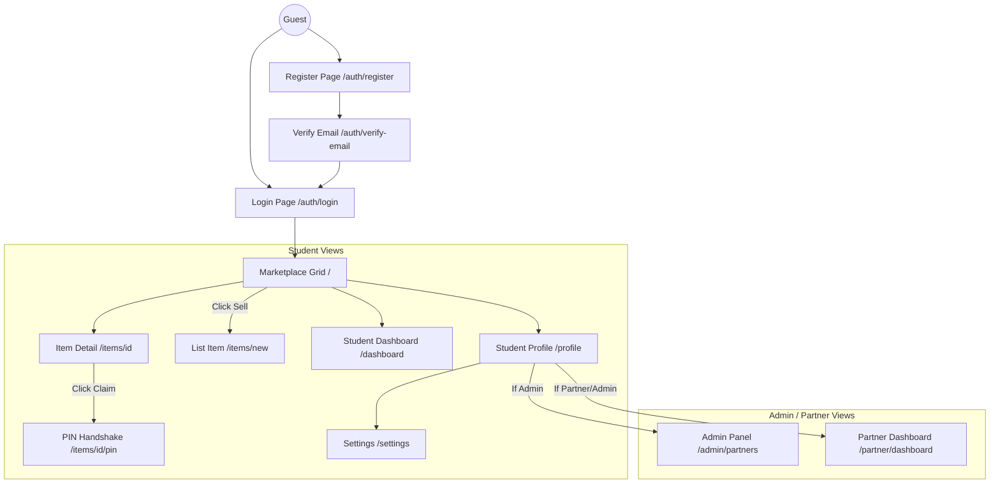

# Reuni — Master System Architecture & UI/UX Navigation Map

> **Date:** June 7, 2026
> **Author:** Master System Architect & Software Engineer
> **Project:** Reuni (Campus Circular-Economy Platform)
> **Mission:** Supporting UN SDG 12 — Responsible Consumption & Production

---

## 1. Executive Summary & Vision

Reuni is a hyper-local, campus-exclusive circular-economy marketplace designed for university students, staff, and sustainability administrators. By enabling student-to-student transactions (buying, selling, and donating pre-loved items), the platform prevents waste on campus and redirects items away from landfills. 

A primary strategic differentiator of Reuni is the **sacred and immutable tracking of carbon and landfill waste savings in real kilograms (`kg_saved`)**. Unlike typical systems that use arbitrary "points," Reuni maps transaction categories to average material weights. This data is aggregated in real-time to generate university-level ESG (Environmental, Social, and Governance) reports. These reports are delivered through dedicated partner portals, serving as a "Trojan Horse" to drive institutional newsletter acquisition and B2B SaaS licensing.

---

## 2. System Infrastructure & Technology Stack

Reuni is built on a modular, secure, and performant Python/Flask architecture optimized for rapid development, testability, and enterprise-grade security headers.



### 2.1 Backend Architecture
*   **Core Framework:** **Flask 3.1**. Selected for its lightweight footprint and structural flexibility.
*   **Database ORM:** **Flask-SQLAlchemy**. All data queries are mapped to objects, enforcing parameterized queries across the application.
*   **Migration Engine:** **Flask-Migrate (Alembic)**. Tracks, versions, and deploys schema changes incrementally without data loss.
*   **Session Management:** **Flask-Login**. Handles cookie-based user states. Permanent sessions are configured to last 7 days (`PERMANENT_SESSION_LIFETIME = 7 days`).
*   **Authentication Cryptography:** Hashed password storage utilizing PBKDF2/scrypt (via Werkzeug security utilities).
*   **Rate Limiter:** **Flask-Limiter** backed by memory storage in development/testing. Protects routes against denial-of-service and brute-force cracking.
*   **Email Engine:** **Flask-Mail**. Integrates with SMTP (TLS/SSL) to send transactional OTPs, PIN handshake notifications, cancellation notices, and partner invites.

### 2.2 Database System
*   **Development / Test Environment:** In-memory or file-based **SQLite** (`instance/unicycle.db`).
*   **Production Environment:** Scalable **PostgreSQL** (configured via environment variable `DATABASE_URL`).
*   **Connection Integrity:** Fully managed database sessions that auto-commit or auto-rollback on exception to maintain relational ACID compliance.

### 2.3 Frontend Presentation Layer
*   **Server-Side Rendering:** **Jinja2 templates** compile page layouts, dynamic variables, conditional blocks, and flash notifications server-side.
*   **Dynamic UI Interactivity:** **Vanilla client-side JavaScript (`app.js`)** provides form validation, image uploading drag-and-drop triggers, visual image preview, and dynamic price-toggle inputs.
*   **Styling (CSS):** Vanilla CSS design system (`static/css/style.css`) utilizing modern HSL color tokens, responsive layout grid structures, Google Fonts (`Plus Jakarta Sans`), and lightweight `Material Symbols Outlined` SVG font icons.
*   **Mobile-First Approach:** Responsive fluid grids optimized for mobile screen boundaries (<768px) with a persistent bottom-bar tab navigation, transitioning into side-by-side structures on desktop (>1024px).

### 2.4 Image Processing Pipeline
To guarantee student privacy and optimize bandwidth consumption, Reuni intercepts all item image uploads using **Pillow (PIL)**:
1.  **Format Verification:** Rejects files unless they match a strict whitelisted extension set (`jpg`, `jpeg`, `png`, `webp`).
2.  **EXIF Sanitization:** Extracts raw pixel data and compiles it into a new, clean JPEG canvas, stripping metadata (GPS coordinates, camera IDs, timestamps) to prevent doxxing.
3.  **Dimensional Resizing:** Constrains images to a maximum boundary of `800px` (maintaining original aspect ratio) to optimize page loading.
4.  **Secure Storage:** Saves sanitised images into `static/uploads/` with a non-predictable UUID filename (e.g., `e2a77a94b8e24483a992019b88301d2d.jpg`).
5.  **Payload Cap:** Limits HTTP request body payload sizes to **5MB** (`MAX_CONTENT_LENGTH = 5MB`), preventing disk depletion attacks.

---

## 3. Database Schema Map

The current relational database model comprises three tables mapping users, items, and cancellation metrics.



### 3.1 Relational Schema Definitions

#### Table: `users`
Represents student buyers/sellers, sustainability partners, and global administrators.

| Column | Type | Constraints | Description |
| :--- | :--- | :--- | :--- |
| `id` | Integer | Primary Key | Auto-incrementing identifier. |
| `email` | String(120) | Unique, Index, Not Null | Institutional email (restricted to `.ac.uk`). |
| `name` | String(80) | Not Null | Display name of the user. |
| `phone_number` | String(20) | Unique, Nullable | Normalized WhatsApp contact format. |
| `password_hash` | String(256) | Not Null | Hashed password string. |
| `kg_saved_total` | Numeric(10,2) | Default `0.00` | Lifetime environmental savings credit. |
| `failed_login_attempts` | Integer | Default `0`, Not Null | Tracks consecutive password failures. |
| `locked_until` | DateTime | Nullable | Unlock timestamp for rate-limited bruteforce locks. |
| `role` | String(20) | Default `'student'`, Not Null | User privileges: `'student'`, `'partner'`, `'admin'`. |
| `partner_university` | String(100) | Nullable | B2B Scoping domain (only for `'partner'` roles). |
| `is_active` | Boolean | Default `True`, Not Null | Set to `False` to restrict account logins. |
| `is_verified` | Boolean | Default `False`, Not Null | User has proven email ownership via OTP. |
| `university_domain` | String(100) | Nullable | Extracted domain from email (e.g. `brookes.ac.uk`). |
| `email_verification_code` | String(256) | Nullable | Hashed OTP code string. |
| `email_verification_expires_at` | DateTime | Nullable | Expiration timestamp of verification OTP. |
| `email_verification_attempts` | Integer | Default `0`, Not Null | Failed attempts inputting verification OTP. |
| `created_at` | DateTime | Default `UTC Now` | Timestamp when the record was created. |

#### Table: `items`
Represents listing items posted on the campus marketplace.

| Column | Type | Constraints | Description |
| :--- | :--- | :--- | :--- |
| `id` | Integer | Primary Key | Auto-incrementing identifier. |
| `title` | String(140) | Not Null | Title of the item listing. |
| `description` | Text | Max 2000 Chars | Detailed item description. |
| `category` | String(60) | Not Null | Categorical division (e.g. `'Furniture'`). |
| `condition` | String(20) | Not Null | Condition Choice (e.g. `'Like New'`). |
| `price` | Numeric(10,2) | Default `0.00` | Sale price. If `is_free` is True, price is forced to `0.00`. |
| `is_free` | Boolean | Default `False` | Flags item as donation. |
| `image_filename` | String(255) | Nullable | Filename of the uploaded picture. |
| `kg_saved` | Numeric(10,2) | Default `0.00` | Category weight coefficient (saves database lookup). |
| `pin_code` | String(256) | Nullable | Hashed 4-digit PIN generated at claim. |
| `pin_expires_at` | DateTime | Nullable | 72-hour handshake expiration timestamp. |
| `claimed_at` | DateTime | Nullable | Timestamp when a buyer claimed the item. |
| `pin_attempts` | Integer | Default `0` | PIN verification failure counter. |
| `is_sold` | Boolean | Default `False` | Handshake complete flag. Locked from modification. |
| `university_domain` | String(100) | Nullable | Filters listings by university context. |
| `seller_id` | Integer | Foreign Key (`users.id`), Not Null | Account that listed the item. |
| `buyer_id` | Integer | Foreign Key (`users.id`), Nullable | Account that claimed/purchased the item. |
| `created_at` | DateTime | Default `UTC Now` | Timestamp when the listing was created. |

#### Table: `cancellation_records`
An audit trail recording details of claims cancelled before completion.

| Column | Type | Constraints | Description |
| :--- | :--- | :--- | :--- |
| `id` | Integer | Primary Key | Auto-incrementing identifier. |
| `item_id` | Integer | Foreign Key (`items.id`), Not Null | Listing reference. |
| `cancelled_by_id` | Integer | Foreign Key (`users.id`), Not Null | Account that triggered the cancel action. |
| `other_party_id` | Integer | Foreign Key (`users.id`), Not Null | The user affected by the cancellation. |
| `claimed_at` | DateTime | Not Null | The timestamp when the item was claimed. |
| `cancelled_at` | DateTime | Default `UTC Now`, Not Null | The cancellation timestamp. |
| `hours_held` | Float | Not Null | Number of hours between claim and cancellation. |
| `tier` | String(10) | Not Null | `'clean'` (<= 24 hours) or `'late'` (> 24 hours). |
| `cancelled_by_role` | String(10) | Not Null | Role of canceller relative to transaction (`'buyer'`, `'seller'`). |

---

## 4. Security & Safety Hardening Architecture

Reuni applies rigorous defense-in-depth security policies:

1.  **Strict Content Security Policy (CSP):**
    The app configures a response header restricting asset loads to local origins, with specific exceptions for Web Fonts:
    ```
    Content-Security-Policy: default-src 'self'; script-src 'self' 'unsafe-inline'; style-src 'self' 'unsafe-inline' https://fonts.googleapis.com; font-src 'self' https://fonts.gstatic.com; img-src 'self' data:; connect-src 'self'
    ```
2.  **Anti-Brute-Force Account Lockout:**
    Keeps track of failed login attempts (`failed_login_attempts`). Upon reaching 5 consecutive failures, `locked_until` is populated with `now + 15 minutes`. During lockout, password authentication attempts are immediately rejected.
3.  **Route-Level Rate Limiting:**
    Protects crucial entry paths via `Flask-Limiter` with custom keys:
    *   `POST /auth/login`: 10 requests per minute (keyed by IP + email).
    *   `POST /auth/resend-verification`: 10 requests per hour (keyed by target email address).
    *   `POST /items/<id>/resend-pin`: 3 requests per hour (keyed by authenticated user id).
4.  **Global CSRF Protection:**
    All template forms render dynamic `csrf_token` hidden inputs, validated by the `Flask-WTF` CSRF extension.
5.  **SQL Injection Prevention:**
    Enforced through absolute reliance on the SQLAlchemy ORM; direct string interpolation of queries is prohibited.
6.  **Open Redirect Prevention:**
    The login handler checks the `?next=` URL query parameter. If it contains an absolute protocol, target domain, or begins with double slashes (`//`), it rejects it, preventing phishing redirects.
7.  **Cookies and Session Protection:**
    Saves cookies with `HttpOnly` and `SameSite=Lax`. In production mode, `Secure` cookie attributes are set, requiring HTTPS.

---

## 5. Core Application Protocols

### 5.1 Dynamic OTP Email Verification Protocol

Dual-phase verification prevents invalid registrations and spam.



---

### 5.2 PIN Handshake Protocol

To prevent fake or exaggerated transactions, collection is validated via a 4-digit PIN. The PIN holder is chosen to protect the party with the most financial risk.

*   **Free Items (£0):** The **Seller** holds the PIN. The seller only reveals it once the buyer collects the item, giving the seller proof of handoff.
*   **Paid Items (£):** The **Buyer** holds the PIN. The buyer only reveals it after inspecting the item and sending payment, ensuring the seller does not close the transaction unilaterally.

#### Free Item Handshake Sequence:


#### Paid Item Handshake Sequence:


---

### 5.3 Cancellation Tiers & Reputation Management

If an exchange is cancelled after a claim is initiated, the system processes it according to two tiers based on a 24-hour threshold:

*   **Clean Cancellation (<= 24 hours):** Claim is released with no impact on reputation. The item is marked "Available" again.
*   **Late Cancellation (> 24 hours or 72-hour auto-expiry):** A permanent record is logged in the `cancellation_records` table. This builds an audit trail to seed the trust score system in Phase 2.



---

### 5.4 WhatsApp Bypass Protocol

To keep the MVP simple, Reuni skips an in-app chat engine and utilizes a WhatsApp redirection system:
1.  **Format Normalization:** The system normalizes phone inputs via the `_normalise_phone()` utility:
    *   Trims spaces, dashes, parentheses.
    *   Replaces a leading `0` (UK style) with `+44`.
    *   Prepend `+` to inputs beginning with `44` without a plus.
    *   Rejects inputs that do not match E.164 pattern `^\+\d{10,15}$`.
2.  **Privacy Protection:** Phone numbers are hidden until a claim is created. Once claimed, the other party's phone number is shown on the PIN page.
3.  **One-Click Messaging:** A messaging link is rendered:
    ```
    https://wa.me/<normalized_phone>?text=Hey,%20I%20just%20claimed%20your%20<item_title>%20on%20Reuni.%20When%20can%20we%20meet%20for%20the%20PIN%20handshake?
    ```

---

### 5.5 Partner Scoping & Domain Extraction

To isolate university data, Reuni scopes data to specific institutional domains:
1.  **Domain Parsing:** The `extract_university_domain()` utility validates emails against `^([^@]+)@([a-zA-Z0-9.-]+\.ac\.uk)$` and isolates the domain portion (e.g. `brookes.ac.uk`).
2.  **Validation:** Registration validates this domain against a configured set (`ALLOWED_UNIVERSITY_DOMAINS`). If the set is empty, any valid `.ac.uk` domain is allowed.
3.  **Data Isolation:** Listings (`items`) carry the domain of the seller. The home page, search, and partner dashboards filter query results by this domain, keeping university networks separate.

---

## 6. Page-by-Page UI/UX Map & Navigation Matrix

This section maps out every page, button, input form, and redirect flow in the application.



### 6.A Route Accessibility & Navigation Friction Analysis
This section analyzes how easy or difficult it is to reach pages in the system. It highlights scoped access levels, hidden redirections, and navigation paths.

```
+-----------------------------------------------------------------------------+
|                                  NAVIGATION TYPE                            |
+----------------------+--------------------+---------------------------------+
| DIRECT ACCESS        | INDIRECT ACCESS    | HIDDEN / SCOPED ACCESS          |
| (Always in Navbar)   | (Behind Submenus)  | (Requires Token/State/Role)     |
+----------------------+--------------------+---------------------------------+
| * Marketplace (/)    | * Profile          | * Partner Registration          |
| * Sell (/items/new)  | * Settings         |   (/auth/invite/<token>)        |
| * Log In / Sign Up   | * OTP Verification | * Partner ESG Dashboard         |
| * Student Dashboard  |   (/verify-email)  |   (/partner/dashboard)          |
|                      | * PIN Page         | * Admin Panel (/admin/partners) |
|                      |   (/items/id/pin)  | * Edit Listing                  |
+----------------------+--------------------+---------------------------------+
```

#### 1. Student Profile Route (`/profile`)
*   **Access Level:** Verified Student
*   **Accessibility Type:** **INDIRECT** (High Navigation Friction on Desktop)
*   **Access Paths:**
    *   *Desktop Flow:* There is **no link** to `/profile` in the header navbar or the user avatar dropdown menu. To reach it, a desktop user must click the avatar dropdown → click **"Settings"** → click the **"Back to Profile"** link.
    *   *Mobile Flow:* **Direct**. Renders as a dedicated, persistent bottom navigation tab labeled "Profile".
    *   *Direct URL:* Accessible by typing `/profile` into the browser address bar.

#### 2. Email OTP Verification Route (`/auth/verify-email`)
*   **Access Level:** Guest (Registration Pending)
*   **Accessibility Type:** **INDIRECT & SESSION-GUARDED**
*   **Access Paths:**
    *   *Flow:* Automatically redirected here after submitting the Sign Up form, or after requesting a resend code.
    *   *Session Guard:* If a user attempts to navigate directly to `/auth/verify-email` without a pending `verify_email` email stored in their active Flask session, the backend blocks entry and redirects them to the Resend Verification page.

#### 3. Resend OTP Verification Route (`/auth/resend-verification`)
*   **Access Level:** Guest (Unverified)
*   **Accessibility Type:** **INDIRECT**
*   **Access Paths:**
    *   *Flow:* Reached by clicking the link **"Resend code"** in the footer of `/auth/verify-email`. It is also triggered automatically by the backend if an unverified user tries to log in.

#### 4. Partner Registration Route (`/auth/invite/<token>`)
*   **Access Level:** Guest with Invite Token
*   **Accessibility Type:** **HIDDEN & TIMED**
*   **Access Paths:**
    *   *Flow:* Cannot be reached via any UI navigation path. It is only accessible via a direct link containing a signed invitation token generated by an administrator. The token signature is checked by `URLSafeTimedSerializer` and expires after 48 hours.

#### 5. B2B Partner Dashboard Route (`/partner/dashboard`)
*   **Access Level:** Scoped Partner or Administrator
*   **Accessibility Type:** **SCOPED**
*   **Access Paths:**
    *   *Flow:* The "Partner Dashboard" menu option is only appended to the navbar dropdown list if `current_user.role` is `'partner'` or `'admin'`. Other roles are blocked and redirected to the student dashboard with a permission warning.

#### 6. Admin Control Panel Route (`/admin/partners`)
*   **Access Level:** Global Administrator
*   **Accessibility Type:** **SCOPED**
*   **Access Paths:**
    *   *Flow:* The "Admin Panel" menu option is only visible in the dropdown if `current_user.is_admin` is True. Direct URL entry by non-admin roles triggers a HTTP `403 Forbidden` error.

#### 7. PIN Handshake Route (`/items/<int:item_id>/pin`)
*   **Access Level:** Buyer or Seller of the Item
*   **Accessibility Type:** **STATE-GUARDED**
*   **Access Paths:**
    *   *Flow:* Reached automatically after claiming an item, or by clicking an item card in the "Pending Handshakes" section of the Student Dashboard.
    *   *State Guard:* Direct access is rejected by the backend if `buyer_id` is null (item is not claimed), or if `is_sold` is True. In these cases, the user is redirected to the item details page.

#### 8. Edit / Delete Listing Routes (`/items/<int:item_id>/edit` & `/delete`)
*   **Access Level:** Seller of the Item
*   **Accessibility Type:** **STATE & ROLE SCOPED**
*   **Access Paths:**
    *   *Flow:* Reached by clicking "Edit Listing" or "Delete" on the item details page. These buttons are only displayed if the viewer is the creator of the listing.
    *   *State Guard:* Access to edit/delete is blocked by the backend if the item has a pending claim (`buyer_id` is set) or has already been sold (`is_sold` is True).

---

### 6.0 Global Layout & Navigation Shell
Defined in `app/templates/base.html`. Wraps every page view inside a unified header and footer layout.

#### UI Elements & Visual Layout
*   **Header Navigation Bar (Desktop):**
    *   Left side: Reuni logo icon (`recycling`) and bold text brand link.
    *   Center: A search bar with a gray magnifying glass icon (`search`) and a text input.
    *   Right side (Unauthenticated): "Log in" plain link and a teal "Sign up" button.
    *   Right side (Authenticated): A teal "+ Sell" button and a user avatar dropdown menu button (displaying first letter of name, first name, and a downward arrow `expand_more`).
*   **Mobile Bottom Tab Bar (Viewport width < 768px):**
    *   Four tab targets aligned horizontally: Home (`home` icon), Search (`search` icon button), Sell (`add_circle` icon button), and Profile (avatar or `person` icon).
*   **Mobile Expandable Search Overlay:**
    *   A hidden bar that slides down from the top header when triggered on mobile, containing a text input field and a close button (`close` icon).
*   **Flash Messages Box:**
    *   A full-width container below the navbar that dynamically shows server messages in colored alert blocks (e.g. green for success, yellow for warnings, red for danger).

#### Click Targets & Action Pathways
*   **Reuni Logo Link:**
    *   **Action:** Click.
    *   **HTTP Method:** GET.
    *   **Backend Controller:** `app.index()`.
    *   **Result:** Redirects the user to `/` (home page). Clears search state unless query parameters are explicitly appended.
*   **Header Search Input:**
    *   **Action:** Type search query and press **Enter**.
    *   **HTTP Method:** GET (via form submit).
    *   **Backend Controller:** `app.index()`.
    *   **Result:** Reloads `/` with query parameter `?q=input_text`. The items grid re-filters, and an active search tag is rendered.
*   **"+ Sell" Button (Navbar):**
    *   **Action:** Click.
    *   **HTTP Method:** GET.
    *   **Backend Controller:** `items.list_item()` (Guarded by `@login_required` and `@verified_required` decorators).
    *   **Result:** 
        *   If logged in & verified: Redirects to `/items/new`.
        *   If unauthenticated: Redirects to `/auth/login?next=/items/new`.
        *   If authenticated but unverified: Redirects to `/auth/resend-verification`.
*   **User Dropdown Trigger Button:**
    *   **Action:** Click.
    *   **Client-Side JS:** Toggles the CSS class `.user-dropdown--open` on the menu, setting `aria-expanded="true"`. Clicking anywhere else on the screen removes the class and sets it back to `"false"`.
    *   **Result:** Displays the floating dropdown menu options.
*   **Dropdown: "Admin Panel" Option (Visible only to users with role `'admin'`):**
    *   **Action:** Click.
    *   **HTTP Method:** GET.
    *   **Backend Controller:** `admin.admin_partners()` (Guarded by `@admin_required`).
    *   **Result:** Redirects to `/admin/partners`.
*   **Dropdown: "Partner Dashboard" Option (Visible only to `'partner'` or `'admin'` roles):**
    *   **Action:** Click.
    *   **HTTP Method:** GET.
    *   **Backend Controller:** `partner.partner_dashboard()` (Guarded by `@partner_required`).
    *   **Result:** Redirects to `/partner/dashboard`.
*   **Dropdown: "Dashboard" Option:**
    *   **Action:** Click.
    *   **HTTP Method:** GET.
    *   **Backend Controller:** `app.dashboard()` (Guarded by `@login_required`).
    *   **Result:** Redirects to `/dashboard`.
*   **Dropdown: "Settings" Option:**
    *   **Action:** Click.
    *   **HTTP Method:** GET.
    *   **Backend Controller:** `app.settings()` (Guarded by `@login_required` and `@verified_required`).
    *   **Result:** Redirects to `/settings`.
*   **Dropdown: "Log Out" Button:**
    *   **Action:** Click.
    *   **HTTP Method:** POST (via hidden logout form to pass CSRF validation).
    *   **Backend Controller:** `auth.logout()`.
    *   **Result:** Invalidates session cookies, logs out the user, flashes "You have been logged out," and redirects to `/` (home page).
*   **Mobile Bottom Tab "Home":**
    *   **Action:** Tap.
    *   **HTTP Method:** GET.
    *   **Backend Controller:** `app.index()`.
    *   **Result:** Redirects to `/`.
*   **Mobile Bottom Tab "Search":**
    *   **Action:** Tap.
    *   **Client-Side JS:** Adds the `.navbar__search-expand--open` CSS class to the mobile search container and focuses the text field.
    *   **Result:** Opens the top search drawer.
*   **Mobile Bottom Tab "Sell":**
    *   **Action:** Tap.
    *   **Result:** Acts identically to the desktop "+ Sell" button (evaluates authentication/verification and redirects).
*   **Mobile Bottom Tab "Profile":**
    *   **Action:** Tap.
    *   **Result:** Redirects to `/profile` if logged in, or `/auth/login` if unauthenticated.
*   **Mobile Search "Close" Icon:**
    *   **Action:** Tap.
    *   **Client-Side JS:** Removes the class `.navbar__search-expand--open` from the mobile search container.
    *   **Result:** Collapses the mobile search drawer.

---

### 6.1 Home / Marketplace Grid Page

*   **URL:** `/`
*   **Controller:** `app.index()`
*   **Template:** `app/templates/index.html`
*   **Access Level:** Guest or Verified Student

#### UI Elements & Visual Layout
1.  **Hero Banner:** Shown to logged-out guests. Displays the brand title "Give your stuff a second life," subtitle, CTA buttons, and trust indicators ("Campus-verified", "Zero fees", "Eco-friendly").
2.  **Marketplace Controls:** Contains category pills (All, Furniture, Kitchenware, etc.) and a collapsable filter button.
3.  **Active Search Tag:** Displays when a search query is active, showing the query string and a close icon to clear it.
4.  **Collapsible Filters Panel:** Toggles open on filter button click. Features:
    *   Price Classification (All, Free, Paid).
    *   Price Range fields (Min/Max inputs).
    *   Quick presets buttons ("Under £5", "Under £10", "Under £20").
    *   Action buttons ("Reset Filters", "Apply Filters").
5.  **Items Card Grid:** Lists active items. Each card displays the category badge, an eco badge with `kg_saved`, item image, price or green "Free" label, and the seller's avatar initials and name.
6.  **Pagination Bar:** Navigation buttons ("Prev", page numbers, "Next").
7.  **Empty State:** Displays when no items match the filters or if the database is empty.

#### Click Targets & Action Pathways
*   **"Get Started — it's free" Button (Hero - guest only):**
    *   **Action:** Click.
    *   **HTTP Method:** GET.
    *   **Result:** Redirects to `/auth/register`.
*   **"Browse items" Button (Hero - guest only):**
    *   **Action:** Click.
    *   **Client-Side JS:** Animates view scroll down to anchor target `#marketplace-grid`.
*   **Filter Toggle Icon (`#filter-toggle`):**
    *   **Action:** Click.
    *   **Client-Side JS:** Toggles class `.filters-panel--open` on the `#filters-panel` container and toggles `aria-expanded` between `"true"` and `"false"`.
    *   **Result:** Collapses/expands price filters instantly.
*   **Category Pills (e.g. "Electronics"):**
    *   **Action:** Click.
    *   **HTTP Method:** GET.
    *   **Result:** Reloads the page with `?category=Electronics`. Retains any search query or price filters.
*   **Search Active Tag "Close" Icon:**
    *   **Action:** Click.
    *   **HTTP Method:** GET.
    *   **Result:** Reloads `/` with the `q` query parameter removed, clearing the search query while keeping other category and price filters.
*   **Quick Presets ("Under £5" / "Under £10" / "Under £20"):**
    *   **Action:** Click.
    *   **Client-Side JS:** 
        1. Sets the minimum price input value to `0`.
        2. Sets the maximum price input value to the clicked amount (`5`, `10`, or `20`).
        3. Checks the "Paid Only" price classification radio button.
        4. Submits the parent form immediately.
    *   **HTTP Method:** GET (via form submit).
    *   **Result:** Filters and reloads the items grid based on the selected price preset.
*   **"Reset Filters" Link (Filters Panel):**
    *   **Action:** Click.
    *   **HTTP Method:** GET.
    *   **Result:** Reloads `/` with all price classification, min_price, and max_price query parameters removed. Retains search query (`q`) and category filters.
*   **"Apply Filters" Button (Filters Panel):**
    *   **Action:** Click.
    *   **HTTP Method:** GET (via form submit).
    *   **Result:** Reloads `/` applying the selected radio inputs and number ranges as query parameters.
*   **Item Card:**
    *   **Action:** Click.
    *   **HTTP Method:** GET.
    *   **Result:** Redirects to the item details view `/items/<item_id>`.
*   **Pagination Link (e.g. Page "2" or "Next"):**
    *   **Action:** Click.
    *   **HTTP Method:** GET.
    *   **Result:** Reloads the grid at the requested offset (`?page=2`) while retaining all active search and filter options.
*   **Empty State: "Clear Filters" Button:**
    *   **Action:** Click.
    *   **HTTP Method:** GET.
    *   **Result:** Redirects to `/`, clearing all filters.
*   **Empty State: "List an Item" Button (For logged-in users):**
    *   **Action:** Click.
    *   **HTTP Method:** GET.
    *   **Result:** Redirects to `/items/new`.
*   **Empty State: "Sign Up to List" Button (For guests):**
    *   **Action:** Click.
    *   **HTTP Method:** GET.
    *   **Result:** Redirects to `/auth/register`.

---

### 6.2 Sign Up / Registration Page

*   **URL:** `/auth/register`
*   **Controller:** `auth.register()`
*   **Template:** `app/templates/auth/register.html`
*   **Access Level:** Guest

#### UI Elements & Visual Layout
Centered card template layout displaying the registration form fields, followed by a bottom navigation link.

#### Click Targets & Action Pathways
*   **"Sign Up" Button:**
    *   **Action:** Click.
    *   **HTTP Method:** POST.
    *   **Database Operations:** Creates a pending user record in the `users` table (`is_verified=False`), generates a hashed 6-digit OTP, sets the OTP expiration (15 minutes), and saves it to the DB.
    *   **External Service:** Triggers a SMTP mail task sending the plaintext 6-digit code.
    *   **Result:** Sets `verify_email` in session and redirects the user to the verification page `/auth/verify-email`.
*   **"Log in" Link (Footer):**
    *   **Action:** Click.
    *   **HTTP Method:** GET.
    *   **Result:** Redirects to `/auth/login`.

---

### 6.3 Log In Page

*   **URL:** `/auth/login`
*   **Controller:** `auth.login()`
*   **Template:** `app/templates/auth/login.html`
*   **Access Level:** Guest

#### UI Elements & Visual Layout
Centered login card with email and password inputs, a submit button, and a footer registration link.

#### Click Targets & Action Pathways
*   **"Log In" Button:**
    *   **Action:** Click.
    *   **HTTP Method:** POST.
    *   **Database Operations:** 
        *   Checks email matching.
        *   If account is locked (due to 5 previous failures), rejects and reloads.
        *   Verifies hashed password. If incorrect, increments `failed_login_attempts` in database. If attempts reach 5, sets `locked_until` to `now + 15 minutes`.
        *   If password matches, resets `failed_login_attempts` to 0 and clears `locked_until`.
    *   **Result:** 
        *   If successful and verified: Initializes login session and redirects to target `?next=` page, or default `/` (home page).
        *   If user email is unverified: Sets `verify_email` in session, flashes warning, and redirects to `/auth/resend-verification`.
        *   If user account is deactivated: Flashes error, logs out user, and reloads login page.
*   **"Sign up" Link (Footer):**
    *   **Action:** Click.
    *   **HTTP Method:** GET.
    *   **Result:** Redirects to `/auth/register`.

---

### 6.4 Verify Email (OTP) Page

*   **URL:** `/auth/verify-email`
*   **Controller:** `auth.verify_email()`
*   **Template:** `app/templates/auth/verify_email.html`
*   **Access Level:** Guest (Registration Pending)

#### UI Elements & Layout
Centered registration completion card displaying a single code input box.

#### Click Targets & Action Pathways
*   **"Verify Account" Button:**
    *   **Action:** Click.
    *   **HTTP Method:** POST.
    *   **Database Operations:** 
        *   Checks verification attempts on user record. If >= 5, clears code/expiry and triggers lockout.
        *   Verifies hashed OTP. If correct, sets `is_verified=True` and clears OTP fields. If incorrect, increments attempts in DB.
    *   **Result:** 
        *   If code is correct: Flashes success, prunes `verify_email` from session, and redirects to `/auth/login`.
        *   If code is incorrect & attempts < 5: Reloads page with remaining attempts counter.
        *   If attempts reach 5 or code is expired: Redirects to `/auth/resend-verification`.
*   **"Resend code" Link (Footer):**
    *   **Action:** Click.
    *   **HTTP Method:** GET.
    *   **Result:** Redirects to `/auth/resend-verification`.

---

### 6.5 Resend Verification Code Page

*   **URL:** `/auth/resend-verification`
*   **Controller:** `auth.resend_verification()`
*   **Template:** `app/templates/auth/resend_verification.html`
*   **Access Level:** Guest (Unverified)

#### UI Elements & Layout
Centered form card to submit email for a new OTP.

#### Click Targets & Action Pathways
*   **"Send Code" Button:**
    *   **Action:** Click.
    *   **HTTP Method:** POST (Guarded by `10 per hour` rate limits).
    *   **Database Operations:** Generates a new random 6-digit OTP, updates the hashed code and expiration timestamp in the database, and resets attempts to 0.
    *   **External Service:** Triggers a SMTP task sending the new OTP.
    *   **Result:** Sets `verify_email` in session and redirects to `/auth/verify-email`.
*   **"Log in" Link (Footer):**
    *   **Action:** Click.
    *   **HTTP Method:** GET.
    *   **Result:** Redirects to `/auth/login`.

---

### 6.6 Student Profile Page

*   **URL:** `/profile`
*   **Controller:** `app.profile()`
*   **Template:** `app/templates/profile.html`
*   **Access Level:** Verified Student (Reachable indirectly on desktop)

#### UI Elements & Layout
Vertical profile view displaying user stats, eco metrics, navigation links, and account settings.

#### Click Targets & Action Pathways
*   **"Dashboard" Navigation Row:**
    *   **Action:** Click.
    *   **HTTP Method:** GET.
    *   **Result:** Redirects to `/dashboard`.
*   **"Sell an item" Navigation Row:**
    *   **Action:** Click.
    *   **HTTP Method:** GET.
    *   **Result:** Redirects to `/items/new`.
*   **"Settings" Navigation Row:**
    *   **Action:** Click.
    *   **HTTP Method:** GET.
    *   **Result:** Redirects to `/settings`.
*   **"Log out" Button (Account Section):**
    *   **Action:** Click.
    *   **HTTP Method:** POST (via form submit).
    *   **Result:** Logs out the user and redirects to `/` (home page).

---

### 6.7 Student Settings Page

*   **URL:** `/settings`
*   **Controller:** `app.settings()`
*   **Template:** `app/templates/settings.html`
*   **Access Level:** Verified Student

#### UI Elements & Layout
Form details page with disabled input fields for email and university scope, followed by editable forms for phone number and password updates.

#### Click Targets & Action Pathways
*   **"Back to Profile" Link:**
    *   **Action:** Click.
    *   **HTTP Method:** GET.
    *   **Result:** Redirects to `/profile`.
*   **"Update Phone Number" Button (Phone Settings Form):**
    *   **Action:** Click.
    *   **HTTP Method:** POST.
    *   **Database Operations:** Checks uniqueness constraints. If unique, saves the normalized phone number (e.g. `+447912345678`) to the database.
    *   **Result:** Flashes a success/error message and redirects back to `/settings`.
*   **"Change Password" Button (Change Password Form):**
    *   **Action:** Click.
    *   **HTTP Method:** POST.
    *   **Database Operations:** Validates current password match, validates complexity rules for new password, hashes the new password, updates database user record.
    *   **Result:** Flashes a success/error message and redirects back to `/settings`.

---

### 6.8 Student Dashboard Page

*   **URL:** `/dashboard`
*   **Controller:** `app.dashboard()`
*   **Template:** `app/templates/dashboard.html`
*   **Access Level:** Verified Student

#### UI Elements & Layout
Main overview of user items, displaying user profile stats followed by three lists: pending handshakes, active listings, and purchases.

#### Click Targets & Action Pathways
*   **Pending Handshake Card:**
    *   **Action:** Click.
    *   **HTTP Method:** GET.
    *   **Result:** Redirects to the PIN handshake page `/items/<item_id>/pin`.
*   **Listings Item Row:**
    *   **Action:** Click.
    *   **HTTP Method:** GET.
    *   **Result:** Redirects to the item details view `/items/<item_id>`.
*   **"List Your First Item" Button (Empty listings state):**
    *   **Action:** Click.
    *   **HTTP Method:** GET.
    *   **Result:** Redirects to `/items/new`.
*   **Purchases Item Row:**
    *   **Action:** Click.
    *   **HTTP Method:** GET.
    *   **Result:** Redirects to the item details view `/items/<item_id>`.
*   **"Browse Items" Button (Empty purchases state):**
    *   **Action:** Click.
    *   **HTTP Method:** GET.
    *   **Result:** Redirects to `/` (home page).

---

### 6.9 List Item Page

*   **URL:** `/items/new`
*   **Controller:** `items.list_item()`
*   **Template:** `app/templates/items/list_item.html`
*   **Access Level:** Verified Student

#### UI Elements & Visual Layout
Listing creation form displaying photo upload area, title/description, category/condition selection dropdowns, price options, and a carbon saving preview box.

#### Click Targets & Action Pathways
*   **"Back to Marketplace" Link:**
    *   **Action:** Click.
    *   **HTTP Method:** GET.
    *   **Result:** Redirects to `/`.
*   **Photo Upload Drop Zone Area:**
    *   **Action:** Click anywhere inside the box.
    *   **Client-Side JS:** Forwards the click event to the hidden `<input type="file">` element, opening the user's native file picker.
*   **Photo Drag & Drop:**
    *   **Action:** Drag and drop an image onto the zone.
    *   **Client-Side JS:** Intercepts files, updates input parameters, and renders a preview of the selected image.
*   **Category Dropdown Field:**
    *   **Action:** Select a category option (e.g. `'Furniture'`).
    *   **Client-Side JS:** Reads the corresponding weight coefficient from `#category-weights` JSON script block (e.g. 12.0 kg), sets the text in `#kg-saved-display`, and makes the `.eco-preview` box visible.
*   **"This item is free" Checkbox:**
    *   **Action:** Toggle (Check/Uncheck).
    *   **Client-Side JS:** If checked: hides the price input field container and sets price input value to `""` (which defaults to `0.00`). If unchecked: shows the price input container.
*   **"List Item" Button:**
    *   **Action:** Click.
    *   **HTTP Method:** POST (Form submission).
    *   **Database Operations:** Inserts a new item row into the `items` table, setting `seller_id = current_user.id` and `university_domain = current_user.university_domain`.
    *   **Result:** Redirects to the details view of the newly created listing `/items/<item_id>`.

---

### 6.10 Edit Listing Page

*   **URL:** `/items/<int:item_id>/edit`
*   **Controller:** `items.edit_item(item_id)`
*   **Template:** `app/templates/items/edit_item.html`
*   **Access Level:** Seller of the Item

#### UI Elements & Visual Layout
Listing modification form pre-populated with current values, showing a thumbnail of the current photo.

#### Click Targets & Action Pathways
*   **"Back to Item" Link:**
    *   **Action:** Click.
    *   **HTTP Method:** GET.
    *   **Result:** Redirects to `/items/<item_id>`.
*   **Upload New Photo (Optional Replacement):**
    *   **Action:** Click replacement box.
    *   **Result:** Triggers file picker and replaces thumbnail preview.
*   **"Save Changes" Button:**
    *   **Action:** Click.
    *   **HTTP Method:** POST.
    *   **Database Operations:** Updates the values of the item record in the `items` table. If a new photo is uploaded, deletes the old file from static storage.
    *   **Result:** Flashes a success message and redirects to the item details view `/items/<item_id>`.

---

### 6.11 Item Details Page

*   **URL:** `/items/<int:item_id>`
*   **Controller:** `items.detail(item_id)`
*   **Template:** `app/templates/items/detail.html`
*   **Access Level:** Guest or Verified Student

#### UI Elements & Visual Layout
*   Left Column: Large listing image (with a "Sold" overlay if complete).
*   Right Column: Details including category, condition, title, price, carbon savings badge, description, and seller profile card.
*   Action Banners / Buttons: Updates dynamically based on status and viewer role.

#### Click Targets & Action Pathways
*   **"Back to Marketplace" Link:**
    *   **Action:** Click.
    *   **HTTP Method:** GET.
    *   **Result:** Redirects to `/`.
*   **"Go to PIN Page" Button (Banner visible only to buyer/seller if claimed and pending):**
    *   **Action:** Click.
    *   **HTTP Method:** GET.
    *   **Result:** Redirects to the PIN handshake page `/items/<item_id>/pin`.
*   **"Edit Listing" Button (Visible only to the seller):**
    *   **Action:** Click.
    *   **HTTP Method:** GET.
    *   **Result:** Redirects to the listing editor `/items/<item_id>/edit`.
*   **"Delete" Button (Visible only to the seller):**
    *   **Action:** Click.
    *   **Window Prompt:** Triggers a native confirmation dialog: *"Are you sure you want to delete this listing?"*
    *   **HTTP Method:** POST (via form submit if confirmed).
    *   **Database Operations:** Removes the row from the `items` table. Deletes the item image from static storage.
    *   **Result:** Redirects to `/` (home page).
*   **"Claim This Item" / "Buy for £X.XX" Button (Visible only to authenticated student buyers):**
    *   **Action:** Click.
    *   **HTTP Method:** POST (via form submit).
    *   **Database Operations:** Atomically updates the item record:
        *   Sets `buyer_id = current_user.id`.
        *   Generates and hashes a random 4-digit PIN, setting `pin_attempts = 0`.
        *   Sets `claimed_at = now`.
        *   Sets `pin_expires_at = now + 72 hours`.
    *   **External Service:** Emails the plaintext PIN code to the appropriate holder (seller if free, buyer if paid).
    *   **Result:** Redirects to the PIN handshake page `/items/<item_id>/pin`.
*   **"Log In to Buy" Button (Visible only to guests):**
    *   **Action:** Click.
    *   **HTTP Method:** GET.
    *   **Result:** Redirects to `/auth/login?next=/items/<item_id>`.

---

### 6.12 PIN Handshake Page

*   **URL:** `/items/<int:item_id>/pin`
*   **Controller:** `items.pin_page(item_id)`
*   **Template:** `app/templates/items/pin.html`
*   **Access Level:** Buyer or Seller of the Item (State Guarded)

#### UI Elements & Visual Layout
*   Item summary details header.
*   Two-column main layout displaying the PIN action box and coordinates exchange info, followed by safe exchange tips and cancellation options.

#### Click Targets & Action Pathways
*   **"Back to Item" Link:**
    *   **Action:** Click.
    *   **HTTP Method:** GET.
    *   **Result:** Redirects to `/items/<item_id>`.
*   **"Regenerate & Email PIN" Button (Visible only to the PIN holder):**
    *   **Action:** Click.
    *   **HTTP Method:** POST (Form submission).
    *   **Database Operations:** Generates a new 4-digit PIN, updates the hashed code in the database, and resets `pin_attempts` to 0.
    *   **Result:** Sends new PIN email, caches plaintext PIN in session (so it is visible on screen), flashes success, and reloads `/items/<item_id>/pin`.
*   **"Confirm PIN" Button (Visible only to the PIN enterer):**
    *   **Action:** Click.
    *   **HTTP Method:** POST.
    *   **Database Operations:** Compares entered text against database hash.
        *   *If matching:* Sets `is_sold = True`, adds item `kg_saved` to seller's `kg_saved_total` profile, and clears PIN fields.
        *   *If mismatch:* Increments `pin_attempts` in database. If attempts reach 3, triggers automatic claim cancellation.
    *   **Result:**
        *   If matching: Redirects to `/items/<item_id>` displaying transaction complete.
        *   If mismatch & attempts < 3: Reloads page with warning and remaining attempts.
        *   If attempts reach 3: Automatically cancels claim and redirects to `/items/<item_id>`.
*   **"Message on WhatsApp" Button:**
    *   **Action:** Click.
    *   **External Navigation:** Opens a new tab pointing to the WhatsApp API with a pre-filled coordination message.
*   **"Cancel Claim" Button:**
    *   **Action:** Click.
    *   **Window Prompt:** Native confirmation dialog: *"Are you sure you want to cancel this claim?"*
    *   **HTTP Method:** POST (Form submission).
    *   **Database Operations:** 
        *   Calculates elapsed hours since `claimed_at`.
        *   If elapsed hours > 24, inserts a late cancellation audit row into the `cancellation_records` table.
        *   Resets the item record claim fields (`buyer_id=None`, `pin_code=None`, etc.).
    *   **External Service:** Sends cancellation notification email to the other party.
    *   **Result:** Redirects the buyer to `/`, or the seller to `/items/<item_id>`.

---

### 6.13 Partner Invite Registration Page

*   **URL:** `/auth/invite/<token>`
*   **Controller:** `auth.invite_register(token)`
*   **Template:** `app/templates/partner/invite_register.html`
*   **Access Level:** Guest with valid URL token (Hidden Invite)

#### UI Elements & Visual Layout
Centered registration form scoped to a university domain.

#### Click Targets & Action Pathways
*   **"Create Partner Account" Button:**
    *   **Action:** Click.
    *   **HTTP Method:** POST.
    *   **Database Operations:** Inserts a user record setting `role = 'partner'`, `partner_university = university_domain`, `is_verified = True`, and `is_active = True`.
    *   **External Service:** Sends partner welcome email.
    *   **Result:** Flashes success and redirects to `/auth/login`.
*   **"Log in" Link (Footer):**
    *   **Action:** Click.
    *   **HTTP Method:** GET.
    *   **Result:** Redirects to `/auth/login`.

---

### 6.14 Partner ESG Dashboard Page

*   **URL:** `/partner/dashboard`
*   **Controller:** `partner.partner_dashboard()`
*   **Template:** `app/templates/partner/dashboard.html`
*   **Access Level:** Scoped Partner or Global Administrator (Scoped Menu)

#### UI Elements & Visual Layout
Data display displaying metrics (Items Exchanged, kg Saved, Verified Students) and a categorical breakdown of items.

#### Click Targets & Action Pathways
This dashboard is read-only. It has no forms, buttons, or navigation links.

---

### 6.15 Admin Partners Control Page

*   **URL:** `/admin/partners`
*   **Controller:** `admin.admin_partners()`
*   **Template:** `app/templates/admin/partners.html`
*   **Access Level:** Global Administrator (Scoped Menu)

#### UI Elements & Visual Layout
Admin dashboard containing the invite link generator form and a directory listing of partner accounts.

#### Click Targets & Action Pathways
*   **"Generate Invitation Link" Button:**
    *   **Action:** Click.
    *   **HTTP Method:** POST.
    *   **Security Logic:** Generates a secure, signed URL token (signed with `URLSafeTimedSerializer` with a 48-hour expiration).
    *   **Result:** Reloads page displaying the copyable registration link.
*   **"Copy" Button (Generated Link panel):**
    *   **Action:** Click.
    *   **Client-Side JS:** Executes `navigator.clipboard.writeText(url)` and pops up a confirmation browser alert box: *"Copied to clipboard."*
*   **"Deactivate" Button (Partners Directory row):**
    *   **Action:** Click.
    *   **Window Prompt:** Native confirmation dialog: *"Are you sure you want to deactivate partner email? This takes effect immediately."*
    *   **HTTP Method:** POST (Form submission).
    *   **Database Operations:** Updates the partner user record setting `is_active = False`.
    *   **External Service:** Sends account deactivation email notice.
    *   **Result:** Flashes confirmation message and reloads directory page `/admin/partners`.

---

## 7. Future Growth Schema & Roadmap (Phase 2+)

Planned schema extensions to support gamification, trust scores, self-moderating juries, and seasonal leaderboards.

### 7.1 New Database Columns

*   **`users.trust_score` (Integer, Default = 100):**
    Internal reputation score. Drops based on late cancellations or negative jury reviews. If the score falls below 50, the user is shadow-muted.
*   **`users.boost_tokens` (Integer, Default = 0):**
    Tokens used to promote listings, capped at 3. Earned through jury participation.
*   **`items.moderation_status` (String, Default = `'visible'`):**
    Status states: `'visible'`, `'hidden'` (under review), or `'removed'` (deleted by jury).
*   **`items.is_boosted` (Boolean, Default = False):**
    Flags item to be prioritized in listing feeds.
*   **`items.boost_expires_at` (DateTime):**
    Expiration timestamp for listing boosts.

### 7.3 Planned Database Tables

#### Table: `reports`
Logs item reports submitted by users.
*   `id` (PK), `reporter_id` (FK to `users`), `item_id` (FK to `items`), `reason` (String), `created_at` (DateTime).

#### Table: `jury_votes`
Logs votes cast by trusted users during item reviews.
*   `id` (PK), `juror_id` (FK to `users`), `report_id` (FK to `reports`), `vote` (String: `'clear'` / `'guilty'`), `created_at` (DateTime).

#### Table: `seasons`
Tracks academic leaderboard seasons.
*   `id` (PK), `name` (String), `start_date` (DateTime), `end_date` (DateTime), `is_active` (Boolean).

#### Table: `season_scores`
Tracks user carbon savings scores for each season.
*   `id` (PK), `user_id` (FK to `users`), `season_id` (FK to `seasons`), `kg_saved` (Numeric).

#### Table: `trust_log`
Audit log detailing changes to user trust scores.
*   `id` (PK), `user_id` (FK to `users`), `delta` (Integer), `reason` (String), `created_at` (DateTime).
